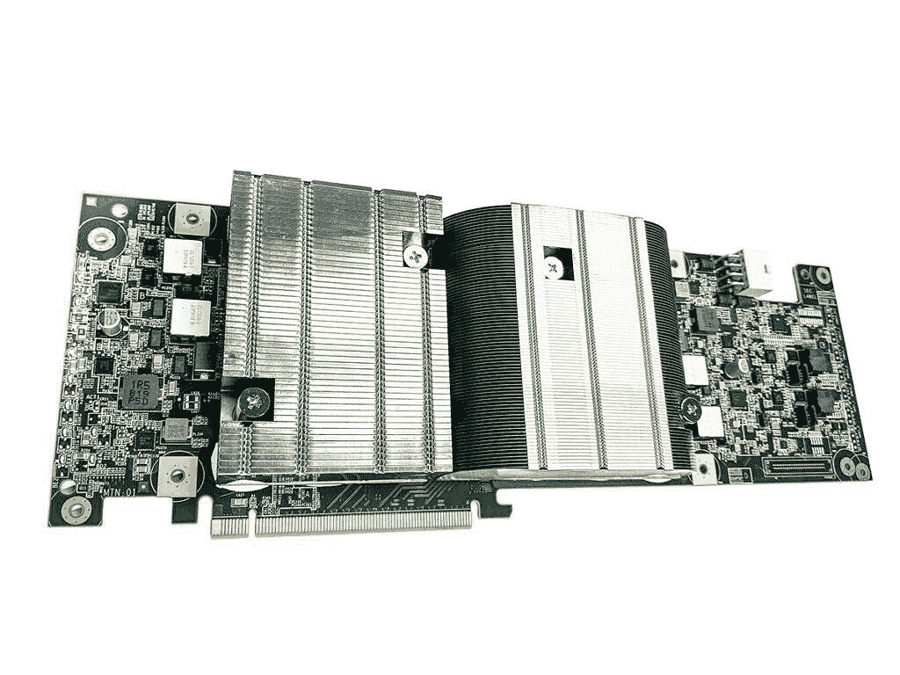
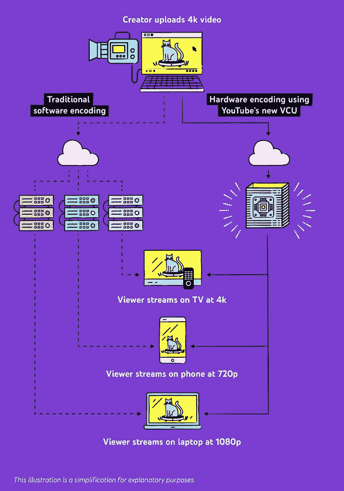

# 谷歌用于 YouTube 的新视频芯片支持 AV1 编码

> 原文：<https://www.xda-developers.com/google-new-video-chip-youtube-support-av1-encoding/>

# 谷歌用于 YouTube 的新视频芯片支持 AV1 编码

谷歌为 YouTube 开发了一种新的视频芯片，名为 Argos，支持 AV1 编码，比以前的解决方案效率高 20-33 倍。

开放媒体联盟早在 2017 年就推出了免版税的 AOMedia Video 1 (AV1)编解码器，取代 H.264 成为在线流媒体和媒体消费的主要编解码器。AV1 编解码器在不影响图片质量的情况下，比之前的 VP9 标准提供了约 30%的更好压缩，自那以来，谷歌一直在推动更广泛地采用该编解码器。

在过去几年中，该公司在其许多服务上推出了 AV1 支持，包括[谷歌 Chrome](https://www.xda-developers.com/google-chrome-90-stable-rollout/) 和 [YouTube](https://www.xda-developers.com/youtube-for-android-tv-adopts-av1-video-codec-in-certain-devices/) ，该公司计划使用该编解码器来提高[照片、Meet 和安卓电视](https://www.xda-developers.com/google-av1-codec-improve-bandwidth-stadia-photos-meet-tv/)的带宽。其他几个主要的科技巨头最近也采用了这种编解码器，包括[网飞](https://www.xda-developers.com/netflix-android-streams-some-shows-av1/)、[脸书](https://www.xda-developers.com/facebook-aomedia-royalty-free-av1-video/)、[联发科](https://www.xda-developers.com/mediatek-dimensity-1000-is-the-first-smartphone-soc-to-support-av1-hardware-decoding/)和 [Vimeo](https://www.xda-developers.com/vimeo-supports-av1-video-codec/) ，它的未来看起来很有希望。

 <picture></picture> 

Second-gen Video Coding Unit with two Argos chips

为了进一步增强 YouTube 的功能，谷歌还开发了一款名为 Argos 的定制芯片。该公司最近在 ASPLOS 会议上分享了该芯片的细节(通过*)。根据一篇关于此事的博客文章，Argos 是第二代视频(trans)编码单元(VCU)，可以将上传到平台的视频转换为各种压缩格式，并针对不同的屏幕尺寸进行优化。谷歌声称，其新的 Argos VCU 处理视频的效率比传统服务器高 20-33 倍。*

 *<picture></picture> 

YouTube encoding and decoding process

虽然 Argos 不是 YouTube 的第一个视频编码定制芯片，但它是第一个包含 AV1 支持的芯片。由于这一点，像高通这样的智能手机芯片供应商现在有更多的动力在他们的芯片组上添加 AV1 解码支持。因此，我们应该会看到编解码器得到更广泛的采用。有关 YouTube 新 Argos 芯片的更多信息，以及它将如何帮助观众和创作者改善 YouTube 体验，请查看这篇[博客文章](https://blog.youtube/inside-youtube/new-era-video-infrastructure)。*