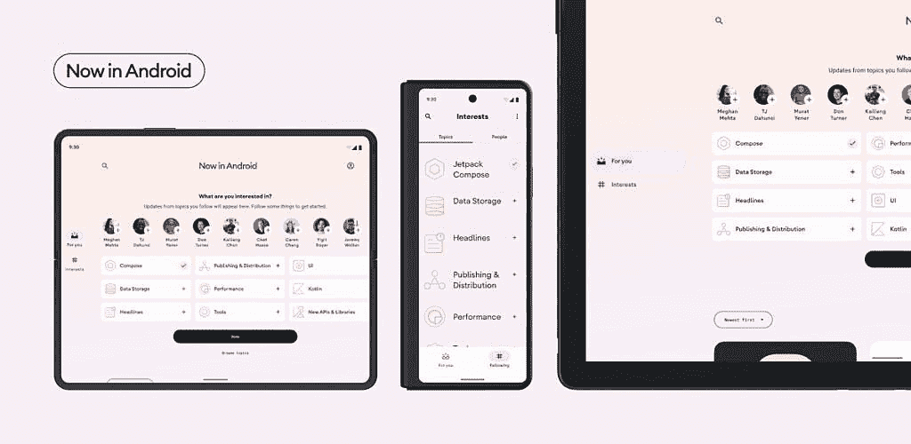

# 新的“Now in Android”应用旨在帮助开发者开发更好的应用

> 原文：<https://www.xda-developers.com/google-now-in-android-app/>

在今年的 I/O 开发者大会上，谷歌为开发者展示了一款新的“现在在 Android 中”应用。该应用旨在帮助开发人员了解 Android 开发的所有领域，并展示最佳实践、有见解的设计以及其他示例应用无法处理的复杂现实问题的解决方案。

“Now in Android”应用的第一个 alpha 版本可以在 GitHub 上下载，所有 Android 应用开发者都应该去看看。

不过，在你下载这个应用之前，让我们快速浏览一下第一个 alpha 版本中包含的所有东西:

*   使用 Jetpack Compose 构建的 UI
*   材料 3 的主题组件
*   适应不同屏幕尺寸的布局
*   遵循谷歌官方指导的架构
*   具有单向数据流的反应式编程模型，使用 Kotlin 流实现
*   用于本地数据存储的房间和原型数据存储区，离线优先
*   使用带有指数补偿的工作管理器安排远程/本地数据同步

除了这些功能，“现在在 Android 中”应用程序还记录了*“我们对应用程序的设计和实现做出某些决定的学习之旅。”*点击[此链接](https://github.com/android/nowinandroid/blob/main/docs/ArchitectureLearningJourney.md)，你可以了解更多关于谷歌应用架构的首次旅程。

 <picture></picture> 

The Now in Android screens adapt based on device screen size

谷歌计划在未来的更新中为“Now in Android”应用程序添加更多功能，包括用户认证和从真实后端加载数据。然而，该公司尚未分享这些功能的明确发布时间表。谷歌还证实，该应用程序将在不久的将来登陆 Play Store。

如果你有兴趣看一下“Now in Android”应用，请点击下面的链接从 GitHub 下载该应用。如果你喜欢这款应用，并想了解更多关于用于构建该应用的工具以及它如何针对多种屏幕尺寸的信息，你可以查看来自 [I/O 2022](https://www.xda-developers.com/google-io-2022-recap-major-announcements/) 的[开发者主题演讲](https://youtu.be/qBkyU1TJKDg)和[实现所有屏幕尺寸的 Android 应用](https://youtu.be/MPwf5DklKp0)演讲。

**[下载现在安卓中的 app](https://github.com/android/nowinandroid)**

* * *

**来源:** [安卓开发者博客](https://android-developers.googleblog.com/2022/05/now-in-android-sample-app-alpha.html)