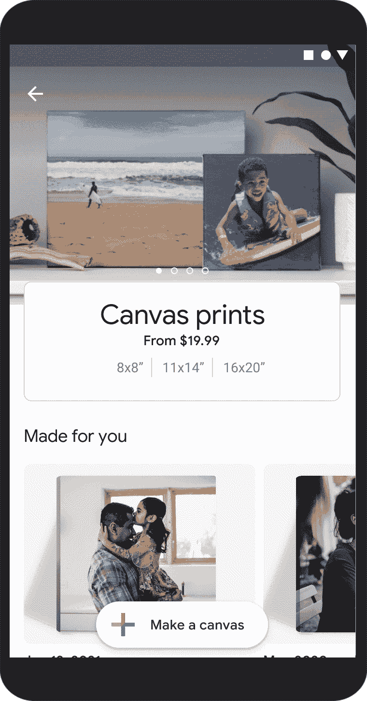

# Google 相册增加了新的交付选项和更大的打印尺寸

> 原文：<https://www.xda-developers.com/google-photos-delivery-options-print-sizes/>

谷歌正在扩展谷歌照片的一些打印功能，推出更大的照片打印尺寸、更大的画布打印尺寸和新的交付选项。以前，在谷歌照片上打印照片的唯一方法是通过使用该公司的人工智能，它每月选择你最好的十张照片，并将它们发送给你。如果你想打印个人照片，你需要到 CVS、沃尔格林或沃尔玛去取。然而现在，谷歌终于在美国推出了照片打印和照片画布的递送服务

在谷歌的博客文章中，该公司宣布，从现在开始，谷歌照片的用户可以选择照片和画布直接送货上门。每张照片的起价仅为 0.18 美元(包括运费)，并且可以订购四种额外的尺寸:11x14 英寸、12x18、16x20 和 20x30。至于画布，也可以送货上门。在美国，还增加了六种尺寸:8x10、16x16、20x30、24x36、30x40 和 36x36。

谷歌现有的打印选项也仍然可用。在美国、加拿大和欧洲仍然可以买到相册，起价仅为 9.99 美元。高级照片也可以使用(尽管只在美国)，每月 6.99 美元，谷歌的人工智能将从你备份的照片中选择 10 张照片送货上门。您可以选择光滑或哑光表面，添加边框，或在每月发货前编辑您的照片选择。

Google 相册在不断变化和改进，[在很大程度上是](https://www.xda-developers.com/google-photos-unlimited-free-storage-expires-next-month/)。随着[新的内存部件](https://www.xda-developers.com/google-photos-memories-widget-for-android/)和类似的改进，服务显然还可以通过增加生活质量和其他功能来改善。很遗憾，它不再提供无限备份(因为这将与照片打印服务很好地集成)，但你仍然可以在下面链接的官方应用程序中查看它。