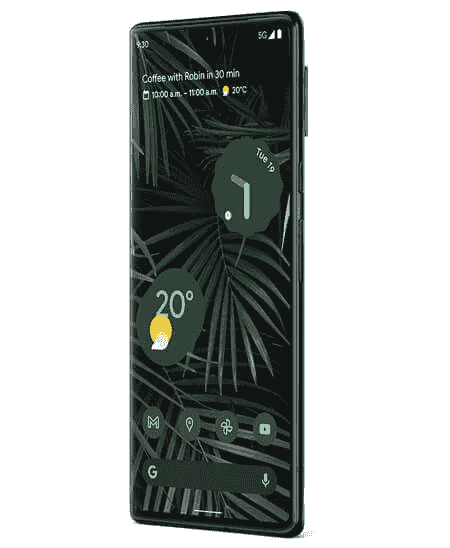
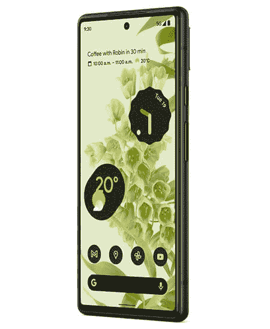

# 2023 年最佳谷歌 Pixel 手机

> 原文：<https://www.xda-developers.com/google-pixel-2-squeeze-hardcoded-assistant-remapping-difficult/>

谷歌 Pixel 手机经常被评为接近最佳安卓设备的“神级”，赢得了评论者和用户的一致好评。由于谷歌是 Android 的创造者，谷歌生产的运行 Android 的手机被认为是“完美的”Android 手机是有道理的。虽然 Pixels 可能尚未成为主流，但它们拥有强大的追随者，通常被认为是市场上的顶级智能手机。如果你正在考虑购买谷歌 Pixel 手机，我们已经编制了一份目前可用的最佳选择列表。毕竟，要充分欣赏 Pixel 手机的独特功能和广受好评的相机性能，你必须亲自尝试一下。

## 整体最佳:谷歌 Pixel 7 Pro

如果钱不是问题，谷歌 Pixel 7 Pro 是你现在能买到的最好的谷歌手机。它解决了我们对其前身的主要抱怨——电池、热量和有问题的软件——同时完善并加倍了已经很棒的东西:相机和人工智能。我们不会将 Pixel 7 Pro 称为 Pixel 6 Pro 的巨大升级，但它带来的改进和完善是受欢迎的补充。

Pixel 7 Pro 从正面看起来与前代产品相同，具有大曲面显示屏和超薄边框。但是把它翻过来，你会注意到几个变化。首先，Pixel 6 Pro 标志性的双色涂装已经消失，取而代之的是看起来更普通的单色涂装。独特的黑色相机杆已被抛光的铝制框架取代，框架上有两个摄像头镜头的切口。正面和背面仍然由 Gorilla Glass Victus 保护，而 IP68 等级意味着您不必担心灰尘和水溅损坏您的设备。尽管如此，我们还是建议拿起一个[保护套](https://www.xda-developers.com/best-google-pixel-7-pro-cases/)来防止划伤。

谷歌 Pixel 7 Pro 拥有华丽的 6.7 英寸 AMOLED 显示屏，分辨率为 3120 x 1440 或 QHD+分辨率。这是一款高刷新率的 LTPO 显示器，可以在 120Hz 和 10Hz 之间平滑调整刷新率。Pixel 7 Pro 面板也变得更亮，提供 1000 尼特的最大亮度和 1500 尼特的峰值亮度。

在内部，Pixel 7 Pro 封装了谷歌最新的内部芯片组: [Tensor G2](https://www.xda-developers.com/google-tensor-g2/) 。虽然 CPU 和 GPU 性能与去年的芯片组相似，但新芯片组在机器学习和相机处理任务方面明显更快。

正如你所料，Pixel 7 Pro 还获得了最好的相机硬件，配备了一个与上一款型号相同的 50MP 主拍摄镜头，一个具有 5 倍光学和 30 倍数字变焦的 48MP 长焦镜头，以及一个兼作微距镜头的 12MP 超宽相机。此外，还有一些新的人工智能摄影功能，如照片取消模糊，引导帧和电影取消模糊。

5,000mAh 电池与去年相比没有变化，但随着 Tensor G2 的效率提高和软件优化，我们可以期待 Pixel 7 Pro 提供更好的电池寿命。在软件方面，这款手机开箱即可运行 Android 13，谷歌承诺三年的操作系统更新和五年的安全更新。Pixel 7 Pro 的其他显著亮点包括改进的指纹识别器、NFC、UWB 支持、无线充电支持、双频 GPS 和蓝牙 5.2。别忘了看看[最好的 Pixel 7 Pro](https://www.xda-developers.com/best-google-pixel-7-deals/) 存大。

 <picture></picture> 

Google Pixel 7 Pro

##### 谷歌 Pixel 7 Pro

Pixel 7 Pro 是谷歌今年的顶级旗舰产品，具有第二代张量 SoC，120Hz LTPO 显示屏，长焦传感器和更大的电池。

## 还是很棒:谷歌 Pixel 6 Pro

现在 Pixel 7 Pro 已经上市，Pixel 6 Pro 不再是城堡之王。但如果你不想花 899 美元购买 Pixel 7 Pro，这款即将推出的机型仍然是一个很好的选择。你可以很容易地在亚马逊和百思买上找到售价 650 美元或更低的基本款。

Pixel 6 Pro 拥有 6.7 英寸的大有机发光二极管显示屏，分辨率为 QHD+级，刷新率高达 120Hz。QHD+分辨率意味着显示器上的一切，包括照片、视频、图形等。，看起来很脆。面板边缘弯曲，类似于 Galaxy S22 Ultra，提供更身临其境的观看体验。峰值亮度没有 Pixel 7 Pro 高，但足以在阳光直射下使用手机，而且你还可以在网飞和其他流媒体平台上支持 HDR10 和 HDR10+内容。由于这是一款 LTPO 显示器，您还可以获得自适应刷新率，这意味着显示器可以根据内容和屏幕交互在 10Hz 到 120Hz 之间自动调整刷新率。正面和背面都有康宁的大猩猩玻璃 Victus 保护。

除了与标准 Pixel 6 相同的 50MP 主摄像头和 12MP 超宽拍摄镜头，Pro 型号还增加了 48MP 长焦镜头，让您在不牺牲细节的情况下拍摄更好的变焦镜头。

为谷歌 Pixel 6 Pro 提供动力的是 Tensor，这是谷歌的第一款内部 SoC。它不像高通的骁龙 8 Gen 1 或 Tensor G2 那么快，但你不太可能在日常活动中注意到任何减速或口吃，无论你扔什么东西。Pixel 6 Pro 唯一不那么专业的性能就是游戏。当长时间处于重负荷下时，手机会发热并减速。

Pixel 6 Pro 的电池续航时间充其量也就一般，当竞争对手提供高达 150W 的速度时，它的 30W 快速充电就没什么可写的了。但如果你不是一个重度用户，你仍然可以期待手机提供一整天的电池寿命。该手机还支持无线充电，可以以高达 5W 的速度为智能手表或耳机反向无线充电。

至于软件，谷歌已经承诺在 Pixel 6 Pro 上提供三年的 Android 版本更新和五年的安全补丁。它配备了最新的 Android 12，开箱即用，材料一应俱全。

 <picture></picture> 

Google Pixel 6 Pro

Pixel 6 Pro 是较大的兄弟，配有谷歌的新张量芯片、现代设计和额外的远摄相机。

## 最适合大多数人:谷歌 Pixel 7

对于那些不在乎曲面显示器和长焦相机的人来说，标准的 [Pixel 7](https://www.xda-developers.com/google-pixel-7-review/) 会是更好的选择。Pixel 7 是该公司产品线中最平衡的手机，提供了一个很好的硬件包，没有任何明显的缺点，价格也比 Pixel 7 Pro 低得多。Pixel 7 遵循与 Pro 型号相同的通用设计语言，包装了横跨手机宽度的铝带。

Pixel 7 的 FHD+有机发光二极管 90Hz 面板不如 Pixel 7 Pro 先进，但它所提供的东西不会让你失望。它比 Pixel 6 的面板更亮、更有活力，峰值亮度达到 1400 尼特，同时还提供 24 位颜色和 HDR 支持。

如果你选择更便宜的 Pixel 7，你也不会牺牲性能，因为它使用与 Pro 型号相同的 Tensor G2 芯片组。虽然与 Pro 上的 12GB 相比，你只能获得 8GB 的内存，但这对大多数人来说已经足够了，而且不太可能影响日常性能。

不可否认，Pixel 7 的相机设置不如 Pro 那么通用。它错过了专用的长焦变焦镜头和微距对焦功能。但最重要的是主摄像头，我们很高兴地报告，它拥有与 Pro 型号一样优秀的 50MP 主摄像头。

Pixel 7 装有 4335 毫安时电池，支持 30 瓦快速有线充电和 20 瓦快速无线充电。与 Pro 类似，它开箱即可运行 Android 13，并承诺获得三年的 OS 更新和五年的安全更新。在其他地方，你可以得到一个显示指纹扫描仪，面部解锁，蓝牙 5.2，立体声扬声器和双频 GPS。查看[最佳像素 7 保护套](https://www.xda-developers.com/best-google-pixel-7-cases/)和[屏幕保护套](https://www.xda-developers.com/best-google-pixel-7-screen-protectors/)，让你的设备焕然一新。

 <picture></picture> 

Google Pixel 7

Pixel 7 包含第二代 Tensor SoC、更亮的显示屏和改进的摄像头。

## 仍然预算旗舰:谷歌像素 6

随着 Pixel 7 的到来，谷歌 Pixel 6 可能不是最好的标准 Pixel 旗舰产品，但对于那些想体验 Pixel 的拍照能力和软件智能而又不想支付 599 美元的人来说，它仍然是一个可靠的选择。拿起这个一岁的像素，你不会失去太多。它拥有与 Pixel 7 和 Pixel 7 Pro 相同的出色的 50MP 主摄像头，以及类似的软件体验。

你会得到一个漂亮的 6.4 英寸有机发光二极管显示器，分辨率为 FHD+级，刷新率为 90Hz。面板没有 Pixel 6 Pro 那么亮，也不支持 LTPO 理工大学的动态刷新率。但小屏幕尺寸和 1080p 分辨率意味着 Pixel 6 的显示屏不会像 Pixel 6 Pro 的 QHD+面板那样耗费大量电池。500 尼特时，屏幕并不那么亮，但对于户外使用来说已经足够了。

Pixel 6 在日常任务中的表现类似于 Pro 型号，因为它由相同的旗舰 Tensor Soc 提供动力。然而，由于内存量较低，它可能无法容纳像 Pixel 6 Pro 那样多的应用程序。尽管如此，8GB 的内存对大多数人来说还是绰绰有余，不太可能影响整体性能。

背面有两个出色的摄像头:一个 50MP 主摄像头和一个 12MP 超宽摄像头。手机错过了一个专用的变焦镜头。像往常一样，谷歌已经钉上了性能，由于更新的主摄像头，Pixel 6 对低光性能带来了巨大的改善。在这个价格范围内，你很难找到一款相机性能与 Pixel 6 一样好的手机。

正面的摄像头没有 Pro 上的宽，分辨率也降至 800 万像素。除此之外，这里没有什么值得你留恋的。Pixel 6 上也有同样的软件支持。电池略小，为 4600mAh，但更小的屏幕和更低的刷新率意味着电池寿命将与 Pro 一样好，如果不是更好的话。

 <picture></picture> 

Google Pixel 6

Pixel 6 配备了谷歌新的张量芯片、现代设计和旗舰相机。

## 最实惠:谷歌 Pixel 6a

如果你不需要谷歌 Pixel 7 或 Pixel 6 的所有功能，你可以使用 Pixel 6a T1。像以前的 Pixel A 系列手机一样，新型号将旗舰 Pixel 的最佳功能降至更容易接受的价位，同时放弃了一些高端功能。妥协的形式是更少的优质材料、降级的显示器和更旧的相机硬件。正面不是大猩猩玻璃 Victus，而是大猩猩玻璃 3，背面不是玻璃，而是塑料。

Pixel 6a 配备了 6.1 英寸的有机发光二极管显示屏，分辨率为 FHD+级。令人遗憾的是，该面板没有提供更高的刷新率，最高可达 60Hz。Android 修补社区有望超越这一限制，解锁 90Hz 刷新率。但谷歌没有在 2022 年的中端手机上搭载更高刷新率的面板，这一事实肯定令人失望，并使这款手机处于劣势。但从光明的一面来看，显示屏在阳光下清晰可辨，并提供你所期待的 OLED 面板的鲜艳色彩和深黑色。

Pixel 6a 最令人兴奋的是，它使用了与 Pixel 6 和 Pixel 6 Pro 相同的旗舰张量 SoC。但是，在你过于兴奋之前，请注意，这款手机的性能不如顶级机型。这是因为 Pixel 6a 只封装了 6GB 的 RAM，缺乏更高刷新率面板的流畅度。也就是说，像素 6a 在日常使用中表现不错。除非您是超级用户，否则您会对整体性能非常满意。

相机的情况有点棘手。最新的平价相机没有从 Pixel 6 系列借用新的相机硬件，而是包装了之前所有 Pixel A 系列手机上出现的旧相机模块。尽管相机较旧，但 Pixel 6a 仍能产生我们期望从 Pixel 系列获得的高质量照片，这要归功于 Tensor 的新图像信号处理器和谷歌的机器学习魔法。

Pixel 6a 装有 4，410 毫安时电池，比 Pixel 6 的 4，614 毫安时电池略小。但更小的屏幕和更低的刷新率意味着你不会在中午伸手去拿充电器。说到充电器，盒子里没有。你必须使用现有的充电器，或者从最好的 Pixel 6a 充电器中选择。

Pixel 6a 售价 449 美元，具有很高的价值，提供了出色的相机性能和周到的软件体验的令人愉快的组合。三年 Android OS 支持更是锦上添花。在过去的几个月里，我们已经看到 Pixel 6a 几次跌至 300 美元。所以，如果你想得到它，不要错过这样的好机会。

Pixel 6a 是一款出色的中端智能手机，内置强大的摄像头和谷歌内部的张量芯片组。

这就是我们现在能买到的最好的 Pixel 手机的总结。你可能已经看到了这一点，但目前最好的谷歌 Pixel 智能手机是谷歌 Pixel 7 Pro 和 Pixel 7。它们可以说是有史以来像素最好的手机。如果你不在乎最新最棒，想省钱，Pixel 6 和 Pixel 6a 也不会让你失望。如果你对 Pixel 7 和 Pixel 6a 感到困惑，你可能想看看我们的对比，看看哪个更适合你。