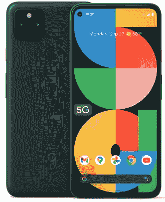

# 谷歌 Pixel 5a 支持哪些 5G 和 4G 频段？它支持哪些美国运营商？

> 原文：<https://www.xda-developers.com/google-pixel-5a-5g-4g-bands-carrier-support/>

Google Pixel 5a T1 包含了非常强大的功能集和令人兴奋的规范，包括 5G 支持。[我们非常喜欢 Pixel 5a](https://www.xda-developers.com/google-pixel-5a-review/) 的简洁风格。如果你打算通过众多优惠中的一个来购买这款手机，你可能会想知道这款手机到底支持哪些 5G 和 4G 频段，以确保它与你的运营商兼容。这篇文章将解释 Pixel 5a 的 5G 和 4G 前景。

## 谷歌 Pixel 5a 支持的 5G 频段

作为一款中端智能手机，Pixel 5a 仅提供低于 6GHz 的 5G 连接，不支持毫米波。它可以与几乎所有主要运营商和移动运营商的 6GHz 以下 5G 网络兼容，包括美国电话电报公司、T-Mobile 和威瑞森。如果你普遍对 5G 技术感兴趣，我们有一个非常详细地涵盖主题的[伟大指南。](https://www.xda-developers.com/5g/)

**这些都是美国 Pixel 5a 支持的 5G 频段:**n1/2/5/12/25/28/41/66/71/77/78

### **美国兼容 Pixel 5a 5G 调制解调器的美国运营商完整列表**

*   美国电话电报公司(American Telephone and Telegraph Company)
*   板球
*   c 尖塔
*   船方不负担装货费用
*   第一网
*   地铁个人电脑
*   范围
*   T-Mobile/冲刺
*   USCC
*   威瑞森
*   看得见的
*   有限性

Pixel 5a 缺乏 mmWave 5G 令人失望，但没什么大不了的。虽然毫米波 5G 网络可以提供 1Gbps 以上的数据速度，但它们只能在有限的城市地区使用，并且需要更多的资本进行扩展。另一方面，低于 6GHz 的网络没有毫米波 5G 快，但它们可以覆盖更广的区域，因此被运营商用于支持 5G 的大部分覆盖。

## 像素 5a 支持的 4G 网络频带

Pixel 5a 支持的 4G LTE 频段也非常广泛，该手机可以与几乎所有运营商合作。例如，它兼容美国电话电报公司、T-Mobile 和威瑞森使用的所有 4G LTE 频段。

**美国 Pixel 5a 支持的 4G LTE 频段完整列表:**B1/2/3/4/5/7/8/12/13/14/17/18/19/20/25/26/28/29/30/32/38/39/40/41/42/46/48/66/71

### 像素 5a 上支持 3G 和 2G 频带

这款手机支持 3G 和 2G 频段并不令人意外。你可以得到常见的 2G GSM 频段- 850、900、1800、1900 MHz -和 3G 频段- 1/2/4/5/8 -和 CDMA 频段- BC0/BC1/BC10。所有这些频段使得 Pixel 5a 与美国几乎所有的手机提供商兼容。

在其他关键连接功能中，Pixel 5a [支持 eSIM 和双 sim](https://www.xda-developers.com/google-pixel-5a-dual-sim-esim/)。因此，您可以使用一个物理 nano-SIM 和一个 eSIM 来利用该功能。

如果你打算订购 Pixel 5a，请务必查看我们的[最佳 Pixel 5a 交易](https://www.xda-developers.com/best-google-pixel-5a-deals/)文章，以节省一些钱。我们还选择了[最佳像素 5a 保护套](https://www.xda-developers.com/best-google-pixel-5a-cases/)来帮助您保护手机。

 <picture></picture> 

Google Store

##### 谷歌 Pixel 5a

Pixel 5a 是谷歌最新的中端智能手机。它配备了骁龙 765G SoC、6GB 内存和全高清+显示屏。