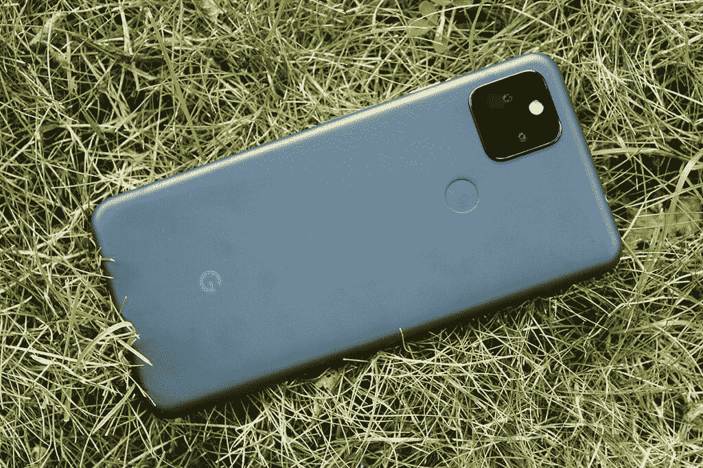

# 谷歌将出售盒子里没有充电器的 Pixel 6

> 原文：<https://www.xda-developers.com/google-pixel-6-no-charger-in-box/>

今天早些时候，谷歌[发布了 5G 技术的](https://www.xda-developers.com/pixel-5a-specs-features-pricing-availability/)Pixel 5a。带 5G 的新 Pixel 5a 与去年的 Pixel 4a (5G)真的很相似:它们有相同的摄像头、处理器、端口选项、软件，以及基本相同的显示器。它们都在盒子里配备了充电器，这是一个需要说明的事实，因为三星和苹果都已经在最新的旗舰产品中停止了这样做。很快，谷歌将加入这两家公司的行列，推出一款包装盒中没有充电器的手机，因为该公司已经证实，其即将推出的 [Pixel 6](https://www.xda-developers.com/google-pixel-6/) 系列不会附带充电器。

谷歌告诉 [*The Verge*](https://www.theverge.com/2021/8/17/22628702/google-pixel-6-charger-not-included) 说，Pixel 5a 是最后一款在盒子里包含充电砖的 Pixel 手机，这当然意味着 Pixel 6 和 6 Pro 不会附带一个。这两款手机都将于今年秋天晚些时候在 T4 推出，配有高级硬件和软件，并将在三星和苹果已经推出不带内置充电器的国家上市。

 <picture></picture> 

Google's Pixel 5a is the last Pixel phone to ship with a charging brick in the box. Credits: Rich Woods/XDA.

谷歌不会在 Pixel 6 的包装盒中包括充电器的原因很简单:大多数在这个价格点购买手机的人家里已经有一个 USB-C 充电砖——或者多个。当然，不把充电器装在盒子里还有其他好处。对谷歌来说，此举降低了成本，因为他们不需要为每部手机制造充电器。此外，它还降低了分销成本，因为该公司可以减少 Pixel 6 盒子的尺寸和重量。不过，我们不知道谷歌是否计划将这些节省下来的成本转嫁给消费者。至少在理论上，排除内置充电器也减少了电子垃圾，因为用户在升级设备时可以少丢弃一个组件。

苹果和三星是第一批在包装盒中没有充电器的智能手机制造商。苹果率先推出了 iPhone 12 系列，但三星紧随其后推出了 T2 Galaxy S21 系列。三星通过排除内置充电器[及其最新的可折叠产品](https://www.xda-developers.com/samsung-galaxy-z-flip-3-unboxing/)延续了这一趋势，其他原始设备制造商[如 HMD Global](https://www.xda-developers.com/nokia-x20-no-wall-charger-in-the-box/) 也加入了进来，引用了与谷歌相同的理由。一加[和小米](https://www.xda-developers.com/oneplus-confirms-the-oneplus-9-will-come-with-a-charger/)[仍然在他们最新的手机中包含充电器，但他们效仿这种做法只是时间问题。](https://www.xda-developers.com/xiaomi-ship-mi-11-55w-charger-europe/)

据传，由于升级了 Pixel Stand 附件，Pixel 6 将推出更快的无线充电速度，但尚不清楚它们是否也支持更快的有线充电速度。之前的 Pixel 手机通过支持的 USB-C PD 电源适配器达到了 18W 的有线充电速度，包括[谷歌自己的](https://store.google.com/product/usb_c_18w_power_adapter_2?hl=en-US)。我们希望谷歌计划在下一代 Pixel 中提高充电速度，并让用户可以选择购买充电器，即使它是单独发货的。