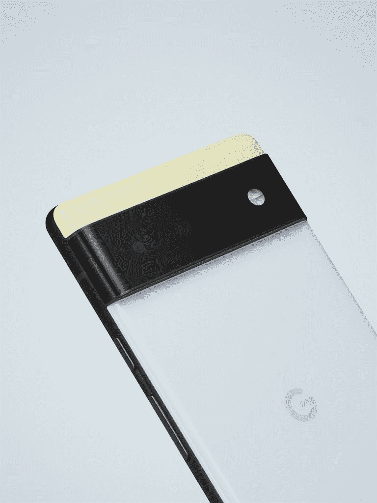

# 谷歌用其定制的谷歌张量芯片调侃 Pixel 6 系列

> 原文：<https://www.xda-developers.com/google-pixel-6-teaser/>

毫不奇怪，谷歌正准备在今年晚些时候推出 [Pixel 6](https://www.xda-developers.com/google-pixel-6/) 系列，按照现在典型的谷歌方式，该公司在新手机发布前几周分享了大量细节。谷歌今天证实了其即将推出的 Pixel 6 系列的名称、设计、预计发布日期和许多规格。以下是他们取笑的所有内容的摘要。

## 认识一下 Pixel 6 和 Pixel 6 Pro

由于泄密，我们知道谷歌正在开发其 2021 年 Pixel 系列中的两款手机。我们不确定的是名字。许多人认为更大更高端的型号将被称为 Pixel 6“Pro ”,而不是 Pixel 6“XL ”,尽管一些泄露消息指向后者的名称，但谷歌今天证实，他们将使用“Pro”来表示超高端型号。

**[谷歌 Pixel 6 论坛](https://forum.xda-developers.com/f/google-pixel-6.12311/)**| |**|[谷歌 Pixel 6 Pro 论坛](https://forum.xda-developers.com/f/google-pixel-6-pro.12313/)**

Pixel 6 和 Pixel 6 Pro 都将于今年秋天亮相，尽管谷歌没有明确说明这两款手机的确切发布时间。不过，如果他们之前的历史是可靠的话，发射可能会在 10 月中旬进行。在发布会上，我们将听到更多关于新功能、技术规格、定价和可用性的信息，但谷歌今天的预览仍然揭示了许多令人兴奋的信息。

首先，谷歌大谈新 Pixel 6 系列的设计。两款手机都采用了“工业设计”，Pro 拥有“轻度抛光铝边框”，非 Pro 拥有“哑光铝表面”。有趣的是，非专业版似乎将有更多有趣的颜色可供选择，而专业版将有三种稳重的颜色可供选择。

与之前的 Pixel 手机相比，Pixel 6 系列将有一个巨大的矩形摄像头，横跨手机的宽度，以容纳其多摄像头设置。Pixel 6 Pro 将首次在 Pixel 手机中拥有三个后置摄像头——一个主广角摄像头，一个辅助超广角摄像头和一个第三长焦摄像头。Pro 的长焦相机[提供 4 倍光学变焦](https://twitter.com/madebygoogle/status/1422227451816685568)，这似乎比谷歌相机 APK 暗示的的[要少一点，但在不知道确切的传感器和光学细节的情况下，我们无法评论这种差异。普通的 Pixel 6 跳过了 4X 长焦相机，但它将拥有相同的主相机和超广角相机。](https://www.xda-developers.com/google-pixel-6-xl-ultra-tele-camera-rumor/)

 <picture></picture> 

Pixel 6 Pro camera bump.

谷歌向 [*The Verge*](https://www.theverge.com/2021/8/2/22605094/google-pixel-6-pro-tensor-processor-specs-ai-ml) 确认了一些额外的硬件细节。根据出版物，Pixel 6 Pro 将拥有 6.7 英寸的四高清+分辨率曲面显示屏，刷新率为 120Hz。两侧有“闪亮、抛光的铝轨”，广角传感器“吸收的光线增加了 150%。”同时，常规 Pixel 6 拥有更小的 6.4 英寸全高清+分辨率平板显示器，刷新率为 90Hz。侧面有“哑光处理的栏杆”,而不是铝制的。

## 首次亮相 Android 12 和材料你

在今年的谷歌 I/O 开发者大会上，该公司发布了最新版本的材料主题指南 [Material You](https://www.xda-developers.com/material-you/) 。Material You 完全是关于个性化的，它对 Android 设计范式进行了几个关键的更新。首先，Material You 带来了“monet”主题系统，该系统使用颜色科学从壁纸中提取颜色，并生成调色板，作为系统范围的主题。接下来，Material You 还呼吁改造 Android 陈旧的 widgets 系统。最后，Material You 还引入了新的推荐布局、样式选项、动画等。

在 Android 12 测试版中，我们已经瞥见了你的新“莫奈”主题系统、布局和动画，但我们还没有看到谷歌的任何新部件。然而，随着 Pixel 6 系列的推出，这种情况将会发生变化，因为谷歌[已经证实](https://twitter.com/madebygoogle/status/1422231294025609226)这些手机不仅会开箱即用 Android 12，而且会提供你在 I/O 上取笑的所有材料

虽然谷歌尚未对 Pixel 6 系列是否将提供扩展的软件支持发表评论(目前有传言称他们将提供 5 年的支持)，但他们的软件预告确实证实了 2021 年 Pixel 系列中两款手机的正面设计。如上图所示，Pixel 6 Pro 有一个边到边的曲面显示屏，中央有一个小的打孔切口，用于单个前置摄像头。Pixel 6 与此类似，尽管它的屏幕非常平坦。

## 谷歌硅 101 (GS101)的官方名称是“谷歌张量”

随着今年的 Pixel 手机，有传言称谷歌将放弃高通的骁龙芯片，转而使用三星合作设计的内部芯片。据报道，这些芯片的代号为“white chapel”,[许多关于新定制芯片的参考资料](https://www.xda-developers.com/google-pixel-6-gs101-whitechapel-aosp/)以“GS101”的形式出现在网上，其中“GS”可能指的是“谷歌芯片”,“101”表示谷歌芯片系列中的第一款芯片。谷歌今天证实，其新的定制芯片将被称为“谷歌张量”。

“张量”是机器学习领域中一个重要的数学术语，所以谷歌称其芯片将在 Pixel 6 系列上呈现多少人工智能功能也就不足为奇了。

例如，谷歌定制了张量芯片来运行他们的计算摄影模型，如 HDR。根据 [*The Verge* ，](https://www.theverge.com/2021/8/2/22605094/google-pixel-6-pro-tensor-processor-specs-ai-ml)张量芯片中的张量处理单元——或 TPU——能够以高达 30fps 的速度在视频的每一帧上运行 HDRNet。张量芯片还可以通过将主相机的多张照片同时堆叠成一张 HDR 图像，并从超广角相机拍摄的照片中捕捉细节，来帮助减少照片中的模糊。主相机曝光场景并捕捉颜色，而超广角相机以更高的速度拍摄，以获得更多细节。

谷歌一直将其人工智能技术应用于在 Pixel 手机上制作更好的照片，但他们也在使用张量芯片来支持更多的设备上人工智能功能。该公司表示，谷歌张量芯片让他们在语音识别、翻译、字幕和听写方面实现了巨大的飞跃。据 [*《华盛顿邮报》*](https://www.washingtonpost.com/technology/2021/08/02/google-pixel-6-tensor-chip/) 报道，Pixel 6 将能够“在你观看或收听另一种语言的内容时，生成实时翻译字幕。”基于此，听起来像是谷歌传言的“ [Live Translate](https://www.xda-developers.com/android-12-beta-2-google-live-translate-feature/) ”功能将在即将到来的 Pixels 上首次亮相。WaPo 和 The Verge 都报告说，设备上的转录速度快得多，但如果没有看到并行演示，很难评估这种改进。

除了谷歌张量芯片，Pixel 6 系列还将拥有更新的安全硬件。泰坦 M 硬件安全模块[首次在 Pixel 3](https://www.xda-developers.com/google-pixel-3-titan-m-security/amp/) 中发货，其继任者泰坦 M2 将在 Pixel 6 上首次亮相。不过，谷歌还没有透露泰坦 M2 芯片的任何信息。当计算张量芯片自己的安全核心时，谷歌表示，Pixel 6 将“在任何手机中拥有最多的硬件安全层。”

最后，谷歌告诉《The Verge》, Pixel 6 将拥有一台“永远在线的计算机”,来处理低级、低功耗的任务，如环境显示。不过，这两款手机的预期电池续航时间仍然是一整天。

## 像素的新方向

谷歌 Pixel 手机在美国卖得并不好，更不用说在世界各地了。最近的报告甚至表明，该品牌的[增长为负](https://www.xda-developers.com/oneplus-us-growth-budget-phones-t-mobile/)，这给其未来带来了麻烦。然而，很明显，谷歌在 Pixel 6 系列上投入了大量资源。谷歌设备和服务的 Rick Osterloh 告诉 *The Verge* 该公司准备在营销方面投入大量资金，使 Pixel 系列增长。现在说 Pixel 6 是否值得大肆宣传还为时过早——毕竟，它的价格可能会打消人们对它的所有热情——但谷歌这么早就开始大肆宣传的事实表明，他们对它很有信心。

谷歌商店今天更新了 Pixel 6 系列的[登陆页面](https://store.google.com/magazine/google_pixel_6)。在那里，你可以注册获得更多关于 Pixel 6 可用性的新闻。

\ r \ nht TPS://www . YouTube . com/watch？v=CiWQrTpV6sk\r\n