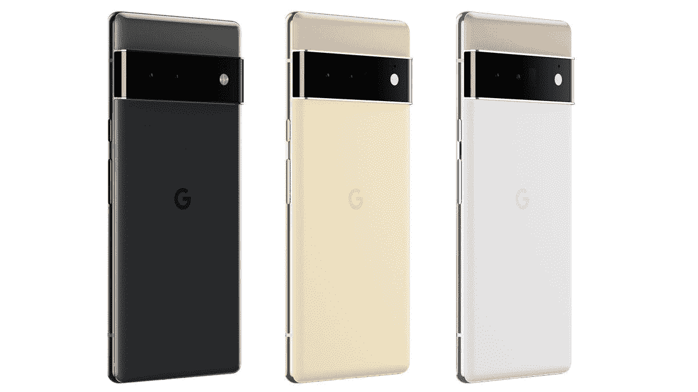

# 谷歌 Pixel 7 Pro 在一个新的拆箱视频中亮相

> 原文：<https://www.xda-developers.com/google-pixel-7-pro-unboxed-in-new-video/>

谷歌 Pixel 7 和谷歌 Pixel 7 Pro 即将上市。虽然这并不令人惊讶，但由于谷歌在 5 月份的谷歌 I/O 期间展示了这款手机，在正式发布前看到这款手机仍然很有趣。也就是说，脸书上出现了一段新视频，让我们很快了解了 Pixel 7 Pro 的情况。

这个短片由孟加拉国达卡的一家电子商店 Gadgetfull BD 提供。该视频没有提供太多解释，该人很快通过拆箱 Pixel 7 Pro 进入了正题。如果视频中的零售包装是合法的，它看起来与当前的 Pixel 设备非常相似。虽然我们以前在野外见过这种手机，但这是我们第一次看到在视频中展示的工作模型。

谷歌 Pixel 7 Pro 的设计与之前的 Pixel 6 Pro 相似，有一些小的变化。虽然很难说，但谷歌的人表示，与之前的型号相比，Pixel 7 Pro 看起来没有那么咄咄逼人地向显示器边缘弯曲。当谈到其他外观差异时，后置摄像头遮阳板现在有一个轻微的镀铬色调。关于尺寸，我们从八月份弹出的[拆箱视频](https://www.xda-developers.com/the-google-pixel-7-and-pixel-7-pro-leaked-in-new-hands-on-video/)中获得了更多信息，显示 Pixel 7 Pro 的尺寸和重量与其前代产品几乎相同，只是更短更薄。在同一个拆箱视频中，Pixel 7 Pro 被发现比当前型号宽一点，重一克。

尽管谷歌尚未宣布确切日期，但 Pixel 7 和 Pixel 7 Pro 可能会在 10 月初推出。您可以通过指向源代码链接来查看这个简短的拆箱剪辑。如果你不需要最新最好的，Pixel 6 Pro 可能是个不错的选择。Pixel 6 Pro 最近获得了大幅折扣，降至 649 美元。如果有兴趣，您可以使用下面的链接购买该设备。

 <picture></picture> 

Google Pixel 6 Pro

谷歌 Pixel 6 Pro 打折 250 美元，价格降至 649 美元。

* * *

**来源** : [Gadgetfull BD](https://www.facebook.com/watch/?v=1226336384807605) (脸书)

**Via** : [9to5Google](https://9to5google.com/2022/09/03/pixel-7-pro-unboxing-leak/)