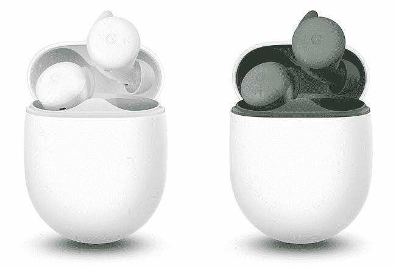

# Pixel Buds A 系列现已在英国和欧洲接受预购

> 原文：<https://www.xda-developers.com/google-pixel-buds-a-series-more-markets/>

# 谷歌 Pixel Buds A 系列进军更多市场

谷歌的平价 TWS 耳塞 Pixel Buds A 系列终于进入了更多市场，包括英国、欧洲和印度。

今年 6 月，[谷歌推出了](https://www.xda-developers.com/pixel-buds-a-unveiled/)一副平价的 TWS 耳塞，名为 Pixel Buds A 系列。当时，该公司仅在美国和加拿大推出了这款耳塞，但现在它正将它们推向更多市场。Pixel Buds A 系列现已在英国和欧洲接受预购，并将于 8 月 25 日开始在印度销售。

Pixel Buds A 系列看起来几乎与第二代 Pixel Buds 相同，采用椭圆形便携包和最小的圆形设计。耳塞具有与高级型号相同的声音和麦克风质量，并且它们还提供自适应声音支持。Pixel Buds A 系列一次充电可连续播放 5 小时，使用充电外壳可连续播放 24 小时。这款耳塞还支持快速充电，可在 15 分钟内额外播放 3 小时。

 <picture></picture> 

Pixel Buds A-series in Clearly White and Dark Olive

与第二代 Pixel Buds 不同，Pixel Buds A 系列不提供无线充电支持和滑动手势来控制音量。然而，它确实提供了防汗和防水功能(仅限耳塞)。关于新的 Pixel Buds A 系列的更多信息，请查看[这篇文章](https://www.xda-developers.com/pixel-buds-a-unveiled/)。如果你想买一副新的 TWS 耳塞，但对 Pixel Buds A 系列不太感冒，可以看看我们在[最佳真无线耳塞](https://www.xda-developers.com/best-wireless-earbuds/)上的帖子，了解其他推荐。

## Pixel Buds A 系列的定价和供货情况

Pixel Buds A 系列可在英国[和欧洲](https://store.google.com/gb/config/pixel_buds_a_series?hl=en-GB)[的谷歌商店](https://store.google.com/es/product/pixel_buds_a_series?hl=es)预购。这款耳塞的售价分别为 99.99 英镑和€99 英镑。在印度，这款耳塞将于 8 月 25 日开始在₹9,999 通过 Flipkart、Reliance Digital 和 Tata Cliq 销售。Pixel Buds A 系列将有两种配色可供选择——清晰的白色和深橄榄色。