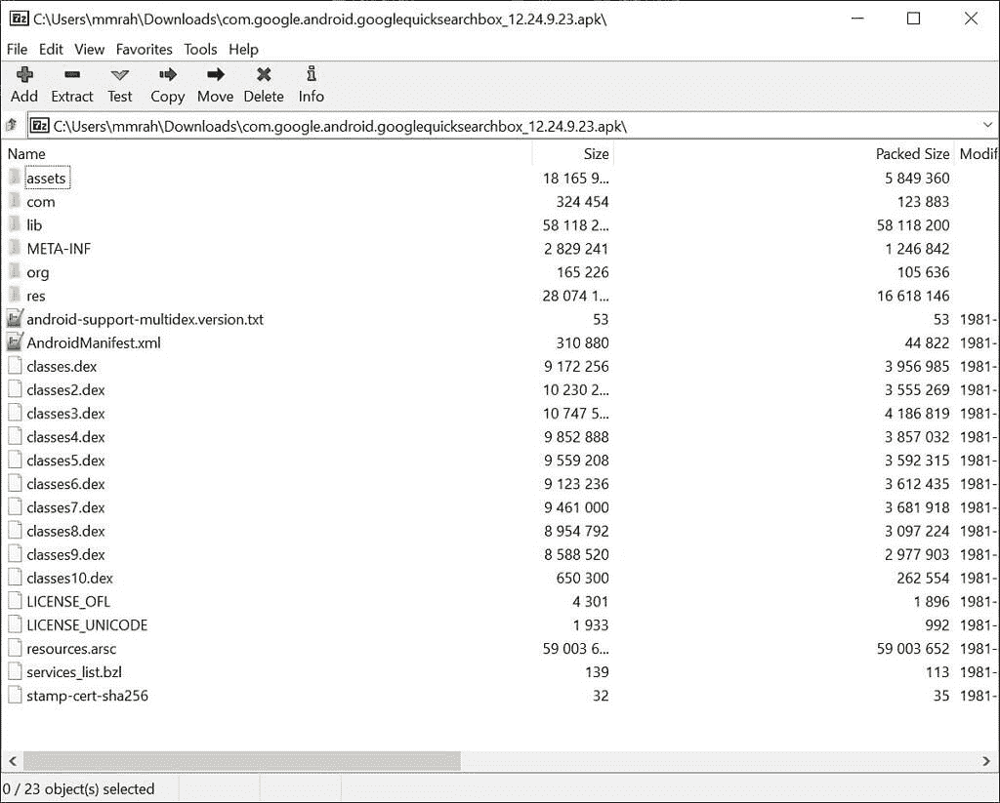
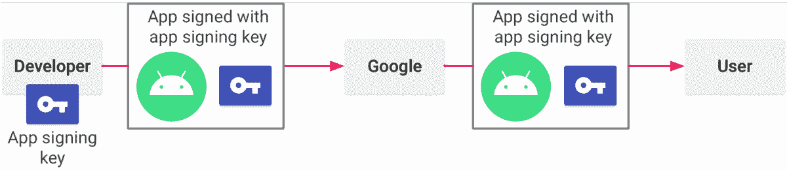
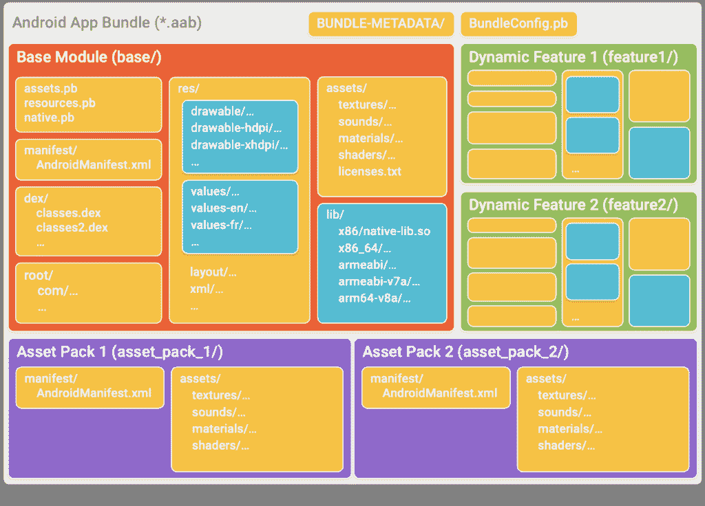
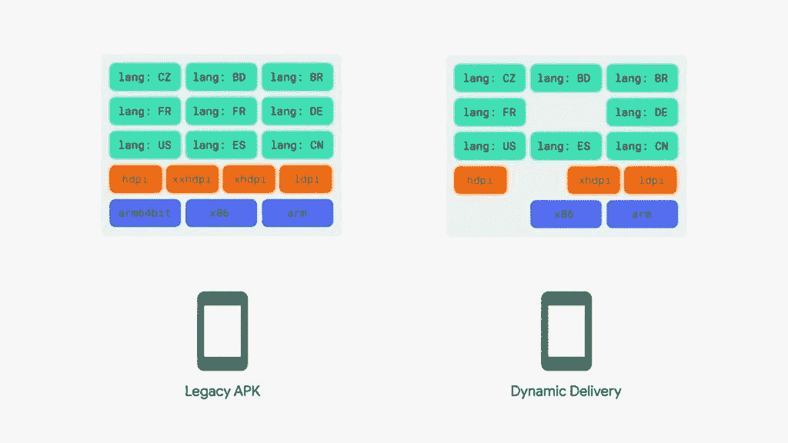
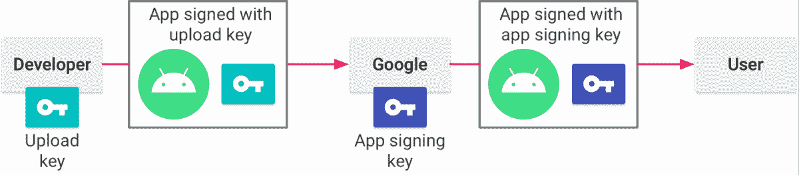
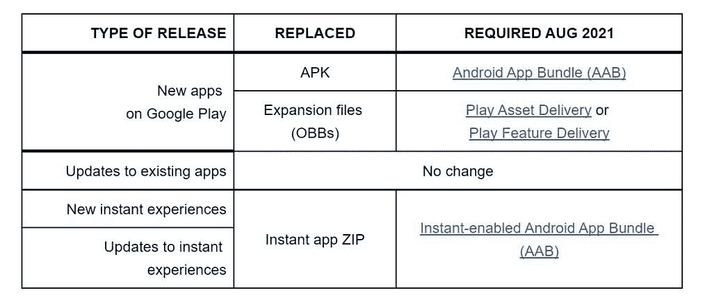
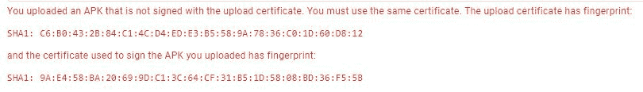
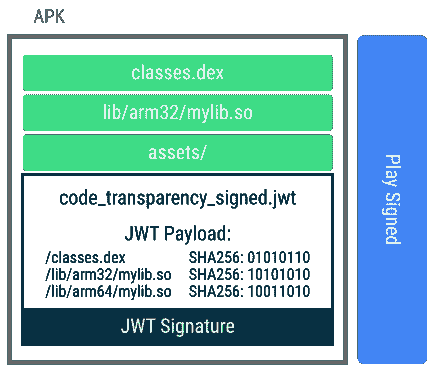
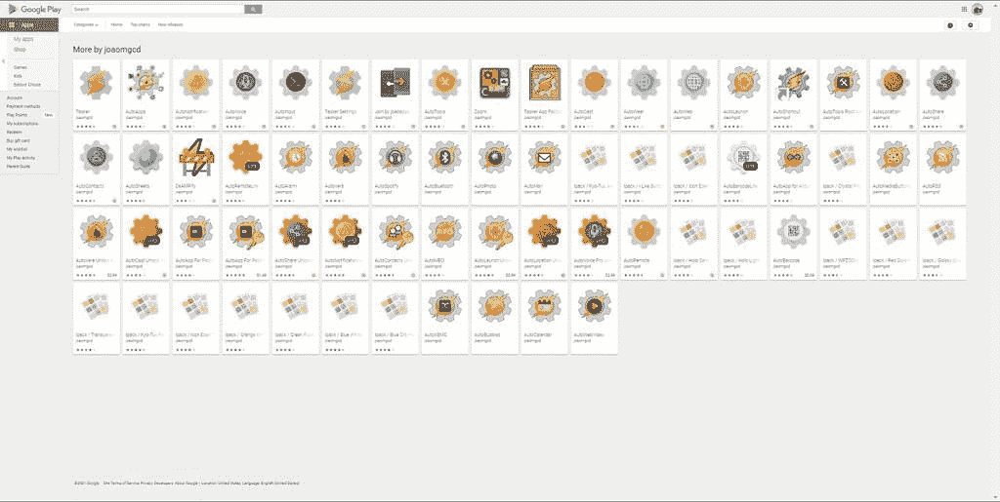
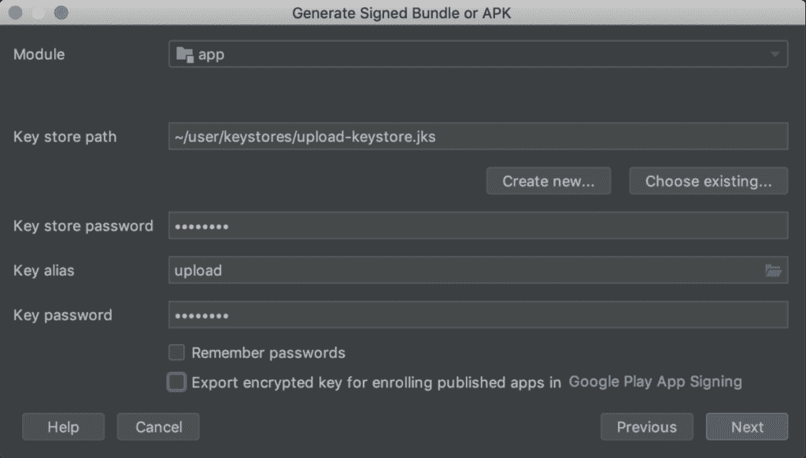

# 为什么 Google Play 的 APK 替代品吓坏了一些安全专家

> 原文：<https://www.xda-developers.com/google-play-apk-replacement-pros-cons/>

去年 11 月，[谷歌宣布](https://www.xda-developers.com/google-android-app-bundle-play-store/)开发者将被要求使用安卓应用捆绑(AAB)格式而不是 APK 在 Play Store 上发布新应用。就在几天前，谷歌提醒开发者这一即将到来的要求，引发了用户的争议，他们认为谷歌正在扼杀 apk，消除侧加载，阻碍第三方应用商店等等。

不管是作为用户还是开发者，Android 应用捆绑包确实与你可能习惯的经典 APK 格式有很大的不同。虽然使用应用捆绑包有很多好处，但有一个关键方面让一些开发人员和安全专家担心。

在本文中，我们将涵盖我们看到的对转向 Android 应用捆绑包的批评以及一些提议的解决方案，我们还将谈论谷歌对这些问题的提议解决方案。

## 背景

不过，在这之前，我们需要谈谈应用程序分发在 Android 上的一般工作方式。如果你已经知道应用签名和应用捆绑包是如何工作的，你可以跳过这一部分。

### APKs

在很大程度上，Android 上的应用程序分布在 APK 文件中。APK 包含应用程序的所有代码和资源，以及一些安全功能，如签名清单。安装 APK 时，它基本上只是被复制到一个特定的文件夹，并添加到已安装应用程序的内部数据库中。

 <picture></picture> 

The contents of an APK file can be explored just like archive file formats like .zip.

### 签名

在安装过程中，该应用程序的签名也会得到验证，以确保其有效。如果已经安装了应用程序，Android 会根据已经安装的应用程序检查新应用程序的签名。如果签名无效或不匹配，Android 将拒绝安装该应用程序。

签名检查是 Android 安全性的重要组成部分。它可以确保你正在安装的应用程序是有效的，并且至少与你已经安装的应用程序来自相同的来源。例如，如果你从 Play Store 安装了[我的锁屏小工具应用，你可以合理地确定我就是那个签名的人，并且它是可信的。如果你试图从一些可疑的第三方网站安装锁屏插件的更新，但失败了，你就会知道有人篡改了 APK，可能是添加了恶意软件。](https://play.google.com/store/apps/details?id=tk.zwander.lockscreenwidgets)

用于签署应用程序的密钥(理想情况下)*永远不会*公开发布。这就是所谓的私钥。然后，私钥用于生成应用程序签名中显示的密钥，即公钥。这是 Android 和应用程序商店用来验证应用程序有效性的工具。我不会详细讨论如何在不暴露私钥的情况下生成公钥，因为这涉及到大量的加密数学。如果你想了解更多细节，可以查看[谷歌关于签署 APKs](https://developer.android.com/studio/publish/app-signing) 的文档，或者研究一下单向数学函数。

 <picture></picture> 

Signing an app when you manage your own app signing key. Source: [Google](https://developer.android.com/studio/publish/app-signing#opt-out).

应用程序签名的另一个功能是能够将权限仅限于具有匹配签名的应用程序。Android 在内部为许多功能提供了这种功能，只有使用与框架相同的密钥签名的应用程序才能访问某些功能。

### 应用捆绑包

现在，我们已经对 apk 和签名进行了快速概述，让我们来谈谈应用捆绑包。这就是 APK 资源的用武之地。资源是像布局、图像、音频等东西。基本上，它们是任何不是代码的东西。为了更好地支持不同的显示配置和不同的语言，开发人员可以根据设备和语言制作同一资源的多个版本。

但是在 APK，所有这些资源都存在，不管你使用哪一种。而且它们占用空间。根据应用的复杂程度，许多设备可能会有大量未使用的资源。这就是应用捆绑包要解决的问题。开发者可以像 APK 一样生成一个应用捆绑包，然后可以像 APK 一样上传到 Play Store。

 <picture></picture> 

The contents of a sample Android App Bundle showing one base module, two dynamic feature modules, and two asset packs. Source: Google.

然后，谷歌使用该应用捆绑包为不同的设备配置生成一整套不同的 apk。每个应用捆绑包仅包含该配置所需的资源。当用户去下载该应用程序时，他们会得到与他们的配置相匹配的生成的 APK。这有助于减少应用程序下载和安装的大小，节省带宽和存储空间。

 <picture></picture> 

A graphic that shows how dynamic delivery can result in fewer resources being installed on a device. Source: Google.

当然，为你的设备安装一个特定的 APK 意味着你很难把它复制到另一个设备上，然后安装而不出问题。根据你的观点，这可能是一件好事，也可能是一件坏事。一方面，这使得盗版更加困难，因为用户不再拥有整个应用程序。另一方面，出于同样的原因，它使合法归档应用程序变得更加困难。

### 应用程序签名

由于 Android 应用捆绑包不是 apk，你不能打开一个 AAB 文件就直接安装到设备上。当你上传一个到 Play Store 时，Google 使用这个包来生成不同的(未签名的)APK 文件。这些 apk 在安装之前必须经过签名。

Google 没有要求开发人员签名并重新加载这些生成的 apk，而是自己管理签名。Play Store 要么使用自己创建的新密钥，要么向开发人员索要用于签署 apk 的密钥。无论选择哪一种，Google 都会为开发者处理公共签名，并提供一个上传密钥。谷歌使用上传密钥进行内部验证，并确保开发者上传的应用捆绑包(或 APK)是正确的。

 <picture></picture> 

Signing an app with Play App Signing. Source: [Google](https://developer.android.com/studio/publish/app-signing#app-signing-google-play)

如果上传密钥泄露或丢失，开发者可以申请一个新的，用于分发应用程序的签名密钥保持不变。

关于应用程序签名还有很多，但这是与本文相关的。如果你愿意，你可以在 Wojtek Kaliciński 的这篇文章中阅读更多关于应用捆绑和应用签名的内容。

## 批评

理论上和实践中，应用捆绑包都非常棒。它们减少了数据使用和安装规模，所有这些都不需要用户做任何事情。但是由于它的实现方式，一些开发者和安全研究人员在过去的几个月里提出了一些担忧。在我总结这些问题之前，我想花点时间说，下面写的大部分内容都是直接基于 *CommonsWare 的开发者 Mark Murphy 的一系列文章。你绝对应该看看他的文章，因为它们从开发者的角度提供了更多的细节和批评。*

### 安全性

在经典的分发模型中，开发人员保存他们用来签署 APK 私钥的密钥。它从不与公众共享，只有经过授权的人才能访问它。这确保了只有这些人才能生成有效的 APK。

但如果你在 Play Store 上使用应用捆绑包，谷歌是管理用户收到的 apk 签名密钥的人。从 2021 年 8 月开始，上传到 Google Play [的新应用的*默认*行为是谷歌创建自己的分发密钥，并对开发者保密。](https://www.xda-developers.com/google-android-app-bundle-play-store/)

 <picture></picture> 

Recap of what's changing for Google Play developers starting August 2021\. Source: Google

默认情况下，提交*新应用*的开发者将让谷歌管理他们的私钥，尽管提交*现有应用*更新的开发者可以继续使用 APKs **或**，他们可以通过为谷歌生成新密钥供新用户使用来切换到 AAB 发行版。现有应用*不需要*从 APK 发行版转换到安卓应用捆绑包，尽管他们可以选择这个选项。经过一番推诿之后，谷歌[甚至会让](https://android-developers.googleblog.com/2021/06/the-future-of-android-app-bundles-is.html#:~:text=I%E2%80%99m%20launching%20a%20new%20app.%20Can%20I%20decide%20what%20my%20app%20signing%20key%20is%3F)上传你自己的私人密钥供谷歌签署，不管是新的还是现有的应用。这些情况都不理想，因为无论如何，如果你想使用 Android 应用捆绑包，谷歌都可以访问你的私钥(如果开发者想在 2021 年 8 月后提交新的应用，他们没有选择！)

虽然我们相信谷歌非常重视安全问题，但世界上没有一家公司能免受数据泄露的影响。如果谷歌用来签署你的应用程序以供分发的密钥在其中一个漏洞中，那么任何人都可以签署你的应用程序的一个版本，并使它看起来像是由你签署的。一些开发者和安全专家对这种可能性并不满意。是的，这种可能性非常非常小，但是这种可能性确实让信息安全社区的一些人感到害怕。

让开发者签署 Android APKs 意味着任何人都可以从 Google Play 验证 apk，不需要盲目信任。这是一个优雅的设计，提供可验证的安全性。应用捆绑完全颠覆了这一点，似乎是为了促进厂商锁定。有许多替代技术方法可以提供仍然由开发者签名的小型 apk，但是这些方法不会优先考虑 Play。例如，所有的 APK 变体都可以由开发者生成并签名，然后上传到任何应用商店。

关于把私钥的安全存储交给谷歌还是交给个人开发者更好，肯定会有争论。但是那些开发人员(可能)通常不使用中央存储库来存放他们的密钥。通过强迫开发人员使用 Play 应用程序签名，恶意攻击者只需突破谷歌的安全一次，就可以检索到数千或数百万个密钥。

值得一提的是，以下是谷歌关于如何在其基础设施上保护您的签名密钥的说法:

[block quote author = " Wojtek kaliciński，Google 的 Android 开发人员倡导者"]当您使用 Play App Signing 时，您的密钥存储在 Google 用来存储自己密钥的同一基础架构中。

所有操作的密钥访问都受到严格的 ACL 和防篡改审计跟踪的控制。

所有使用开发者密钥生成和签名的工件都可以在 Google Play 控制台中查看/证明。

此外，为了防止密钥丢失，我们会非常频繁地备份主存储。这些备份是高度加密的，我们定期测试从这些备份中恢复。

如果你想了解谷歌的技术基础设施，阅读[谷歌云安全白皮书](https://services.google.com/fh/files/misc/security_whitepapers_march2018.pdf)。[/blockquote]

尽管如此，所有的声音、损失和盗窃仍然是可能的。审计跟踪只能帮助防止未来的攻击；他们拿不回被破解的密钥。

### 未经授权修改的可能性

谷歌建立应用捆绑包的一个大问题是，未经授权的修改可能会被添加到应用中。从应用捆绑包中提取 APK 的过程必然会涉及修改，因为谷歌必须手动构建每个 APK。虽然**谷歌已经承诺它没有也不会注入或修改代码**，但应用捆绑过程的问题是它有权力这样做。

以下是几个例子，说明处于谷歌位置的公司有能力做些什么:

假设有一个安全的消息应用程序，人们可以使用它进行通信，而没有政府监控的风险。对于抗议独裁政府的人，甚至是那些只想保护自己隐私的人来说，这可能是一个非常有用的工具。该政府希望能够看到应用程序用户在说什么，可能会试图强迫谷歌在应用程序代码中添加一个监视后门。

这个例子有点无关痛痒，但也是一些人关心的事情。假设有一个应用程序每天获得数百万次下载，但它没有任何广告或分析。这是一个巨大的数据源，却无法访问这些数据。作为一家广告公司，谷歌可能想要访问这些数据。

在经典的 APK 应用分发模式中，谷歌不能在不改变签名的情况下修改应用。如果谷歌改变了签名，尤其是在一个流行的应用程序上，人们会注意到，因为更新不会安装。但有了应用捆绑和应用签名，谷歌可以在发布应用之前悄悄地将自己的代码注入应用。签名不会改变，因为谷歌将拥有签名密钥。

 <picture></picture> 

In the classic APK distribution scheme, an updated APK file must be signed with the same key used to sign the original APK. This key is ideally held only by the individual developer. Source: Zachary Wander.

明确地说，**这些例子不太可能发生**。谷歌倾向于简单地[完全退出麻烦的市场](https://en.wikipedia.org/wiki/Google_China)，而不是适应。但即使不太可能，还是有可能的。仅仅因为一个公司承诺某件事不会发生，并不保证它会发生。

### 代码透明性

听到这些担忧，谷歌本周为应用捆绑包引入了一个名为[代码透明的新功能。代码透明性允许开发人员创建第二个签名，随应用程序一起提供给用户。这个额外的签名应该由一个单独的私钥创建，只有开发人员可以访问这个私钥。但是，这种方法有一些限制。](https://developer.android.com/guide/app-bundle/code-transparency)

 <picture></picture> 

How code transparency for Android App Bundles works. Source: Google

代码透明只涵盖代码。从名称上看，这似乎是显而易见的，但这也意味着它不允许用户验证资源、清单或任何不是 DEX 文件或本机库的东西。虽然对非代码文件的恶意修改通常影响较小，但这仍然是应用程序安全性的一个漏洞。

代码透明性的另一个问题是没有内在的验证。首先，**是一个可选的功能**，所以开发者必须记住为他们上传的每个新 APK 包含它。目前，它必须从命令行完成，并且使用 Android Studio 没有的`bundletool`版本。即使开发者包含了它，Android 也没有任何内置的验证来检查代码透明性清单是否与应用程序中的代码相匹配。

最终用户可以通过将清单与开发人员提供的公钥进行比较，或者将 APK 发送给开发人员进行验证，来自行检查。

虽然代码透明性允许确认应用程序中没有代码被修改，但它不包括对应用程序其他部分的任何验证。在这个过程中也没有内在的信任。你可以争辩说，如果你不信任谷歌，你可能会独立完成验证的任务，但你为什么要这么做呢？

正如来自 *CommonsWare* 的 Mark Murphy 所指出的[代码透明特性还有其他问题。我推荐阅读他的文章，对该特性进行更深入的分析。](https://commonsware.com/blog/2021/06/29/initial-thoughts-code-transparency.html)

### 开发者的便利和选择

第三个(也是本文的最后一个)原因是，一些开发人员对应用程序捆绑包有异议，因为这降低了便利性和选择性。

如果在谷歌开始要求应用捆绑包之后，开发者在 Play Store 上开发了一个新的应用，并且他们选择了让谷歌管理签名密钥的默认选项，那么他们将永远无法访问该签名密钥。如果同一个开发者想在另一个应用商店发布该应用，他们必须使用自己的密钥，这与谷歌的密钥不同。

这意味着用户将不得不从 Google Play 或第三方来源安装和更新。如果他们想改变源代码，他们必须完全卸载应用程序，可能会丢失数据，然后重新安装。像 [APKMirror](http://apkmirror.com/) 这样的 APK 聚合器也将不得不处理同一个应用的多个官方签名。(从技术上来说，他们已经不得不这么做了，因为应用签名让你为新用户创建一个新的、更安全的密钥，但当每个人*都不得不*这么做时，这对他们和其他网站来说会更糟。)

Google 对此问题的回应是使用 Play 控制台中的 App Bundle explorer 或 Artifact explorer 从上传的 Bundle 中下载生成的 apk。类似于代码透明，这不是一个完整的解决方案。从播放控制台下载的 apk 将被分割用于不同的设备配置文件。虽然 Play 控制台确实支持为一个应用程序的一个版本上传多个 apk，但许多其他分发渠道不支持。

因此，当开发人员管理多个商店时，使用应用捆绑包的许多好处都消失了，使得分发更加困难。有消息称 [Windows 11](https://www.xda-developers.com/windows-11) 正在[获得 Android 应用支持](https://www.xda-developers.com/windows-11-android-apps/)这要归功于亚马逊应用商店，一些人认为应用捆绑的要求会阻碍开发者在亚马逊上分发。当然，谷歌主要担心的是自己的应用商店，但这正是[让他们陷入困境的原因，竞争对手](https://www.xda-developers.com/fortnite-circumvents-google-play-fees-direct-payment-option/)导致他们对第三方应用商店在 Android 上的工作方式做出[小规模的和解性改变](https://www.xda-developers.com/android-12-alternative-app-stores-update-apps-background/)。

多个商店的几个相关问题是应用程序互连和快速测试。

让我们从应用程序互联性开始。你有没有下载过在付费墙后面锁定功能的应用？几乎可以肯定。一些开发者将这些功能放在应用内购买的背后，但其他人可能会选择制作一个单独的付费应用。安装附加应用程序后，主应用程序的功能将被解锁。

但是，是什么阻止人们安装来自盗版的附加软件呢？嗯，开发人员有很多选择，但至少有一个涉及到使用签名保护的权限。假设主应用程序声明了一个受签名保护的权限。然后，附加应用程序声明它想要使用该权限。理想情况下，附加应用程序还将具有某种许可证验证功能，连接到互联网以确保用户是合法的。

如果两个应用程序具有相同的签名，Android 将授予附加应用程序权限，盗版保护检查将通过。如果附加应用程序没有正确的签名，则不会授予权限，并且验证将失败。

在经典的 APK 发布模式下，用户可以从任何合法渠道获得任何一款应用，然后就可以使用它了。使用当前默认的应用捆绑模型，主应用和附加应用上的签名将不匹配。谷歌将为每个应用程序制作一个唯一的密钥。开发人员总是可以取消受签名保护的权限，并使用直接签名哈希验证，但这样安全性要差得多。

然后是速射测试。用户总是给开发者发邮件，询问他们应用中的问题。有时这些问题只是简单的修复:重现问题，找到问题，修复问题，然后上传新版本。但有时并非如此。有时候开发人员不能重现一个问题。他们可以修复他们认为的问题，但是用户必须测试它。现在假设用户通过 Google Play 安装了该应用程序。

使用 APK 模型，开发人员可以更改一些代码，构建并签署一个新的 APK，然后将其发送给用户进行测试。由于测试 APK 的签名与用户安装的签名相匹配，因此更新、测试和报告过程非常简单。有了应用捆绑包，这一点就不存在了。由于谷歌签署了用户最初安装的 APK，它不会匹配开发者发送的 APK 的签名。如果这款应用在应用捆绑包截止日期之后发布，开发者甚至无法获得谷歌使用的密钥。为了进行测试，用户必须在安装测试版本之前卸载当前的应用程序。

这里有一堆问题。首先，对开发者和用户来说都不方便。不得不卸载应用程序只是为了测试一个修复并不好玩。如果问题消失了呢？是开发者做的改动，还是因为用户有效清除了应用的数据？Play Store 确实有内部测试，这是为了让开发者快速构建和发布，但它要求用户首先卸载发布版本。这并不能解决任何问题。

如果这一切听起来像一堆假设的废话，这里有一个非常真实的例子，如果他们让谷歌为他们生成一个私钥，就会有这些问题的开发人员:joo Dias。他是 Tasker 以及包括 AutoApps 套件在内的一大堆插件应用的开发者。有了新的应用捆绑包需求，joo 的开发周期可能会变得更加棘手，至少对于新应用来说是这样。直接发送测试版本会不太方便。验证许可证的效率会降低。

 <picture></picture> 

João Dias maintains a lot of apps that all rely on a shared license. If there are two signing keys involved, things could get really complicated for him.

这听起来可能有点极端，但 joo 并不是某个小开发人员，他可能并不孤单。Play Store 上有许多应用程序依赖签名验证来检测非法用户。

当然，有了开发者上传自己的签名密钥到 Google 的新选项，这些问题至少在一定程度上得到了缓解。但开发者必须选择加入，才能为每个应用程序启用该选项。如果他们不这样做，互连将失败，快速支持将需要上传一个包到谷歌，并等待 apk 生成，然后将正确的发送给用户。此外，这仍然意味着他们必须共享他们的私钥，这将我们带回到了我们之前讨论的问题。

## 解决方法

这是一个老问题，因为几个月前就公布了应用捆绑需求，所以在此期间提出了很多解决方案。

一种解决方案是避免 Play 应用程序签名的需要。谷歌不用生成一个应用捆绑包，然后处理成 apk 和签名，这种处理可以由 Android Studio 来完成。然后，开发人员只需上传一个 ZIP 文件，其中包含 Google 生成的每个配置的本地签名 apk。

有了这个解决方案，谷歌根本不需要访问开发者的密钥。该流程与经典的 APK 分销模式非常相似，但会涉及多个更小的 apk，而不是一个。

 <picture></picture> 

Signing your app in Android Studio with your own upload key. Source: [Google](https://developer.android.com/studio/publish/app-signing#sign_release)

另一个解决方案是不要求使用应用捆绑包，继续允许开发者上传本地签名的 apk。虽然在许多情况下，应用捆绑包可能对用户来说是更好的体验，但一些应用实际上并没有从按配置拆分中受益，其大小减少很少。

如果谷歌实现了这两种解决方案，那么一个想要使用应用捆绑包的开发者就不必将签名交给谷歌，一个其应用不会从该格式中受益多少的开发者就根本不必使用它。

## 谷歌的回应

### 自签名

当他们第一次被问及允许开发者处理应用捆绑包的签名时，谷歌的回答非常含糊:

[block quote author = " "]所以，我简要地谈到了明年新应用程序使用应用程序捆绑包的要求，随之而来的一件事是，通过扩展，我们将要求 Play 应用程序签名。因此，开发人员需要在 Play 上生成应用签名密钥，或者上传他们自己的密钥来播放…因为这是应用捆绑包的先决条件。我们从开发人员那里听说，他们中的一些人就是不想这么做。他们不想让钥匙由 Play 管理。目前，如果你想使用应用捆绑包，这是不可能的。

但是，我们已经听到了反馈，而且…我现在不能谈论任何事情，我们没有什么要宣布的，但是我们正在研究如何减轻这些担忧。上传包时，不一定要允许保存自己的密钥。我们正在考虑不同的选择。我们只是现在没有解决方案可以公布。但是，我们仍然有大约一年的时间来满足需求，所以我真的希望我们能为开发者提供一个答案。[/blockquote]

那是去年 11 月下旬，好像什么都没发生。距离[应用捆绑包要求生效](https://www.xda-developers.com/google-android-app-bundle-play-store/)只有几个月了，开发者仍然没有办法处理自己应用的签名。虽然谷歌现在已经让*上传*你自己的密钥给新的和现有的应用成为可能，但这仍然把签名部分从开发者手中拿走了。

### 代码更改

虽然谷歌已经明确承诺 Play Store 不会修改应用程序代码，但承诺并不是保证。有了应用捆绑和应用签名，就我们所知，没有任何技术限制可以阻止谷歌在发布前修改上传的应用。

Google 已经引入了[代码透明性](https://developer.android.com/guide/app-bundle/code-transparency)作为一个可选特性，虽然这有所帮助，但正如我们之前讨论的那样，它也有一些问题。

### 自制捆绑包

当谷歌被问及允许开发者制作自己的应用“捆绑包”(包含分裂 apk 的 zip)时，回答基本上是“我们不会这么做”:

可能不像问题中描述的那样，因为这将使发布过程对开发者来说更加困难，我们实际上想使它更简单和安全。然而，我们再次听到了这一反馈，我们将研究如何实现这一点的选项，但可能不是以这里描述的方式。

有趣的是，谷歌的理由似乎是这将使出版更加复杂。然而，谷歌仍然可以将这个过程自动化，作为 Android Studio 中 APK 生成对话框的一部分。此外，如果有问题的应用程序在多个商店分发，它实际上会使发布过程更简单，因为开发者不必管理多个签名密钥和用户的投诉。

随着代码透明性的引入，复杂性似乎不再是一个问题。代码透明性，至少现在，要求开发者使用命令行工具，并让用户明确验证他们所使用的应用程序的有效性。这比自己制作捆绑包的过程更复杂，目前还不清楚为什么这是谷歌更喜欢的解决方案。

## 前进

从 8 月 1 日开始，应用捆绑包将成为提交到 Google Play 的新应用的必需分发格式。虽然谷歌至少在某种程度上解决了开发者和安全专家提出的大部分问题，但这些回应仍有许多不足之处。作为下一代分发格式，应用捆绑包有许多明显的好处，但将应用签名的部分或全部控制权交给谷歌总会有挥之不去的担忧。

谷歌的回应和努力当然值得赞赏，但有些人，比如马克·墨菲，觉得他们做得还不够。随着像自制捆绑包这样的解决方案没有得到实施，以及要求 Android 应用捆绑包的最后期限即将到来，Google Play 上的开发者似乎无法长时间保持对其应用的完全控制。

* * *

今天下午晚些时候，我们将在 Twitter 空间讨论 Android 应用捆绑需求的含义，所以加入我们吧！