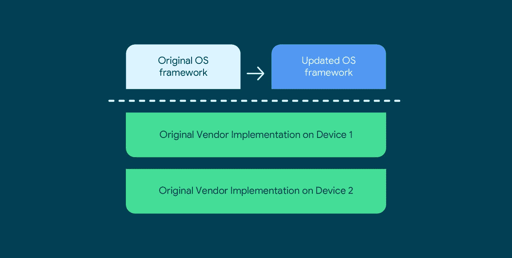
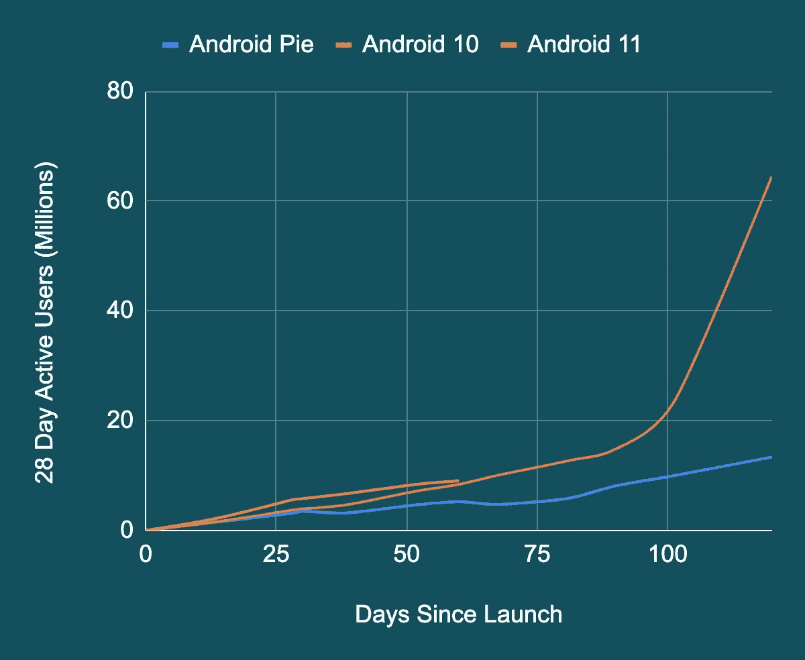

# 谷歌，高通合作伙伴，为新芯片组带来 4 操作系统 Android 更新

> 原文：<https://www.xda-developers.com/google-qualcomm-4-android-os-updates/>

三年前，谷歌[宣布了 Project Treble](https://www.xda-developers.com/googles-project-treble-modularize-android-so-oems-can-update-devices-faster/) ，这是 Android 的一次重大重组，旨在加速软件更新。虽然 Project Treble 引入的架构帮助原始设备制造商加快了主要 Android 操作系统更新和每月安全补丁的交付速度，但它对高通等 SoC 提供商产生了不利影响。事实上，Treble 实际上增加了复杂性，从而增加了为任何给定芯片组提供 Android 操作系统更新支持的工程成本。这限制了高通能够为其 SOC 提供的支持时间，但这种情况很快就会改变。所有骁龙 SOC 均采用 Android 11 或更高版本——从[的骁龙 888](https://www.xda-developers.com/qualcomm-snapdragon-888-explained-specs-features/) 开始，高通将支持 3 次 Android OS 版本更新(发布版本+ 3 次字母升级)以及 4 年的安全更新。这比他们之前为旗舰 800 系列芯片组提供的时间多了一年。

今天的声明意义重大，但如果没有谷歌 3 年前试图通过 Project Treble 实现的背景知识，就无法理解它。

Treble 在 Android OS 框架(包括所有 UI 代码、API 和应用程序交互的系统进程)和特定于设备的底层软件(包括底层 Linux 内核和硬件抽象层，或 HALs)之间创建了一个分裂。特定于设备的低级软件通过定义明确、稳定的[供应商接口](https://source.android.com/devices/architecture/vintf)与 Android OS 框架通信。每个 Android 操作系统版本都保证了与供应商实现的向后兼容性，谷歌通过使用供应商测试套件(VTS)来确保这一点，这是一个标准化的合规性测试套件。这意味着，例如，Android 11 OS 框架向后兼容为 Android 10 设计的供应商实现。事实上，对于每一个新的 Android 版本，Google 都会发布通用系统映像(GSI ),这是一个源代码构建的系统映像，可以向后兼容供应商实现的最后 3 个版本。当 OEM 制造新的 Android 设备时，他们可以自由修改 Android 操作系统框架以引入新的专有功能和 API，但他们必须确保设备的供应商实现与 GSI 兼容。

 <picture></picture> 

Thanks to the Treble architecture, the same Android OS framework code can be reused across different vendor implementations. That's the "Generic" in Generic System Image. Source: Google.

这主要是 Treble 如何减少碎片并加快新操作系统更新的交付速度——由于稳定的供应商接口，当 Android 操作系统框架(由谷歌提供的开源软件)和特定于设备的低级软件(通常是封闭源代码的，并根据与 SoC 供应商的合同提供)配对时，破坏会少得多。理想情况下，这意味着 OEM 厂商可以花更少的时间来修复硬件漏洞，而花更多的时间在最新的 Android 操作系统版本上移植他们的系统级更改。事实上，自从 Treble 推出以来，谷歌表示，原始设备制造商采用最新 Android 操作系统的速度比以前快得多。谷歌表示:“Android 11 推出时，Android 10 有 6.67 亿活跃用户，其中 82%是通过空中下载(OTA)更新获得 Android 10 版本的。”。

 <picture></picture> 

Adoption of Android 9 Pie versus Android 10 versus Android 11\. Source: Google.

因为每个新的 Android 版本都增加了对更多硬件功能的支持(操作系统需要支持新功能以跟上移动行业的快速发展)，所以谷歌需要更新该版本的供应商界面。因此，该公司定义了新的 HAL 要求，并强制要求新的 Linux 内核版本，但他们只要求设备*启动*新的 Android 操作系统版本，以实际支持这些影响供应商的变化。例如，如果谷歌修改 Android 的摄像头 HAL 以支持多个后置摄像头传感器，则只有使用新 Android 版本的新设备才必须支持更新的 HAL，而升级到新版本的旧设备可以重用其旧供应商实现，而没有新的摄像头 HAL 要求。从 OEM 的角度来看，这降低了将新的 Android 操作系统版本引入旧设备的成本和复杂性。然而，问题是这种方法给高通、联发科技等 SoC 厂商带来了额外的复杂性。

由于这种设计原则，高通和其他 SoC 供应商必须支持 Android OS 框架软件和供应商实现的多种组合。支持特定芯片组的 3 代 Android 操作系统版本的 SoC 供应商必须支持操作系统框架软件和供应商实施的 6 种组合。这是因为虽然 OEM 厂商可以通过重用旧的供应商实现来回避新的 HAL 和 Linux 内核版本要求，但 SoC 供应商必须确保他们的供应商实现支持旧的和新的要求。他们不能挑挑拣拣。再乘以一个 SoC 供应商必须支持的几十个芯片组，您就会发现 Treble 实际上增加了他们的复杂性。

正是因为这个原因，高通和其他 SoC 供应商通常只为特定芯片组提供最多 2 次操作系统字母升级和 3 年安全更新。虽然我不知道确切的成本，但我认为像高通这样的 SoC 供应商支持芯片组超过这个时间在经济上是不可行的。我们已经看到高通和其他 SoC 供应商有时会提供更长时间的支持，但这[取决于原始设备制造商的需求](https://www.xda-developers.com/microsoft-surface-duo-3-years-os-security-updates-unlockable-bootloader/)以使其更经济。如果不存在这样的需求，那么 OEM 厂商就要承担开发新 Android 版本的主要成本——而[这并不是一件容易的事情](https://www.xda-developers.com/fairphone-2-android-9-pie-beta/)。但由于谷歌和高通的共同努力，后者现在将支持 4 个 Android 操作系统版本和 4 年的骁龙芯片组安全更新，从高通骁龙 888 开始。

为了实现这一点，谷歌将 Project Treble 的“无追溯原则”扩展到了 SOC 和设备。这意味着新的 HAL 和 Linux 内核版本要求对于 SOC 来说是不可追溯的。因此，例如，采用 Android 11 的 SoC(如骁龙 888)可以重用相同的供应商实现来支持 Android 12 至 Android 14。因此，SoC 供应商可以为特定芯片组开发一个单板支持包(BSP)以分发给 OEM，而不是维护多个版本的 BSP，每个新的 Android 版本都需要更新 BSP。这极大地降低了与在特定芯片组上支持 Android 相关的工程成本，使高通等 SoC 供应商能够更长时间地支持他们的芯片组。

谷歌还与高通合作，确保后者在多个高通芯片组上重用相同的操作系统框架软件，进一步减少高通必须支持的操作系统框架和供应商实施组合的数量。SoC 供应商目前正在修改 AOSP 框架代码，并构建自己版本的通用系统映像。例如，高通的叫做 QSSI，而联发科的叫做 MSSI。这些特定于 SoC 的系统映像现在将保证与多种芯片组以及旧的供应商软件兼容，就像谷歌的 AOSP GSI 一样。

 <picture></picture> 

A hypothetical software support timeline for an SoC vendor that has implemented the new no-retroactivity principles. Source: Google.

采用高通骁龙 888 的设备预计将很快推出，首先是小米 Mi 11 和三星 Galaxy S21 系列。虽然我们希望谷歌和高通的声明意味着所有骁龙 888 设备将获得 3 年的 Android 操作系统和安全补丁更新，但不能保证这将是事实。原始设备制造商仍然需要投入大量资金来开发和分发新的操作系统版本——但现在更有可能发生的是，高通自己将支持 4 个 Android 操作系统版本。我们希望一家或多家原始设备制造商能够利用今天的发布会，宣布为他们未来搭载骁龙 888 的旗舰手机提供扩展的软件支持。大多数原始设备制造商目前只提供 2 年的 Android 更新，而三星和谷歌都承诺 3 年。与苹果相比，这仍然太短了，而且已经被正确地喊了很多很多次，并将继续被喊，直到差距缩短。

至于其他 SoC 供应商，谷歌正在与他们谈判，以应用这一新的无追溯性原则，这样他们也可以为他们的芯片组提供扩展的软件支持。我们没有得到联发科或其他 SoC 供应商的任何确认，但我们认为他们没有理由不同意这个想法——至少对于新的芯片组来说。根据谷歌的说法，他们预计大多数情况下只有新推出的 SOC 才会利用这些变化，所以不要指望你当前的任何设备都会因为今天的公告而获得扩展的软件支持。

*本文于美国东部时间 2020 年 12 月 16 日下午 1:50 更新，将标题中的“设备”更改为“芯片组”，以更好地反映更改将在何处生效。由谷歌提供的额外信息已添加到文章中。*

*这篇文章在美国东部时间下午 2:10 更新，以反映谷歌和高通承诺支持 4 个 Android 操作系统版本——意味着发布加上 3 年的 Android 操作系统更新——而不是 4 年的操作系统更新。不过，高通承诺提供 4 年的安全更新。*