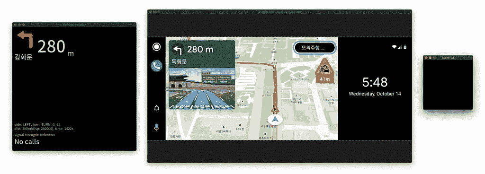

# 谷歌发布 Android for Cars 应用程序库，让开发者为 Android Auto 创建应用程序

> 原文：<https://www.xda-developers.com/google-releases-android-for-cars-app-library-developers-create-apps-android-auto/>

# 谷歌发布 Android for Cars 应用程序库，让开发者为 Android Auto 创建应用程序

谷歌今天发布了新的 Android for Cars 应用程序库，以帮助开发人员为 Android Auto 构建应用程序。

今年 8 月早些时候，谷歌宣布，它已经开始与几个著名的导航、停车和电动汽车充电应用程序背后的开发者合作，以便为 Android Auto 带来新类别的应用程序。合作产生了新的 Android for Cars 应用程序库，该公司[现在发布了](https://android-developers.googleblog.com/2020/10/introducing-android-for-cars-app-library.html)该库的开放测试版，供任何应用程序开发者使用。

 <picture></picture> 

ChargePoint, SpotHero, and Sygic apps for Android Auto

根据 Android 开发者博客最近的一篇文章，Android for Cars 应用程序库将允许开发者在 Android Auto 上设计、开发和测试他们自己的导航、停车和充电应用程序。谷歌将公开测试版分为三个阶段，以帮助开发者的每一步。在设计阶段，该公司发布了[设计指南](https://developer.android.com/training/cars/Android%20for%20Cars%20App%20Library%20design%20guidelines.pdf)和[应用质量指南](https://developer.android.com/docs/quality-guidelines/car-app-quality)，以确保新应用针对平台进行了优化，并遵循最佳安全实践。

 <picture></picture> 

DHU simulating an instrument cluster, a widescreen head unit, and a touchpad

一旦开发人员完成了设计，他们就可以进入开发阶段。在这个阶段，谷歌提供了一个开发者指南，让开发者更容易为这个平台开发应用。最后，在测试阶段，开发者将能够在模拟汽车信息娱乐显示器的[Android Auto Desktop Head Unit emulator](https://www.xda-developers.com/google-releases-updated-android-automotive-emulator-image-with-play-store/)上测试他们的应用。为了进一步简化流程，谷歌更新了模拟器，支持[多屏幕尺寸](https://developer.android.com/training/cars/testing#configure-dhu)，在[仪表组](https://developer.android.com/training/cars/testing#instrument_cluster)中显示信息，并通过[触摸板输入](https://developer.android.com/training/cars/testing#test-touch)模拟车辆。

如果您有兴趣将您的应用程序引入 Android Auto，您可以通过点击[此链接](https://developer.android.com/training/cars/navigation)开始使用 Android for Cars 应用程序库。用新库开发的应用程序将在未来几个月内在谷歌 Play 商店上发布。