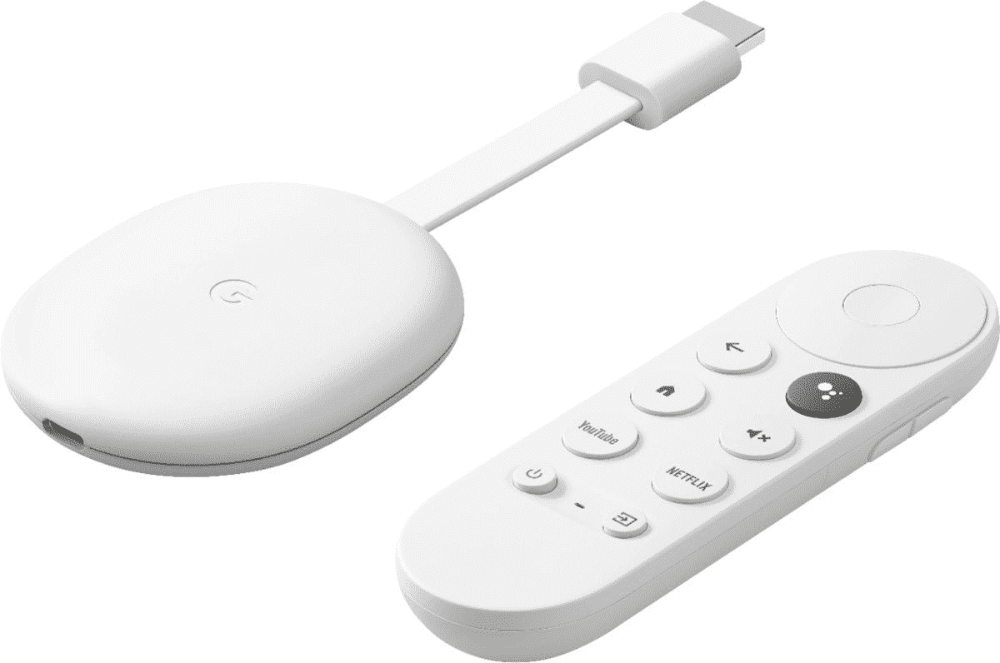

# 谷歌 Stadia 的家庭选择由于直接游戏而增加了六个

> 原文：<https://www.xda-developers.com/google-stadia-outright-games-showcase/>

由于新公布的游戏名称，谷歌体育场的游戏库将增加六个。这不是，但是对于那些家里有年轻球员的人来说，这是个好消息。outlete Games 一直是 Stadia 的坚定支持者，该平台上已经有该出版商的许多适合家庭的游戏。在今天的展示活动中，又有六款游戏被详细介绍到谷歌的云端。

所有六款游戏目前都计划于 2022 年推出，从 7 月开始，一直持续到夏季和秋季。每个都有一个著名的许可证，包括一个新的星际迷航标题。所以，也许大孩子和小孩子都会对这个感兴趣。

这里有一个从直接比赛到体育场的快速纲要，以及什么时候。

### DC 超级宠物联盟:氪星和王牌大冒险

在即将上映的电影中，DC 超级宠物将你扮演成超人和蝙蝠侠最喜欢的四条腿的朋友。穿着斗篷。殴打机器人，保持大都会的街道安全，拯救其他可爱的动物，从你的眼睛发射激光。DC 超级宠物联盟:克里普托和艾斯冒险将于 7 月 15 日在 Stadia 推出。

### 爪子巡逻:大奖赛

\ r \ nht TPS://www . YouTube . com/watch？v=XvpedX5sxsE\r\n

你能有太多的卡丁车选手吗？显然不是，对于那里的年轻人来说，这是一个带爪子的巡逻队。在多达四人的分屏合作游戏中，赛车在众所周知的 Paw 巡逻地点上路，有加电、定制和障碍。对于年轻玩家来说，有一个方便的自动加速控制选项，而更有经验的选手可以体验硬模式。爪子巡逻:大奖赛将于 9 月 30 日启动。

### 星际迷航神童:超新星

\ r \ nht TPS://www . YouTube . com/watch？v=QDd2IOwgz2c\r\n

在原恒星从一颗将死的恒星上获得奇怪的读数后，达尔·雷尔和格温达拉争分夺秒地拯救他们的朋友、他们的飞船、新的外星物种和整个行星系统，以免被超新星毁灭

Supernova 是一款单人或合作的动作冒险游戏，背景是《星际迷航》中的神童宇宙，将于 10 月在 Stadia 首次亮相。

在年底前首次亮相体育场的还有:

*   **我的小马:Maretime 冒险-** 夏季上市
*   **L.O.L. **惊喜！B.B 的生来旅行-****10 月 7 日下水
*   梦工厂的龙:**《九界传说》——**将于秋季推出

Stadia 正在成为孩子们玩游戏的好地方，虽然这些游戏不会引起每个人的兴趣，但对年轻人来说还是有很多值得期待的。Stadia Pro 中也包含了一些以前的爆发游戏，所以预计这些游戏中的任何一个或所有游戏都会随之而来。

 <picture></picture> 

Chromecast with Google TV (4K) - Snow

##### 带谷歌电视的谷歌 Chromecast

这是一种在电视上播放 Stadia 的经济实惠的方式，还能运行 Google TV。将您最喜欢的控制器配对，您就可以开始了！