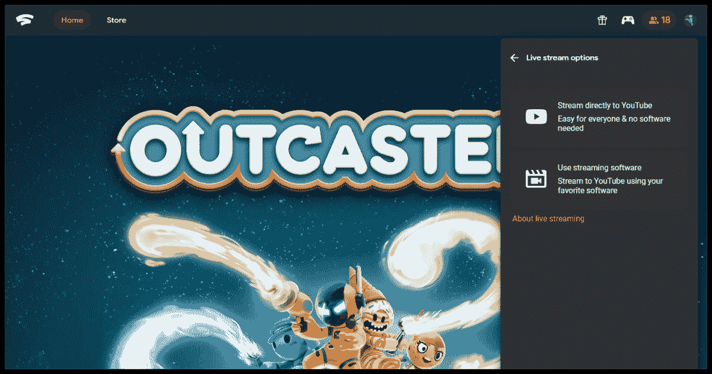

# 谷歌 Stadia 推出 YouTube 直播支持

> 原文：<https://www.xda-developers.com/google-stadia-youtube-live-streaming/>

# 谷歌 Stadia 推出 YouTube 直播支持

谷歌已经证实 Stadia 和 YouTube 之间延迟的整合正在启动，允许从云端向世界直播

谷歌终于实现了它最承诺的功能之一，该服务上线时还没有准备好。从明天开始，所有用户都可以在 YouTube 上直播他们的比赛，纠正了一个导致一些用户放弃这项服务的疏漏。除了流媒体，YouTube 的整合将使人们更容易看到创作者在做什么。唉，提供网页链接来加入正在进行的游戏的计划似乎不会在这次更新中实现。根据 *[9to5Google](https://9to5google.com/2020/12/07/stadia-youtube-streaming-rollout/)* 和 [*The Verge*](https://www.theverge.com/2020/12/7/22162574/google-stadia-opens-youtube-livestream-feature-december-8) ，你只要给你的流命名并确认它是否适合儿童就可以了。

 <picture></picture> 

Credits: 9to5Google

到目前为止，流媒体质量还没有被提及，尽管谷歌在 Stadia 的发布会上表示将支持 4K，但我们还无法确认这是否属实。有人猜测 4K 将留给 Stadia Premium 用户。

谷歌 Stadia 的推出对谷歌来说是非常“品牌化”的，因为有几个功能还没有准备好，后来才添加进来。除了整合 YouTube 之外，Stadia 还推出了不支持谷歌 Chromecast 设备的产品，除了与控制器捆绑在一起的高端 Chromecast Ultra。Chromecast 和谷歌电视将于明年年初加入，而 Nvidia Shield 用户已经取得了一些成功。

缺乏对 YouTube 的启动支持并没有证明 Stadia 的资格。与当前一代的实体游戏机相比，谷歌最初对该平台的兴趣仍然相形见绌，因此它需要努力展示云游戏可以做的更多事情。这一点在即将上映的《赛博朋克 2077》中表现得最为明显，这被视为 Stadia 展示其实力的第一次重大机会。

至于 YouTube 集成，如果你的应用是最新的，你可能会发现该选项已经被添加，但仍然是灰色的。这个问题应该会在明天服务上线时自行解决。