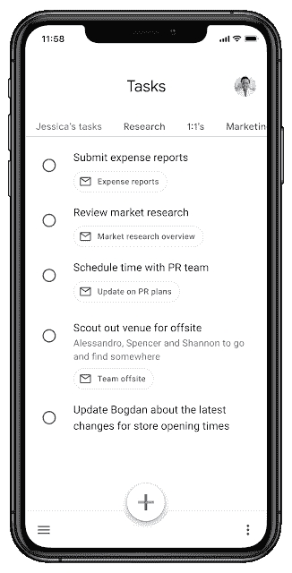

# 谷歌任务现在将你的列表组织成标签

> 原文：<https://www.xda-developers.com/google-tasks-now-organizes-your-lists-into-tabs/>

# 谷歌任务现在将你的列表组织成标签

谷歌任务移动应用现在有一个标签栏，可以在任务列表之间快速切换。

从技术上讲，谷歌任务作为 Gmail 的一部分已经存在多年，但它只是在 2018 年成为一项独特的服务，当时手机应用程序[发布](https://www.xda-developers.com/google-tasks-app-android/)。自那以后，谷歌一直在为任务带来新的功能，最近的一次是与[的谷歌日历整合](https://www.xda-developers.com/google-calendar-integration-tasks-more-widely-available/)。一个新的更新正在为移动应用程序推出，它重新组织了你的任务列表以便于访问。

Google Tasks 支持多个任务列表，这有助于组织，但移动应用程序目前需要至少两次点击才能在它们之间切换。谢天谢地，[终于改变了](https://workspaceupdates.googleblog.com/2021/08/easily-switch-between-lists-in-google.html)，因为谷歌增加了一个标签栏来方便列表切换。你可以点击你想要的标签，或者在它们之间左右滑动。

 <picture></picture> 

The new Tasks UI (Credit: Google)

新的任务更新于 8 月 9 日开始推出，它应该会在接下来的 13 天内到达每个人。谷歌没有说 Gmail 网络应用中的任务是否会收到类似的更新。像它的大多数竞争对手一样，让 Tasks 拥有自己的专用桌面应用程序也是一件好事。