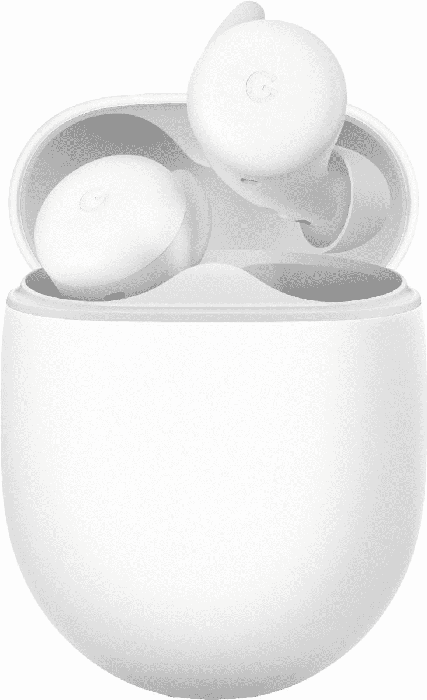

# 谷歌更实惠的 Pixel Buds A 耳塞在美国上市。

> 原文：<https://www.xda-developers.com/googles-more-affordable-pixel-buds-a-earbuds-go-on-sale-in-the-u-s/>

本月早些时候，谷歌[发布了一对新的耳塞](https://www.xda-developers.com/pixel-buds-a-unveiled/)，被称为 Pixel Buds A。谷歌最新的真正无线耳机是去年推出的更优质的 Pixel Buds 的淡化版本。虽然耳塞从发布日起就可以预购，但没有确认它们何时真正上市销售。但是今天这种情况发生了变化。在宣布两周后，Pixel Buds A 终于在美国上市了。

Pixel Buds A 售价 99 美元，你可以从各种零售商那里买到，包括谷歌商店、[百思买](https://shop-links.co/1743770960813743361?u1=bf09663c-ca93-49c1-90dd-d227fb7583c4)、[沃尔玛](https://www.walmart.com/ip/Google-Pixel-Buds-Clearly-White/661564183)和塔吉特百货。你可以选择明显的白色或更低调的深橄榄色。但是是什么让像素芽 A 如此特别呢？首先是价格。

售价 99 美元，比其更高端的同类产品 Pixel Buds 便宜得多，后者的零售价通常在 179 美元左右。在设计方面，它们看起来或多或少与 Pixel Buds 相同。更不用说它们还保留了高级型号的许多功能，如自适应音频、低音增强、IPX4 防汗和触摸感应控制。你会失去无线充电和滑动音量控制等功能，但考虑到价格差异以及你获得相同音频质量和其他核心功能的事实，这对大多数人来说应该不是什么大问题。

 <picture></picture> 

Google Pixel Buds A-Series

##### 谷歌像素芽 A

Pixel Buds A 以非常实惠的价格提供了第二代 Pixel Buds 的所有最佳功能。

在电池寿命方面，耳塞声称可以连续使用长达 5 小时，在充电情况下可以长达 24 小时。它们没有主动噪音消除功能，但你可以通过降低环境噪音来减少通话噪音。与第二代 Pixel Buds 相比，Pixel Buds 还提供了更好、更稳定的蓝牙连接。

如果你不完全喜欢 Pixel Buds A，一定要看看我们列出的适合各种使用情况和需求的最佳真正无线耳塞列表。