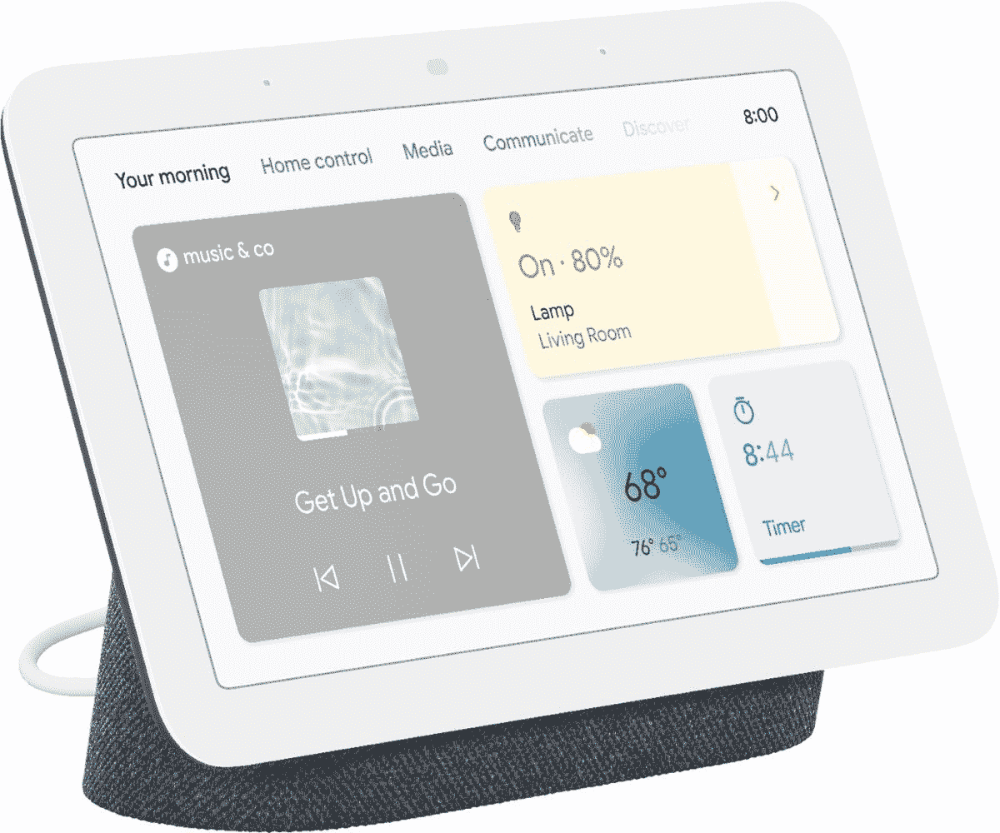

# 谷歌新的 Nest Hub 在多家商店降至 80 美元(优惠 20 美元)

> 原文：<https://www.xda-developers.com/googles-new-nest-hub-is-down-to-80-at-multiple-stores-20-off/>

# 谷歌新的 Nest Hub 在多家商店降至 80 美元(优惠 20 美元)

谷歌最新的 Nest Hub 智能显示器在多家商店出售。它还可以与 Nest Mini 捆绑销售，价格多 10 美元。

谷歌在 3 月份发布了第二代 Nest Hub [，进行了大量升级，包括更好的声音、用于手势控制的 Soli 传感器、可选的睡眠感应等等。新的 Nest Hub 原价为 99 美元，但现在你可以在多家商店只花 79.99 美元买到一个。这是我们见过的新型智能显示屏的最低价格之一。](https://www.xda-developers.com/google-nest-hub-soli-motion/)

Nest Hub 是一款由谷歌助手支持的智能显示器，因此它可以完成所有常见的智能扬声器功能——播放音乐、设置提醒、控制智能家居设备等等。触摸屏的增加使您可以通过简单的点击来控制媒体播放和智能设备。该显示器还可以播放一些视频内容，包括 YouTube(和 YouTube TV)、网飞、Hulu 和 Disney+。你也可以将大部分视频从手机或平板电脑投射到屏幕上，但也有一些例外——例如，亚马逊 Prime 会阻止在 Nest Hub 上播放。

 <picture></picture> 

Nest Hub (2nd Gen)

##### Google Nest Hub(第二代)

这是新更新的谷歌 Nest Hub，具有 Soli 传感器和更好的音质。

这是我们见过的新 Nest Hub 的最低价格之一。然而，如果你除了 Nest Hub 之外还想要一个 Nest Mini，[这两款设备仍然以 90 美元](https://www.xda-developers.com/get-a-nest-hub-gen-2-and-nest-mini-together-for-just-90/)的价格捆绑销售，比 Nest Hub 本身的售价高出 10 美元。这种销售的优势在于可以在多家商店买到，而捆绑销售只能在谷歌的易贝页面上买到。