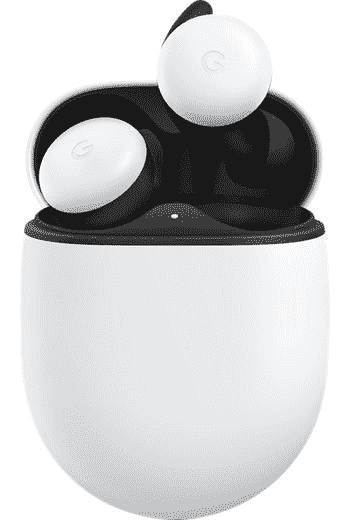

# 谷歌的无线 Pixel Buds 现在减价 80 美元

> 原文：<https://www.xda-developers.com/googles-original-pixel-buds-are-now-on-sale-for-80-off/>

# 谷歌的无线 Pixel Buds 现在减价 80 美元

谷歌的真无线 Pixel Buds 售价 99.99 美元，几乎是原价 180 美元的一半。一点也不差。

谷歌在 2019 年发布了第一款真正的无线耳塞，即第二代 Pixel Buds(第一代耳塞之间有一根线)。他们非常成功，谷歌正在开发续集，但与此同时，目前的 Pixel Buds 又开始销售了。现在你可以从威瑞森的网站上以 99.99 美元买到它们，比原价节省了 80 美元——几乎是半价。

Pixel Buds 是真正的无线蓝牙耳塞，采用入耳式设计，支持 Android Fast Pair。它们没有主动噪音消除功能，但自适应声音功能会在您从安静的环境进入嘈杂的环境时自动调节音量。盒子里有三种耳塞尺寸，IPX4 等级意味着耳塞不会因小雨或汗水而破裂。您也可以在任何 Qi 充电板上无线充电。

 <picture></picture> 

Google Pixel Buds

##### 谷歌像素芽

这些是真正的无线耳塞，支持 Android 快速配对，自动音量调节，轻松访问谷歌助手，等等。

自发布以来，谷歌已经对 Pixel Buds 进行了多次更新。他们在 2020 年 8 月开始使用谷歌的“查找我的设备”功能(以及所有其他快速配对兼容的音频设备)。[那个月的晚些时候](https://www.xda-developers.com/google-pixel-buds-feature-drop/)，注意提醒、低音增强和转录模式在另一个软件更新中到来。