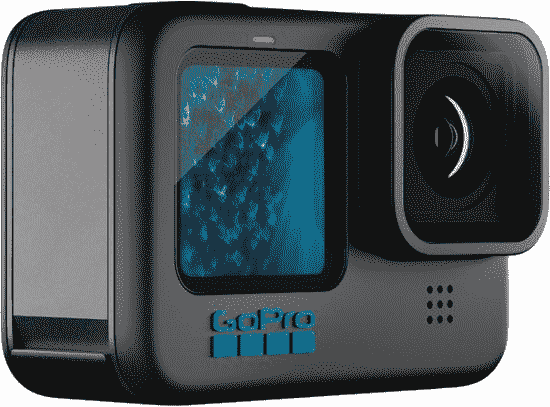

# GoPro 宣布推出全新 Hero 11 Black 和 Hero 11 Black Mini

> 原文：<https://www.xda-developers.com/gopro-announces-the-new-hero-11-black-and-hero-11-black-mini/>

在上周获得非官方的[先睹为快](https://www.xda-developers.com/gopro-hero-11-black-and-hero-11-black-mini-leak/)之后，GoPro 正式宣布了 Hero 11 Black 和 Hero 11 Black Mini。GoPro Hero 11 Black 是去年型号的继任者，而 Hero 11 Black Mini 是一款全新的设备，尺寸小巧，没有显示屏。尽管它们在物理上有所不同，但这两种型号具有相同的内部结构和功能。

今年，GoPro 正在宣传一种新的更大的传感器，这种传感器在 Hero 11 Black 和 Hero 11 Black Mini 中有所体现。1/1.9 英寸的传感器将允许两个摄像头以每秒 60 帧的速度拍摄 10 位 5.3K 视频。新传感器将支持 8:7 的视频宽高比，为您提供更多灵活性，可以选择为社交媒体平台创建 9:16 的垂直镜头，也可以为传统电影创建 16:9 的视频。新相机还能拍摄 2700 万像素的静态照片。此外，GoPro 还推出了一种名为 HyperView 的东西，通过让“活动看起来更快”，让视频看起来更激烈。

除了 HyperView，GoPro Hero 11 Black 和 Hero 11 Black Mini 还将采用 HyperSmooth 5.0，为用户在旅途中提供令人印象深刻的稳定性。新相机将配备三种夜间效果延时模式，这将使捕捉星迹、光绘和车辆尾部灯光变得更加容易。TimeWarp 是一种捕捉稳定时间流逝的模式，现在可以在 5.3K 下拍摄。当然，对于那些更喜欢冒险的人来说，GoPro 仍然会有 Pro 控制，这样你就可以按照你喜欢的方式进行拍摄。为了提供最佳的电池性能，新相机将配备该公司的 Enduro 电池，该电池可以提供最佳性能，特别是在恶劣的温度下。

GoPro Hero 11 Black 将于今天开始发售，售价为 499.99 美元，GoPro 订户的折扣价为 399.98 美元。GoPro Hero 11 Black Mini 将于 10 月 25 日首次亮相零售，定价为 399.99 美元，GoPro 订户可以以 299.98 美元的略低折扣价格获得。GoPro 的前身是 GoPro Plus，是一项订阅服务，每年收费 49.99 美元，提供额外的保修服务，还提供无限的云存储。

 <picture></picture> 

GoPro Hero 11 Black

##### GoPro 英雄 11 黑色

GoPro Hero 11 Black 是 GoPro 的最新动作摄像机，提供令人印象深刻的 5.3K 镜头和 10 位颜色。

* * *

**来源** : [GoPro](https://investor.gopro.com/press-releases/press-release-details/2022/GoPro-Launches-Three-New-HERO11-Black-Cameras-That-Send-Highlight-Videos-to-Your-Phone/default.aspx)