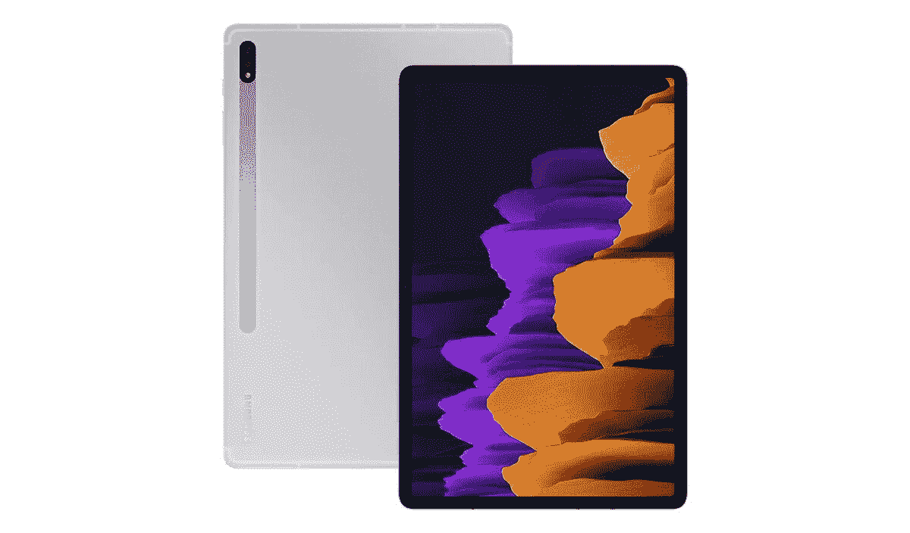

# 现在只需 649 美元就能买到 Galaxy Tab S7+(优惠 120 美元)

> 原文：<https://www.xda-developers.com/grab-a-galaxy-tab-s7-for-just-649-right-now-120-off/>

# 现在只需 649 美元就能买到 Galaxy Tab S7+(优惠 120 美元)

三星最好的 Android 平板电脑 Galaxy Tab S7+的价格已经降至 649.00 美元。这比原价低了 120 美元。

较大的选项卡 S7+使用 OLED 面板。

三星今年早些时候更新了高端 Android 平板电脑阵容，推出了两款机型，Galaxy Tab S7 和 Tab S7+。这两款平板电脑已经降价销售过几次，但现在 S7+的价格已经大幅下降。它现在以 649 美元的价格出售，比最初的建议零售价低 120 美元，比 6 月份的价格低 50 美元。

Galaxy Tab S7+拥有高通骁龙 865+芯片组、12.4 英寸 2800×1752 AMOLED 120Hz 屏幕、6GB 内存、128GB 内部存储(带有 microSD 卡插槽以增加更多空间)、Wi-Fi 6 和蓝牙 5.0。高分辨率 AMOLED 屏幕非常适合观看电影和电视节目，尤其是四个扬声器环绕在边缘，提供出色的声音。Tab S7 包含在三星承诺的“三代”支持中，而且它已经[更新到 Android 11](https://www.xda-developers.com/here-are-the-new-productivity-features-added-in-the-samsung-galaxy-tab-s7s-one-ui-3-1-update/) ，所以它至少应该得到 Android 12 和 13。

 <picture></picture> 

Samsung Galaxy Tab S7

##### 三星 Galaxy Tab S7+

Galaxy Tab S7+的 128GB Wi-Fi 型号现在售价 649 美元。不包括键盘，但 S Pen 手写笔在包装盒中。

Galaxy Tab S7+的盒子里有一支 S Pen 手写笔，可以用来绘图，也可以作为一个简单的指针。即使 S Pen 包括在内，顶部照片中看到的官方键盘附件却没有。或者，如果你不介意键盘与平板电脑过于匹配，任何蓝牙键盘(或带有 Type-C 电缆或适配器的 USB 键盘)都可以与 Tab S7+和 DeX 配合使用。