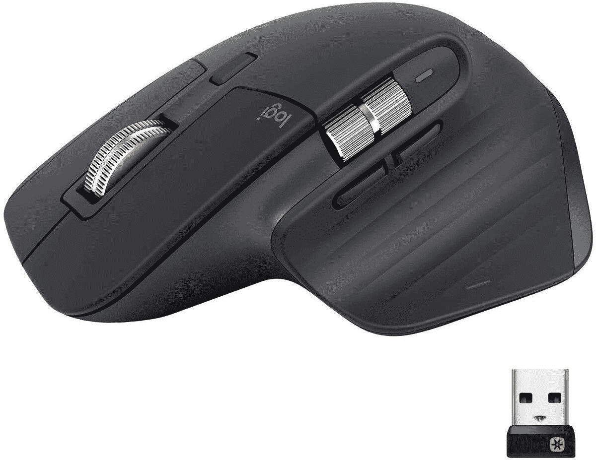

# 以 80 美元的价格购买罗技 MX Master 3 鼠标(优惠 20 美元)

> 原文：<https://www.xda-developers.com/grab-a-logitech-mx-master-3-mouse-for-80-20-off/>

# 以 80 美元的价格购买罗技 MX Master 3 鼠标(优惠 20 美元)

罗技卓越的 MX Master 3 生产力鼠标在史泰博网上商店的价格又比正常价格低了 20 美元。

罗技的 MX Master 3 是你现在可以买到的最好的电脑鼠标之一，这要归功于它的无线连接、软件功能和人体工程学设计。这款鼠标在 5 月以 80 美元[的价格出售，罕见地比正常价格低了 20 美元，但现在 MX Master 3 再次在 Staples 以 80 美元的价格出售。](https://www.xda-developers.com/logitechs-fantastic-mx-master-3-mouse-is-on-sale-for-80/)

MX Master 3 是一款无线鼠标，能够通过蓝牙或内置 USB 适配器的 2.4GHz 低延迟无线连接。这使得 MX Master 3 成为台式电脑、笔记本电脑、平板电脑和任何支持鼠标的设备的绝佳选择。您还可以在鼠标中存储三个连接(USB 适配器算作一个)，因此设备之间的切换并不总是需要重新配对。

 <picture></picture> 

Logitech MX Master 3

##### 罗技 MX Master 3

当您在结账时使用代码 **74638** 时，罗技 MX Master 3 可优惠 20 美元。

MX Master 3 上还有一些其他方便的功能。它有一个 USB Type-C 端口用于充电，而不是许多其他鼠标上的不可逆(也更脆弱)microUSB 连接器。罗技也有一个用于 Windows 和 macOS 的桌面应用程序，可以重新映射鼠标的按钮，并一次性将鼠标与多台 PC 配对(功能类似于多显示器设置)。

MX Master 3 唯一可能的缺点是传感器，它的最大分辨率为 4,000 DPI，对于生产力工作和一些游戏来说是可以接受的，但如果你经常玩竞技游戏，更灵敏的游戏鼠标可能更合适。