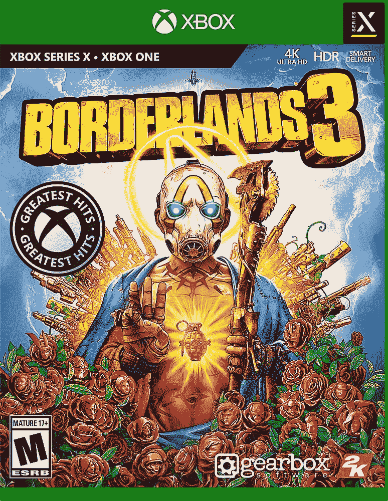

# 在 PlayStation 和 Xbox 上下载 Borderlands 3，仅需 10 美元

> 原文：<https://www.xda-developers.com/grab-borderlands-3-on-playstation-and-xbox-for-only-10/>

# 在 PlayStation 和 Xbox 上下载 Borderlands 3，仅需 10 美元

《边境之地 3》现在在百思买以 9.99 美元的价格发售。PlayStation 和 Xbox 版本都在销售，并提供免费的下一代升级。

*Borderlands 3* 经过多年的炒作和期待终于在 2019 年上映，绝对是近代史上最好的快节奏射击游戏之一。Gearbox 软件一直在开发额外的内容和新的衍生产品，这意味着标准版的*边境 3* (没有 DLC)继续降价。百思买现在出售的*边境 3* 标准版仅售 9.99 美元，比原价低了 20 美元。

就像其他的*边境地带*游戏一样，*边境地带 3* 以虚构的潘多拉星球为中心，在那里有宝藏和技术的地下室的谣言导致“地下室猎人”(如主要人物)寻找它们。主要的故事带你从一个星球到另一个星球，所以你经常会有场景和目标的变化，搭配其他*边境*游戏中常见的抢劫者射击游戏。还有在线合作社，可以和朋友一起玩。

 <picture></picture> 

Borderlands 3 Standard Edition

##### 边境 3 标准版

百思买有《边境之地 3》标准版在售，售价 9.99 美元。Xbox 和 PlayStation 版本都在销售。

*Borderlands 3* 最初是为 PlayStation 4 和 Xbox One 发布的，但 PS5 和 Xbox 系列 X/S 的所有者可以[免费升级到下一代版本](https://borderlands.com/en-US/news/2020-11-02-borderlands-3-next-gen-faq/#:~:text=free%20upgrade)。然而，如果你购买《T4》边境 3 的实体版本，你需要一个带有光盘驱动器的下一代主机来解锁升级版。