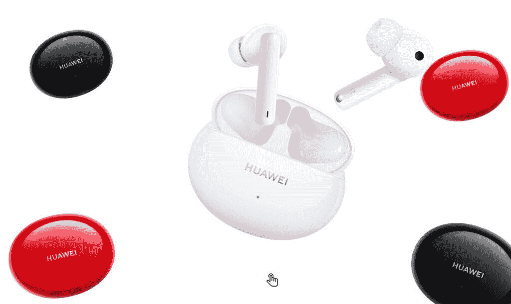

# 华为 FreeBuds 4i 的实际操作

> 原文：<https://www.xda-developers.com/hands-on-with-the-huawei-freebuds-4i/>

继其高端 FreeBuds Pro true wireless 耳塞取得成功后，华为又推出了一款更实惠的版本，名为 FreeBuds 4i，它仍然提供了 FreeBuds Pro 的大部分功能。

## 华为 FreeBuds 4i 设计

与前代产品相比，华为 FreeBuds 4i 采用了更轻、更时尚的椭圆形设计——无论是充电外壳还是耳塞。这款便携包的尺寸仅为 48 毫米 x 61.8mm 毫米 x 27mm 毫米，重量仅为 36.5 克，小巧轻便，甚至可以放入男士牛仔裤或女士手拿钱包的小钥匙口袋中。

这种符合人体工程学设计的耳塞提供了稳定和舒适的贴合感，因为每个耳塞仅重 5.5 克，所以不会让您的耳朵感到沉重。相比之下，Galaxy Buds Pro 和 Jabra Elite 65T 的重量分别为 6.3 克和 6.5 克。在每个花蕾的外面是触摸感应面板，允许用户通过点击控制他们的音乐(和更多)。

可拆卸的硅胶耳塞在我的耳朵周围提供了一个很好的密封，包装包括三种尺寸的耳塞，以确保正确的贴合。我喜欢窄柄不像其他耳塞那样从我的脸上散开，佩戴时看起来更分散。

FreeBuds 4i 有三种不同的颜色，除了干净的白色版本之外，还有醒目的红色版本和光滑的黑色版本。

 <picture></picture> 

Huawei FreeBuds 4i

无线耳塞的设计方法只有这么多，我认为在大多数情况下，华为 FreeBuds 4i 解决了所有的基本问题——它很轻便，很舒适，看起来很时尚。

**华为 FreeBuds 4i 性能和特点**

FreeBuds 4i 在每个 bud 中配备了 10 毫米动态驱动单元，能够输出饱满而生动的音频。清晰的中音和高音意味着流行音乐听起来轻快而干净，正如大多数歌曲所预期的那样，同时有足够的低音为嘻哈节拍增添额外的“活力”。

但这还不是全部——华为还设法将 ANC(主动噪声消除)放入这些芽中，它们工作得非常好。事实上，它可能是我测试过的 100 美元以下耳塞中最好的 ANC(free buds 4 I 的零售价格因地区而异，但通常在 80 美元至 90 美元之间)。位于每个耳塞杆外部的麦克风，以及硅尖提供的耳道周围的密封，加上华为智能人工智能软件算法的组合，确实在消除外部声音方面做得很好。

 <picture></picture> 

You can have conversations while wearing the Huawei FreeBuds 4i thanks to the very effective transparency mode.

还有一种透明模式，可以故意让声音通过，这样你就可以在慢跑/骑自行车时听音乐或播客，同时还能听到周围的声音。这也非常有效。我可以很容易地离开耳塞，随着音乐播放，仍然与另一个人交谈。

ANC 和透明模式通常是为价格在 150 美元以上的耳塞保留的——苹果的 AirPods Pro 或三星的 Galaxy Buds Pro 分别为 249 美元和 199 美元。FreeBuds 4i 在这个范围内提供它对消费者来说是个好消息。

直接从 FreeBuds 4i 控制音频很容易:简单地双击任一 bud 将播放/暂停音乐，长按(触摸并按住)将在 ANC 模式之间循环。

## 华为 FreeBuds 4i 软件和电池寿命

FreeBuds 4i 可以直接与任何支持蓝牙配对的智能手机、电脑或电子设备配合使用。只需连接一次，FreeBuds 4i 就会记住配对，并在您下次取出 Buds 时自动连接。

然而，安装华为 AI Life 应用程序将带来额外的功能，例如定制前述的触摸控制。例如，默认情况下，长按耳塞会在 ANC 模式之间循环，但你可以改为调节音量，或者唤醒语音助手。您也可以打开或关闭“磨损检测”。戴上它，你一把耳塞从耳朵里拔出来，耳塞就会自动暂停音乐。

和大多数华为产品一样，电池寿命非常长:一次充电可以连续播放 10 小时，通过 USB-C 给 FreeBuds 4i 充电只需要 30 分钟就可以从空电池充满电。

## 华为 FreeBuds 4i 结论

没有多少 100 美元以下的耳塞能提供良好的音质*和真正有效的有源 ANC。FreeBuds 4i 的价格为 80-90 美元，对于任何想要寻找一副几乎可以检查每个盒子的真正好的无线耳塞的人来说，这是一款容易的无脑购买产品。*

 <picture></picture> 

Huawei FreeBuds 4i

华为 FreeBuds 4i 价格实惠，低于 100 美元的无线耳塞，提供顶级 ANC 和透明模式。

* * *

###### *本文由华为赞助并撰写。我们的赞助商帮助我们支付与运行 XDA 相关的许多费用，包括服务器成本、全职开发人员、新闻撰稿人等等。虽然您可能会在门户内容旁边看到赞助内容(这些内容将始终被标记为赞助内容),但门户团队对这些帖子不承担任何责任。赞助内容、广告和 XDA 仓库完全由一个独立的团队管理。XDA 绝不会通过接受金钱来赞扬一家公司，或以任何方式改变我们的观点或看法，从而损害其新闻诚信。我们的意见不能被收买。*