# 2020 年假日礼物指南:假日最佳手机、笔记本电脑、耳塞、可穿戴设备！

> 原文：<https://www.xda-developers.com/happy-holidays-from-xda-developer-tv/>

圣诞节总是值得庆祝的，但也许在 2020 年更是如此，因为它庆祝了比往常更艰难的一年的结束。虽然疫情关闭了许多行业，但消费科技领域没有错过任何一个节拍，一个又一个优秀的产品接踵而至。所以，不管你的预算如何，也不管你的朋友或家人需要什么，这份清单上应该有一些可以成为完美礼物的东西。

## 浏览 2020 年最佳圣诞礼物指南:

* * *

## 最佳可穿戴设备

### 华为 Watch Fit

 <picture>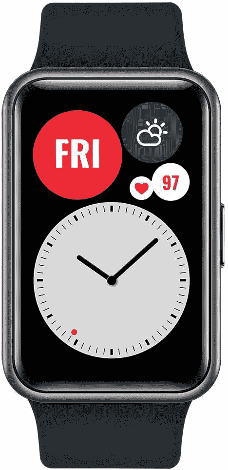</picture> 

Huawei Watch Fit

华为智能手机的电池寿命一直很长，因此它的可穿戴设备也是如此。华为 Watch Fit 一次充电可以使用 10 天，相比之下，Apple Watch 大约 24 小时的电池寿命、三星 Galaxy Watch 3 三天的电池寿命或 Fitbit Sense 六天的续航时间都显得很轻。

 <picture></picture> 

Huawei Watch Fit

##### 华为 Watch Fit

如果你讨厌每天晚上甚至每周都需要给你的可穿戴设备充电，华为 Watch Fit 及其 10 天的电池续航时间非常适合你。除了耐用性，它还是一款轻薄时尚的可穿戴设备，具有强大的健身跟踪功能。

### Fitbit Sense

Fitbit Sense 是健身品牌迄今为止最具雄心的智能手表，因为它不仅可以跟踪你的锻炼和心率，还可以通过一种新的皮肤电活动(EDA)传感器来跟踪你的精神压力水平，这种传感器可以检测我们皮肤上由神经系统引起的微小电荷。

Sense 是世界上第一款使用这种传感器的消费者可穿戴设备，随着精神健康意识变得越来越重要，它可能会成为其他智能手表的一部分。Sense 还支持谷歌助手和亚马逊的 Alexa，为用户提供了比竞争对手智能手表更多的数字助手选择。

 <picture>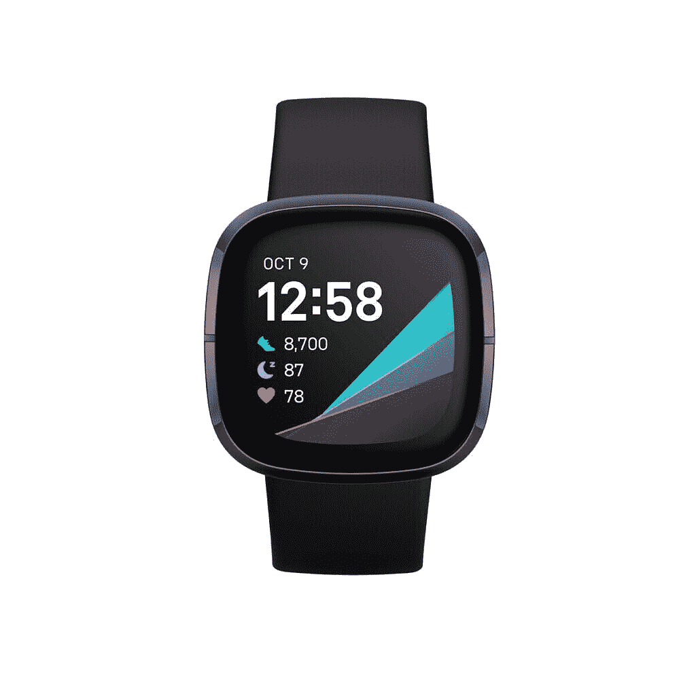</picture> 

Fitbit Sense

##### Fitbit Sense

Fitbit Sense 能够跟踪从台阶到爬楼梯、心率到压力水平的一切信息，是功能最全的智能手表和健身追踪器之一。

### 三星 Galaxy 手表 3

 <picture>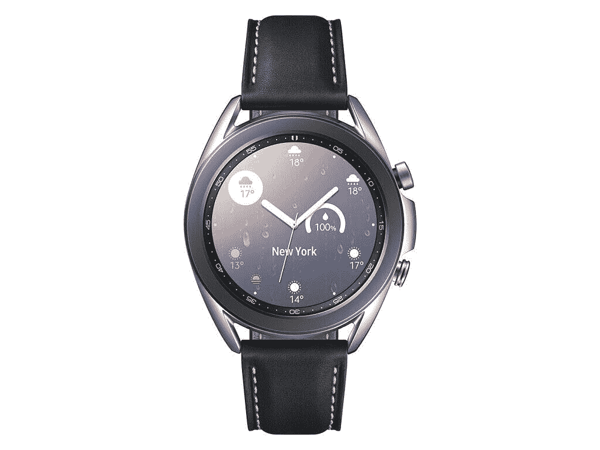</picture> 

Samsung Galaxy Watch 3

从华丽的有机发光二极管显示屏到使用户界面循环如此令人满意的可旋转表圈，三星 Galaxy Watch 3 是 2020 年发布的外观更好、功能更齐全的可穿戴设备之一。

三星的应用程序和手表面部选择近年来有所增长，其中大多数都是完全可定制的。三星的健身跟踪也很准确，允许用户跟踪重要的健康统计数据，甚至进行心电图(ECG)。

使用 Galaxy Watch 3 的最大好处之一是，它比大多数 WearOS 设备或 Fitbit 更擅长回复通知，因为三星的 TizenOS 允许你通过语音、在迷你屏幕键盘上打字或使用 T9 来回复通知，T9 是手机变得“智能”之前使用的老式预测文本技术。

 <picture></picture> 

Samsung Galaxy Watch 3

##### 三星 Galaxy 手表 3

三星的 Galaxy Watch 3 是一款外观优雅、性能流畅的高级可穿戴设备。然而，只能访问 Bixby 而不是谷歌助手是一个败笔。

### 小米 Mi Band 5

如果你送的人喜欢他们的可穿戴小而光滑，小米非常实惠的 Mi Band 5 是一个很好的选择。它的重量仅为 12 克，最厚处为 12.4 毫米，但它并不缺乏功能。小米 Mi Band 5 仍然可以跟踪您的步数、爬楼梯、心率以及骑自行车、瑜伽和游泳等特定运动。电池寿命也很好——一次充电可以让你使用一周，正如我们在 Mi Band 5 的[评测中证实的那样。](https://www.xda-developers.com/xiaomi-mi-band-5-review/)

 <picture>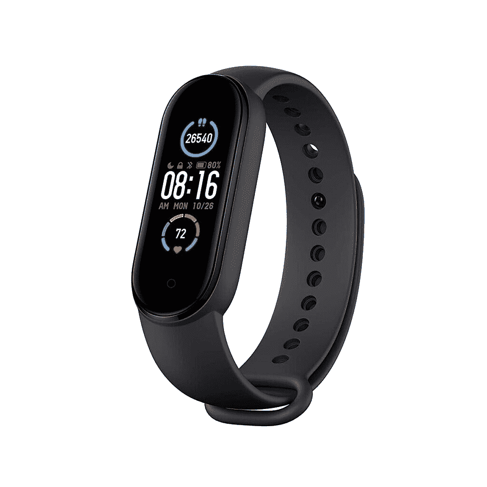</picture> 

Xiaomi Mi Band 5

## 最佳耳机

### 华为 FreeBuds Pro

华为的 FreeBuds Pro 是最受好评的无线耳塞之一。它有一个相对干净的设计，与市场上大多数其他耳塞相比，它的耳塞柄更短，而且它可以说是我们测试过的耳塞中最好的透明模式和主动噪音消除。后者尤其令人印象深刻——华为开发了这项名为“动态噪音消除”的技术，允许耳塞分析用户的周围环境，并相应地调整噪音消除的水平。

 <picture>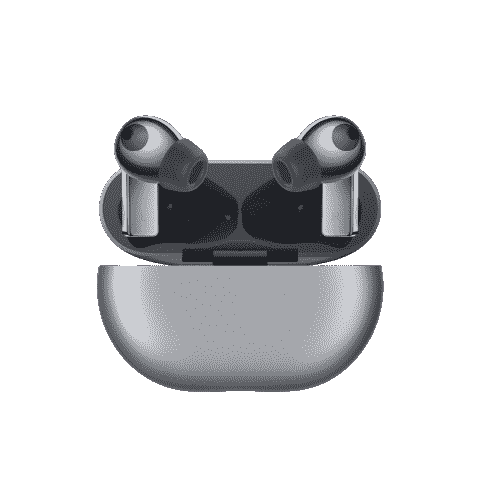</picture> 

Huawei FreeBuds Pro

华为 FreeBuds Pro 是我们今年测试的最时尚和最好的降噪无线耳塞之一

### 三星 Galaxy Buds 直播

 <picture>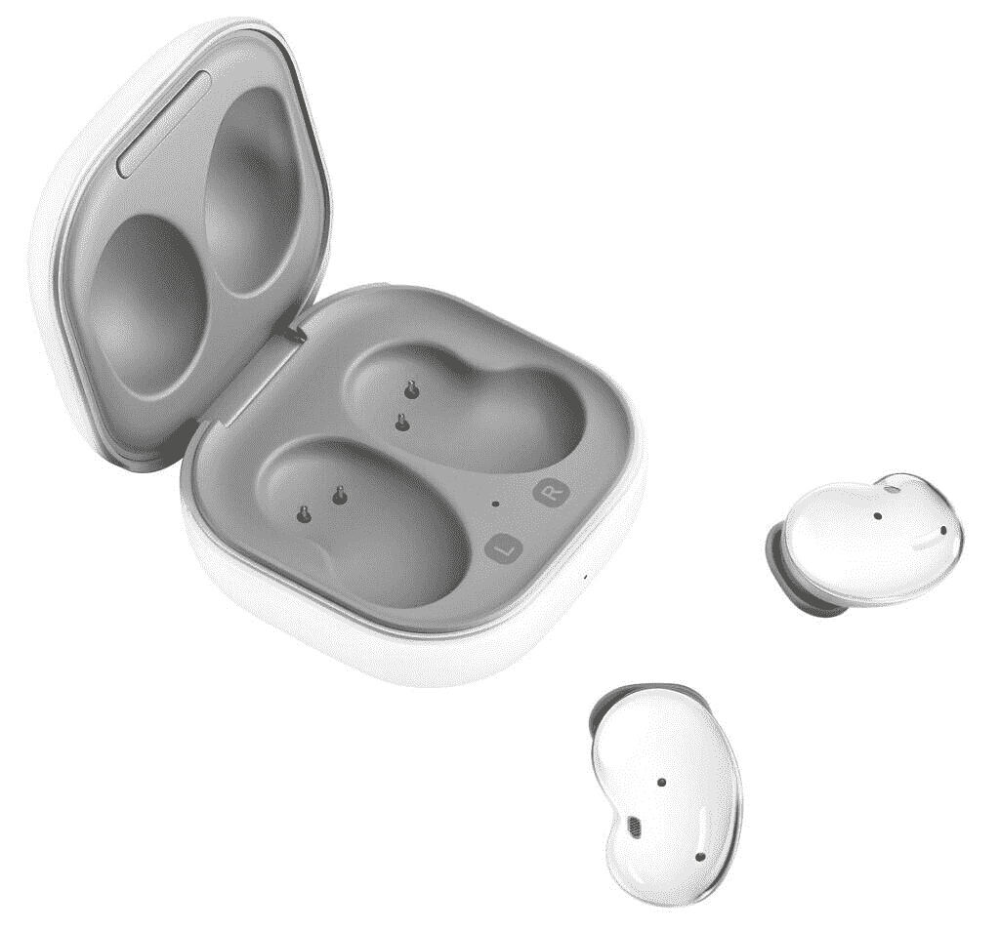</picture> 

Samsung Galaxy Buds Live

三星的 Galaxy Buds Live 可能看起来像菜豆，但不要让奇怪的形状欺骗了你——这些是我们测试过的最舒适的无线耳塞，这主要归功于它的设计，它旨在轻轻地坐在你的耳朵上，而不是插入你的耳道。这意味着这里没有太多的噪音消除，但如果你不是在一个太嘈杂的环境中，芽现场听起来很棒，低音坚实，中音清晰，高音清脆。此外，考虑到整个无线耳塞行业已经随着拉长的耳塞外观而消失，Galaxy Buds 因其独创性而获得加分。

 <picture></picture> 

Samsung Galaxy Buds Live

##### 三星 Galaxy Buds 直播

三星的豆形耳塞提供了一些最舒适的配合，因为它不会塞进你的耳道。他们听起来也很棒。

### 苹果 AirPods Pro

 <picture>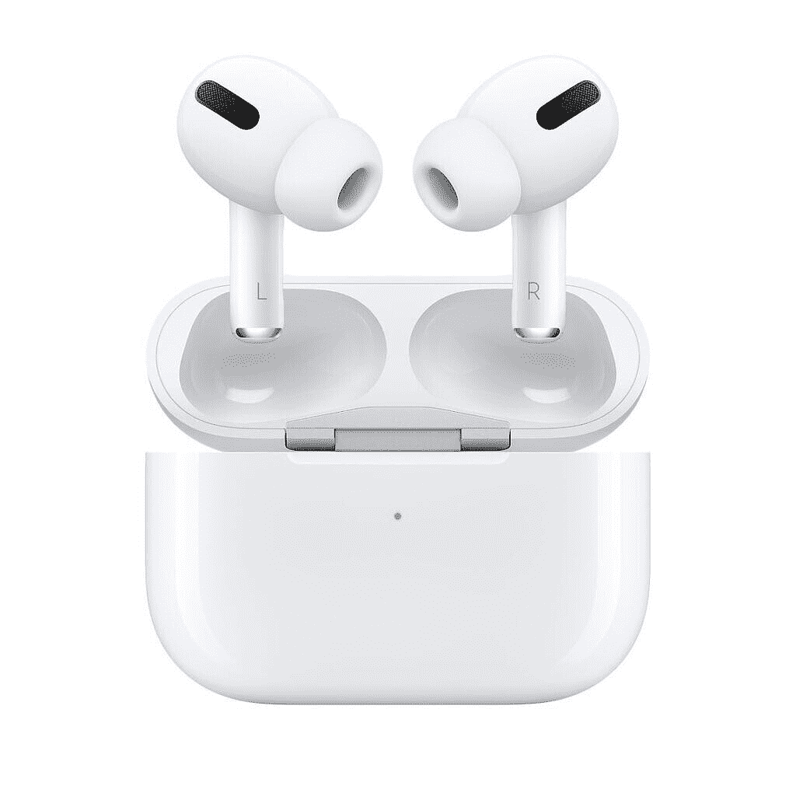</picture> 

Apple AirPods Pro

苹果的无线耳塞无处不在是有原因的——它们工作起来和听起来都很棒，是非常罕见的没有被锁定到 iOS 生态系统中的苹果产品之一。当然，当 AirPods Pro 与 Android 设备或 Windows 笔记本电脑配对时，你会失去一些功能，但大多数核心功能仍然有效，包括出色的音质和透明模式。

是的，我们知道 AirPods Pro 不再是苹果 AirPods 系列中的阿尔法狗。但是 AirPods Max 不管有多好，价格都非常高。我们认为更紧凑的 AirPods Pro 更有价值。

 <picture></picture> 

Apple AirPods Pro

##### 苹果 AirPods Pro

尽管 AirPods Max 已经发布，但我们认为 AirPods Pro 仍然是更好的选择，因为它的设计更紧凑，价格也更合理。

### 第三次非洲国民大会

 <picture>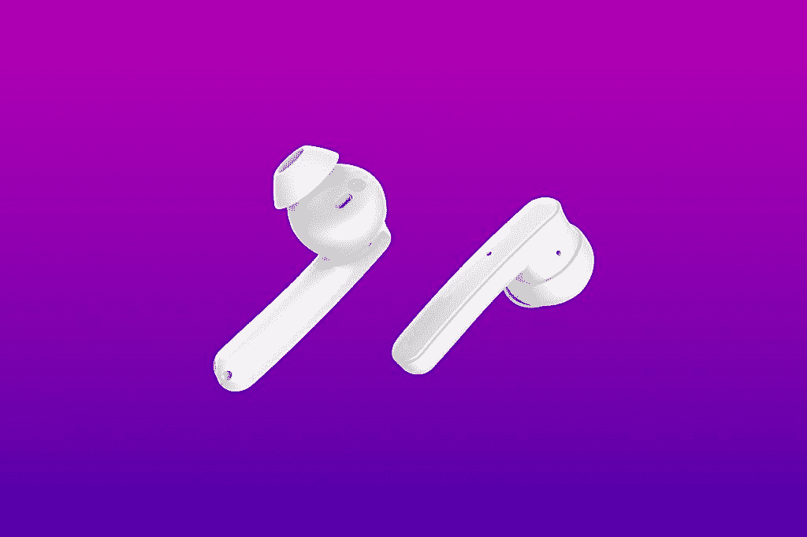</picture> 

TicPods ANC

低于 100 美元的无线耳塞通常没有很好的主动噪音消除功能，因此 [Mobvoi 的 TicPods ANC](https://www.xda-developers.com/ticpods-anc-review/) 是一个惊喜，因为它们提供了坚实的 ANC——虽然不如上面列出的耳塞，但仍然足以淹没现代城市生活中不必要的噪音。更重要的是，这些耳塞甚至有一个功能透明模式，非常适合慢跑者和骑自行车者。

与这个列表中更光滑的耳塞相比，它的设计有点笨重，但话说回来，TicPods ANC 的价格还不到一半。

 <picture></picture> 

TicPods ANC

##### 第三次非洲国民大会

TicPods ANC 是最实惠的耳塞之一，提供主动噪音消除和透明模式。

## 最佳智能手机

**华为 Mate 40 Pro**

 <picture></picture> 

Huawei Mate 40 Pro

华为最新的旗舰产品拥有年度最优质和独特的设计之一；它是目前唯一一款运行在 5 纳米 SoC 上的 Android 手机——强大的麒麟 9000 芯片。在其他地方，它拥有可以说是今年所有智能手机中最好的相机系统，50MP 主相机几乎可以在黑暗中看到，20MP 超宽“电影镜头”可以在不丢失细节的情况下将更多内容纳入画面；还有一个潜望镜变焦镜头，可以拍摄高达 50 倍的清晰照片。Mate 40 Pro 也是使用时间最长的手机之一，电池经过优化，可以全天使用。

 <picture></picture> 

Huawei Mate 40 Pro

华为 Mate 40 Pro 是今年最好看和最强大的手机之一。

### 三星 Galaxy S20 FE

 <picture>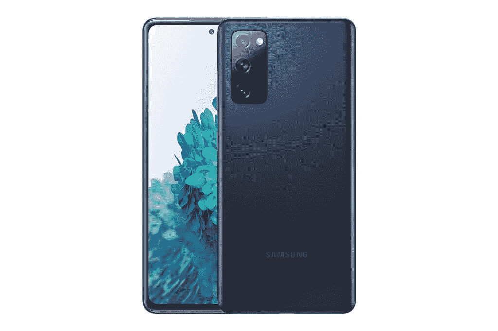</picture> 

Samsung Galaxy S20 FE

三星 Galaxy S20 FE 不是三星 2020 年最强大或最先进的手机，但它是迄今为止最超值的手机。通过带来三星 2020 年旗舰产品的大部分伟大之处 120Hz 有机发光二极管显示器和骁龙 865 以及一个用户界面——同时修剪一些漂亮但不重要的装饰，如潜望镜相机，Galaxy S20 FE 设法满足了一个不会让大多数钱包受伤的价格点。

 <picture></picture> 

Samsung Galaxy S20 FE

##### 三星 Galaxy S20 FE

三星的 S20 FE 削减了该公司旗舰产品的大部分额外功能，同时只提供最关键的部分。

### 一加 8T

 <picture></picture> 

OnePlus 8T

虽然不再是曾经的价值王，一加的手机已经发展到可以与大男孩媲美的水平。该公司最新的[一加 8T](https://www.xda-developers.com/oneplus-8t-review/) 是一款出色的智能手机，拥有今年智能手机中最流畅和最快的软件。一加 8T 的 120 赫兹 OLED 面板可以与三星的显示器一较高下。

 <picture>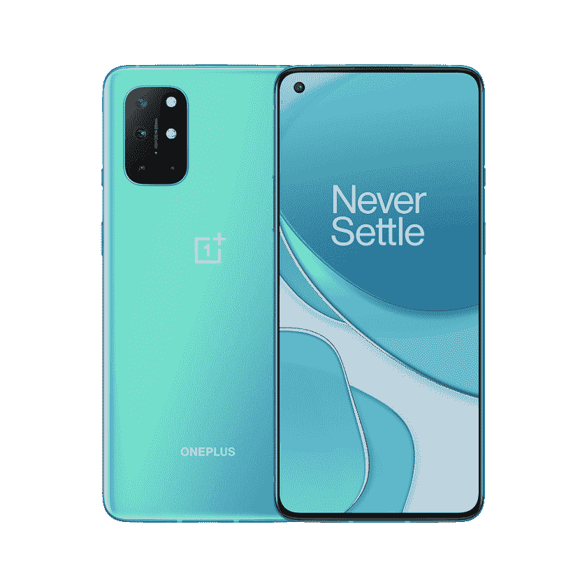</picture> 

OnePlus 8T

##### 一加 8T

一加 8T 是今年最快、最流畅的智能手机之一。

### POCO X3 NFC

 <picture></picture> 

POCO X3 NFC

如果你住在美国，这款手机将需要进口，但如果你想要一款接近旗舰级别的手机，价格接近预算，这是值得的。POCO X3 NFC 提供了 120Hz 的显示屏——尽管是 LCD 而不是有机发光二极管——优质的玻璃和金属结构，以及 5,000 mAh 的大电池，所有这些价格都不到列表中其他手机的一半。

这里运行的 MIUI Android 皮肤出奇的干净，甚至针对西方观众进行了优化。即使把进口商品的涨价因素考虑在内，这仍然是这张清单上最划算的价格。

 <picture></picture> 

POCO X3 NFC

##### POCO X3 NFC

很难相信 POCO X3 NFC 能够以几乎预算的价格提供骁龙 732G、120Hz 显示器和高于平均水平的相机系统。

## 最佳笔记本电脑

### 华为 MateBook D 14 R5

 <picture></picture> 

Huawei MateBook D 14

华为 MateBook D 14 厚度仅为 15.4 毫米，重量仅为 3 磅，由于其优质的结构和锐龙的 5 3500U 芯片，它是一款时尚而强大的笔记本电脑。虽然没有华为的旗舰产品 MateBook X 系列那么高端，但这款手机仍然有一键指纹/电源按钮，允许从冷启动无缝登录，还有一个近乎无边框的 1080p 分辨率屏幕。

如果你使用华为智能手机，MateBook D 14 可以无缝连接到你的手机，所以你可以直接在笔记本电脑的屏幕上访问你手机的应用程序。

 <picture></picture> 

Huawei MateBook D 14

##### 华为 MateBook D 14

华为的锐龙超极本有一个由最小边框包裹的 14 英寸 1080p 屏幕和一个大尺寸的键盘，非常适合旅行。虽然没有华为价格更高的 MateBook X 系列那么高端，但 MateBook D 14 是中端超极本领域的一款优秀产品。

### 苹果 MacBook Air (M1)

与个人电脑领域的替代产品相比，苹果的笔记本电脑和电脑通常定价过高。但是随着该公司有史以来第一台运行自己的芯片的笔记本电脑，剧本被翻转了。运行苹果 M1 芯片的 MacBook Air 起价 999 美元，其处理能力可以轻松赶上价格高出两到三倍的英特尔驱动笔记本电脑。

无论是基准数据还是实际性能都是如此。需要注意的是，由于 M1 芯片基于 ARM 的架构，更像是智能手机/平板电脑的 SoC，而不是传统的英特尔处理器，因此应用程序必须适应苹果的芯片才能发挥最大潜力。现在，并不是所有的应用都是这样——但这是我们正在谈论的苹果，所以这只是一个时间问题。

 <picture>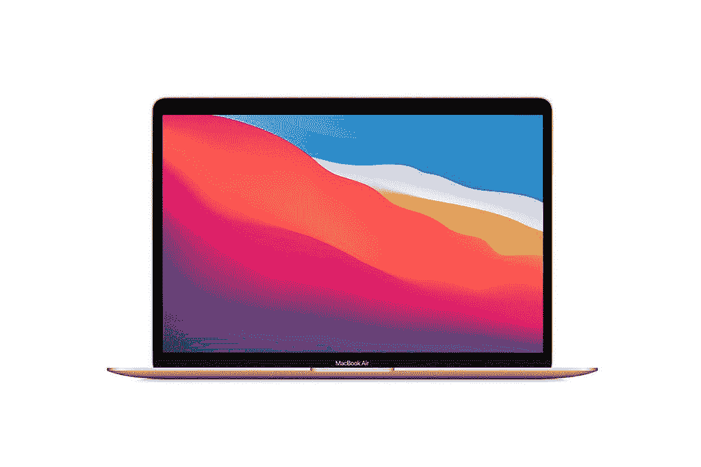</picture> 

Apple MacBook Air (M1)

##### 苹果 MacBook Air (M1，2020 年)

苹果远离英特尔的举动引起了很多人的质疑，但考虑到 M1 芯片迄今为止的表现，苹果似乎做出了正确的决定。

### Dell XPS 13 7390

戴尔的 2 合 1 可变形笔记本电脑一直拥有时尚、多功能的设计，但它并不总是有勇气。几年前推出的第一款机型运行在英特尔平淡无奇的 Y 系列处理器上，但 2019 年底的更新带来了英特尔的第十代 10 纳米 U 系列芯片。仅这一简单的内部升级就使戴尔 XPS 13 7490 成为市场上最好的可转换机器之一。

如果您是艺术家或笔记型电脑爱好者，Dell XPS 13 7390 还支持手写笔，为这款笔记本电脑增加了更多使用案例。

 <picture>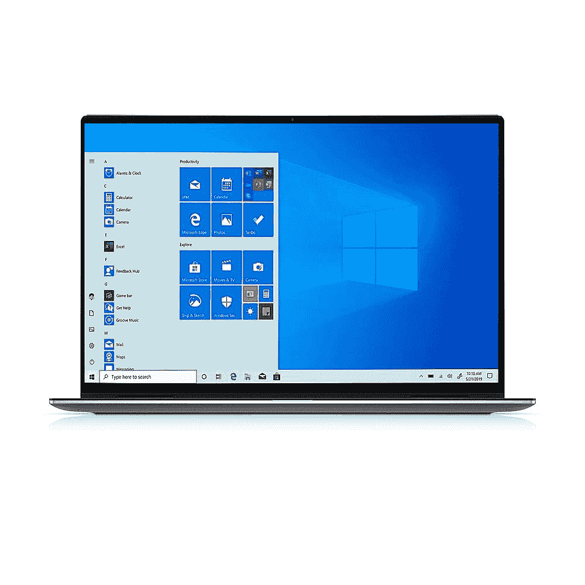</picture> 

Dell XPS 13 2-in-1 (7390)

##### 戴尔 XPS 13 二合一 7390

Dell XPS 13 2 合 1 是一款高度多功能的机器。它可以是一台时尚的笔记本电脑，非常适合工作效率，也可以是一台平板电脑，或者是一个素描本或笔记本，如果你还有手写笔的话。

### ASUS ROG Zephyrus G14

如果你想要一台既能工作又能娱乐的机器，你可以看看华硕 ROG Zephyrus G14。从 120Hz 的刷新率到 NVIDA RTX 2060 超级显卡，再到盖子上的复古 LED 屏幕(因为你知道，有人显然制定了游戏笔记本电脑和手机必须有灯带的规则)，这是一款游戏笔记本电脑。AMD 锐龙 9-4900HS 处理器也足以处理创意或工作任务。

尽管如此，Zephyrus G14 的电池续航时间令人惊讶地好，在工作使用情况下可以达到 11 个小时，重度游戏可以达到近 5 个小时。热量管理系统也是智能的，在不同的级别打开风扇，除非需要，否则不会太大声。

 <picture>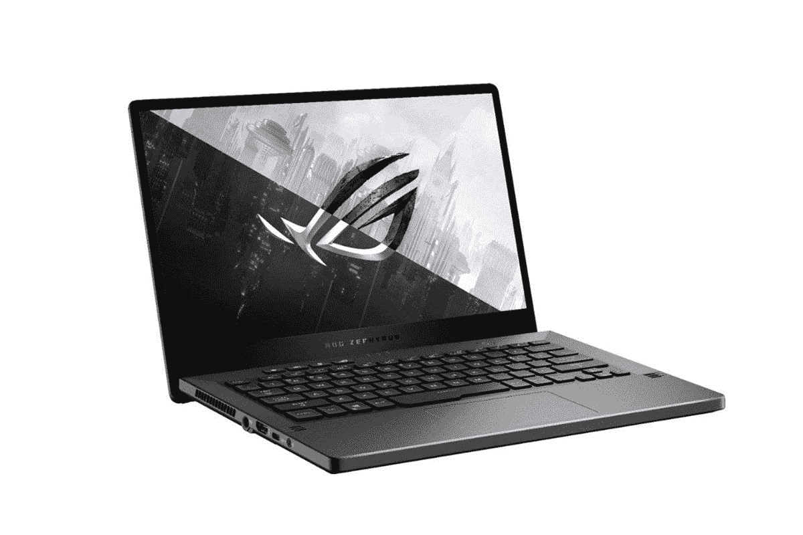</picture> 

ASUS ROG Zephyrus G14

##### ASUS ROG Zephyrus G14

很容易理解为什么 ROG Zephyrus G14 是 2020 年最受欢迎的笔记本电脑之一:它提供了独特的设计和 AMD 的强大 CPU。

* * *

我们的推荐到此为止。每个类别都有选项，涵盖不同的价位，所以这里应该有适合每个技术人员的礼物。我们给出的一条一般性建议是，了解人们的需求——如果他们是学生，他们可能会从新的笔记本电脑中受益匪浅，而经常通勤的人可能会用一些好的耳机做得很好，而希望保持健康的人需要一个好的可穿戴设备来跟踪他们的锻炼。如果你想不通，新手机对每个人都适用。

###### 我们感谢华为赞助 XDA。华为很少参与这篇文章的创作或内容。特别是，为了核实事实，征求了他们的意见。表达的任何意见都是作者的意见。我们的赞助商帮助我们支付与运行 XDA 相关的许多费用，包括服务器、开发人员、作家等等。虽然您可能会在门户内容旁边看到赞助内容，但所有内容都会被清楚地标记为赞助内容。XDA 门户网站团队不会因为接受金钱来写一家公司的好话而损害新闻的完整性。我们的意见不能被收买。赞助内容、广告和 XDA 仓库由我们的营销总监管理，而不是编辑团队。