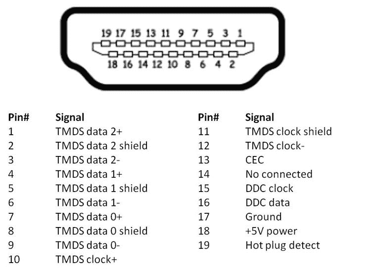

# 以下是各种类型的 HDMI 端口和标准

> 原文：<https://www.xda-developers.com/hdmi-standards-specs-explained/>

HDMI 端口已经成为音频视频 I/O 的标准端口。它是高清多媒体接口的缩写，于 21 世纪初推出，其唯一目的是提供一种改进的便捷方式来取代现有的 HDTV 信号传输标准。HDMI 的创始人包括日立、松下、飞利浦、硅像、索尼、汤姆森、RCA 和东芝。HDMI 端口在大多数现代家庭的电视、笔记本电脑和台式电脑上都很容易找到。今天，大多数游戏控制台也包括 HDMI 端口，因为它提供了一种传输音频和视频数据的单电缆解决方案。

在这里，我们解释了多年来推出的所有不同版本的 HDMI 规范，并快速查看了 HDMI 连接器的类型。很像 [USB](https://www.xda-developers.com/usb-standards-explained/) ，不同的规格可以匹配不同的连接器/端口。

## HDMI 规格

### HDMI 1.0

HDMI 规范的第一个版本于 2002 年 12 月问世。它主要使用与 DVI 类似的架构来发送视频信号，但在视频流的消隐间隔期间发送音频和其他数据。它提供 4.9Gbps 的数据传输速率，在 120Hz 时提供 720p 分辨率，在 60Hz 时提供 1080p 分辨率，在 30Hz 时提供 1440p 分辨率。该标准还支持 8 声道音频。

### HDMI 1.1

HDMI 1.1 于 2004 年 5 月首次亮相，是对现有 HDMI 1.0 标准的一个非常小的更新。唯一增加的新功能是 DVD 音频支持，这意味着 HDMI 现在可以提供从单通道单声道到 5.1 通道环绕声的音频。分辨率和刷新率规格保持不变。

### HDMI 1.2 和 1.2a

在 HDMI 1.1 推出近一年后，HDMI 1.2 是一次重要的更新，因为它包括了对低压设备的兼容性，使其适用于 PC(特别是显卡)。它还增加了对一些新的色彩空间的支持。这一版本最初打算取消对格式的限制，以增加兼容性，并与新出现的显示端口接口竞争。2005 年，HDMI 1.2a 发布，增加了消费电子控制(CEC)的兼容性，允许多个 HDMI 设备用一个遥控器相互控制。

### HDMI 1.3 和 1.3a

这是该标准在 2006 年 6 月推出时的一大飞跃。首先，它最终将带宽增加了一倍，达到 10.2Gbps，提高了 240Hz 时 720p 分辨率、120Hz 时 1080p 分辨率和 1440p 60Hz 分辨率的能力。此外，它还增加了对 4K 或 30Hz 2160 p 的支持，尽管直到 HDMI 1.4 发布后才正式发布。它还增加了对 10 位、12 位甚至 16 位颜色深度的支持，这取决于分辨率。这个版本还支持增加色彩空间和可选的杜比 TrueHD 和 DTS-HD 主音频支持。HDMI 1.3 还引入了一个新的 Type-C 迷你 HDMI 连接器(稍后会详细介绍)。与 1.2 版一样，1.3a 版也进行了中期更新，它也有类似的 CEC 更新和对较小的 type-c 连接器的一些修改。

### HDMI 1.4、1.4a 和 1.4b

2009 年，HDMI 的下一个版本推出了类似的分辨率支持，包括 4K 和影院或“真正的”4K，4096x 2160，只有 24Hz，但宽高比更宽。它还包括一个 HDMI 以太网通道(HEC ),包括两个 HDMI 连接设备之间的 100 Mbit/s 以太网连接和一个音频返回通道或 ARC。这个版本还增加了对立体 3D 的支持和一个新的微型 HDMI 连接器，这两者都没有真正流行起来。它还扩大了对其他丰富和自然色彩空间的支持，包括 Adobe RGB。如果你想获得 1.3 和 1.4 功能的完整体验，还建议购买新的高速 HDMI 电缆。如果你也想要以太网连接，还有一种完全不同的电缆。

随后在 2010 年推出了 1.4a 版本，为广播内容增加了一些额外的 3D 格式和分辨率。它还在 2011 年经历了另一次更新，引入了 1.4b 以标志 LLC 生产标准的转变，所有未来版本都由 [HDMI 论坛](https://hdmiforum.org/)指定。

### HDMI 2.0

作为该标准的重要更新，HDMI 2.0 引入了对 60Hz 4K 的支持，并将总带宽增加到 18Gbps。它于 2013 年推出，推出了 240Hz 的 1080p 分辨率和 144Hz 的 1440p 分辨率，这是游戏的一大飞跃。它还支持 4K 分辨率的 24 位色深，多达 32 个音频通道，并最终在 2015 年随着 HDMI 2.0a 和混合 Log-Gamma 与 HDMI 2.0b 的发布增加了对 HDR 的支持。

### HDMI 2.1

最新版本 HDMI 2.1 由 HDMI 论坛于 2017 年公布。所有新的高端电视、游戏机和显卡现在都配备了 HDMI 2.1。这可以在 120Hz 下实现 4K 分辨率，甚至可以使用显示流压缩在 30Hz 或更高的频率下实现 8K 和 10K 分辨率。所有这一切都要归功于双倍的带宽和第四个数据速率通道的添加，这意味着总比特率为 48Gbps。最新版本还包括用于指定 HDR 元数据的动态 HDR、可变刷新率(VRR)，ARC 更新为 eARC(增强型音频返回通道),适用于杜比 Atmos 和 DTS:X 等音频格式。HDMI 2.1 还引入了超高速 HDMI 电缆类别，以符合高速比特率。

* * *

## HDMI 连接器和端口

HDMI 连接器看起来很像全尺寸的 USB 端口，只是更大，并且具有梯形形状。它包括一个公接头和一个母接头，公接头通常位于电缆或流媒体设备上，而母接头通常位于被链接的设备上。通常 HDMI 口的上端比下面的长，只能单向进去；因此，它是不可逆的。虽然全尺寸 HDMI 端口被广泛使用，但多年来我们已经看到了各种形状和尺寸。

 <picture></picture> 

Typical HDMI Type-A pin configuration (Image: [Gamers Nexus](https://www.gamersnexus.net/guides/2113-hdmi-interface-questions-addressed-1080p-120hz))

### 型个性

这是最常见的版本，或者我们说的全尺寸 HDMI。它包括 19 个引脚，为承载 SDTV、EDTV、HDTV、UHD 和 4K 模式提供带宽。它还与单链路 DVI-D 电气兼容。

### 型个性

HDMI Type-B 比标准的 Type-A 端口更大，兼容双链路 DVI-D，共有 29 个引脚，通常携带 6 个差分对，而不是 3 个。此端口用于高达 WQUXGA (3840×2400)分辨率的高分辨率显示器。值得注意的是，这个端口没有用于任何流行的商业产品。

### C 型

迷你 HDMI，或他们称之为 Type-C，是 A 型插头的较小版本，但具有相同的 19 针配置。这是为包括智能手机在内的便携式设备推出的。唯一的区别是，与 HDMI Type-A 相比，不同引脚的名称并不相同。

### D 型

微型 HDMI 或 Type-D 甚至比 Type-C 端口更小，有点类似于微型 USB 端口。与 A 型和 c 型相比，这款器件同样有 19 个引脚，但引脚分配完全不同。

### E 型

也称为汽车连接系统，这种 HDMI 端口具有锁定机制，以保持电缆稳定并承受振动，以及防止湿气和灰尘干扰信号的外壳。

* * *

如果这篇文章帮助你理解了 HDMI 的各种类型和标准，请确保你也阅读了我们关于各种 [USB 版本和标准](https://www.xda-developers.com/usb-standards-explained/)的指南。