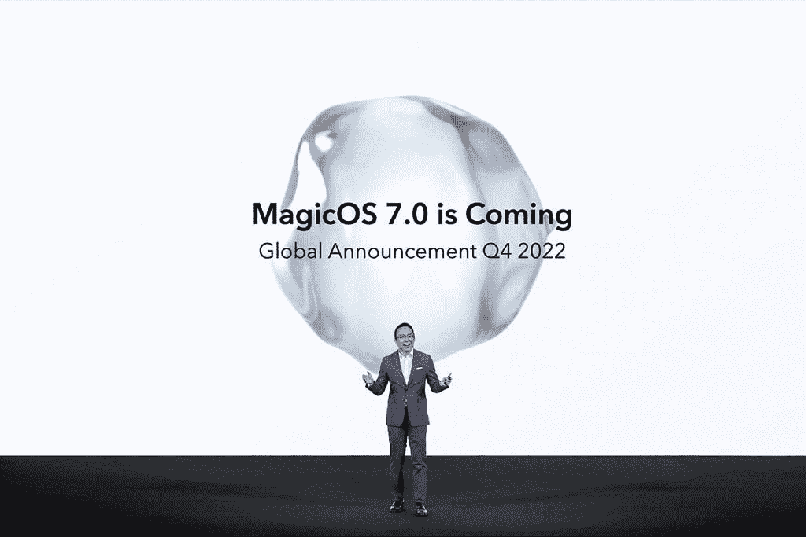
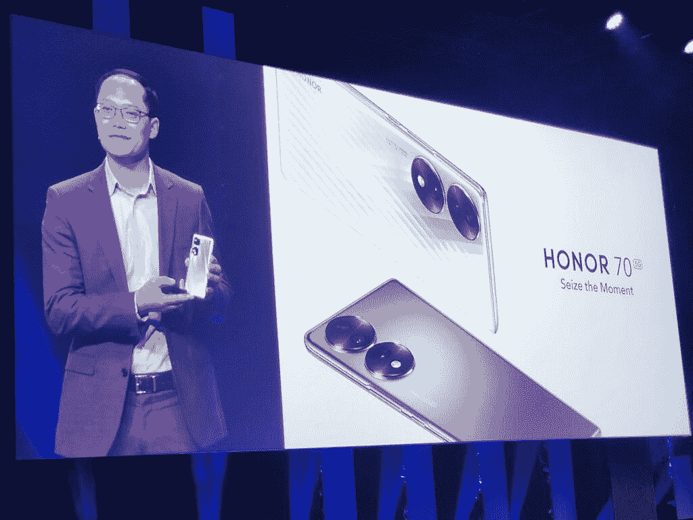

# 采访:Honor 计划如何将其手机与华为的手机区分开来

> 原文：<https://www.xda-developers.com/honor-eu-president-roundtable-ifa-2022/>

当华为在 2020 年末将其子品牌 Honor 出售给一个买家财团时，这对许多手机粉丝来说是个好消息。这不仅意味着我们在智能手机领域获得了一个新的独立参与者，而且还有望让 Honor devices 重新获得谷歌移动服务，自 2019 年年中以来，谷歌移动服务已从华为旗下的所有设备中被剥夺。这正是所发生的事情:Honor 在 2021 年夏天凭借 Magic 3 系列重新进行了全球首次亮相，进行了一场关于成为独立品牌和谷歌全面支持的大规模营销。

从那以后，Honor 又向国际市场发布了几款设备，最新的 [Honor 70](https://www.xda-developers.com/honor-70-review/) 成为柏林 IFA 贸易展开幕的头条新闻。官方荣誉新闻稿副标题的第一句话是:“*自独立以来首次登上 IFA 舞台*”。

## 荣誉和华为的影响力

但房间里有一只大象:迄今为止，尽管骄傲地标榜其独立性，Honor 的所有设备，包括尤其是智能手机，看起来和感觉上都与华为的设备非常相似。怎么回事？

 <picture></picture> 

Honor's EU President, Tony Ran.

Honor 的欧盟主席 Tony Ran 认为，答案是 Honor 独立的时间还不够长。

“是的，目前(Honor 和华为设备)在设计和用户界面方面有相似之处。一个产品的开发过程，从最初的设计到上架，可能需要两到三年的时间，”冉在柏林的一次媒体圆桌会议上说。“我们正在改变，但没有你们想象的那么快。”

Honor 在欧洲的营销董事总经理 Clement Wong 插话说:“在内部，我们比任何人都更关心让我们的产品从华为和其他供应商中脱颖而出。但这是一个循序渐进的过程——从硬件的角度来看，这需要时间，因为制造新产品需要供应链物流和 R&D 投资。”

## Magic OS 7.0 功能

事实上，Wong 承诺，差异化的第一个迹象将很快通过即将于今年第四季度发布的 Magic OS 7.0 软件来实现。“Magic OS 7.0 是以前 Honor 软件的一大飞跃，它的外观和感觉与华为设备完全不同。”

目前还不知道 Magic OS 7.0 是否会与新硬件一起推出，但这很有可能，因为 Honor 在美国制裁之前取消了该品牌的海外增长后，试图重新确立自己作为全球消费科技公司的地位。Ran 和 Wong 表示，Honor 希望将欧洲打造成公司的“第二本土市场”，显然是在中国之后。

这一战略将包括继续与欧洲各地的运营商建立关系。“我们已经与(许多)欧洲和英国的主要航空公司建立了重要联系，”冉说。“但有些运营商在选择像我们这样的新合作伙伴时有点保守，所以这是一个循序渐进的过程，我们正在努力建立我们的网络合作伙伴。”

 <picture></picture> 

Honor CEO George Zhao teasing Magic OS 7.0 during IFA 2022.

与华为消费者业务负责人 Richard Yu 不同，Honor 的领导们似乎有更现实、更实际的目标。“我们知道这不会在一夜之间发生，”冉谈到在欧洲建立主要玩家的荣誉时说。“这可能是一个五到十年的过程，但我们致力于让荣誉在欧洲像在中国一样出名的目标。”

冉说，Honor 可能会在欧洲各地开设实体店，就像它在中国本土市场以及新加坡和马来西亚等一些亚洲地区已经开设的实体店一样。

既然 Honor 不再只是一个“子品牌”,它希望做的另一件事就是最终将自己树立为一个高端品牌。“以前，我们在可以追求的市场方面有些受限，”Wong 说。“我们现在可以追求旗舰领域的产品。”

## 在全球范围内与可折叠产品竞争

该公司已经开始使用 [Honor Magic 4 Pro](https://www.xda-developers.com/honor-magic-4-pro-review/) ，它可以检查旗舰手机应该检查的所有项目。但是要想在市场中脱颖而出，Honor 必须推出一些新的和不同的东西——它就要来了。2023 年，Honor 将在 Q1 推出一款新的[可折叠手机](https://www.xda-developers.com/best-foldable-phones/)，在中国以外销售。除非 Oppo 或谷歌等其他品牌在今年晚些时候击败 Honor，否则 Honor 即将推出的可折叠手机将是第一款完全支持 GMS 的大型可折叠手机，从而最终给[三星带来一些急需的可折叠领域的全球竞争](https://www.xda-developers.com/samsung-needs-global-foldable-competition-editorial/)。

 <picture></picture> 

Ran introducing the Honor 70 during Honor's keynote at IFA 2022.

“我们最终是一家产品公司，与消费者沟通的最佳方式是通过产品，”冉说。"荣誉最重要的方向仍然是投资和制造产品."