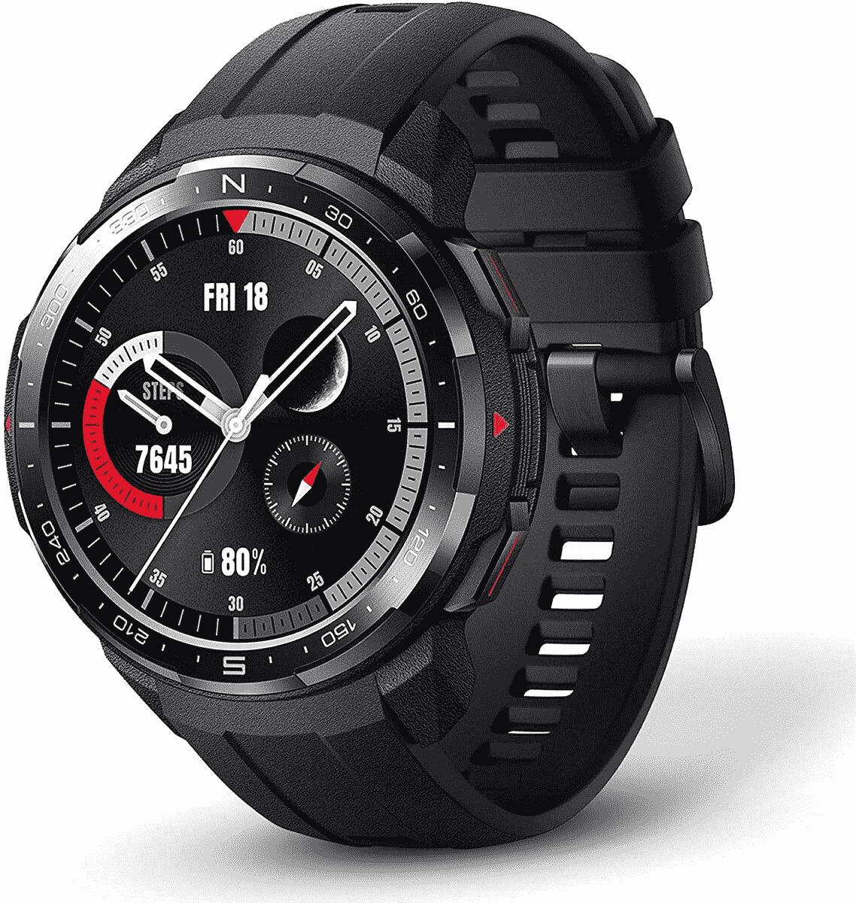

# 购买荣誉手表 GS Pro 可节省 50 英镑，正好赶上假期

> 原文：<https://www.xda-developers.com/honor-watch-gs-pro-amazon-uk/>

如果你想要一个智能手表，你真的不能错过荣誉。虽然这个品牌最近被廉价出售，但你仍然可以放心，Honor 制造的产品质量好，价格不会掏空你的钱包。更好的是，它们也经常打折！现在，在亚马逊英国，你可以在荣誉手表 GS Pro 上节省 50 英镑。

这只手表到底有多好？在他对[各种 Honor 和华为手表](https://www.xda-developers.com/huawei-watch-gt-2-pro-honor-watch-es-gs-pro-liteos-review/)的评论中，Adam 表示 Honor Watch GS Pro 是一款坚固耐用的手表。这是一款专为喜欢户外活动的人打造的智能手表，比如野营或爬山。手表已经过测试，证明可以经受恶劣的环境，所以无论你去哪里，GS Pro 都不会退出。

这款智能手表的电池续航时间也很长。它将持续 25 天，或者 100 小时，如果你让 GPS 跟踪。如果你计划进行一次多日徒步旅行，那么你不必担心 Honor Watch GS Pro 会在中途离开你。

当然，这款运动风格的手表还有你期望从智能手表中获得的其他功能。手表可以追踪你的心率和血氧，甚至你的睡眠(虽然 GS Pro 有点大，所以可能不是最好的睡眠追踪器)。您还可以设置各种锻炼模式来保持活力。

那么 GS Pro 多少钱？就 199！正常情况下 249，你可以使用商店页面上的优惠券节省 50 英镑，仍然可以在圣诞节前及时获得。

 <picture></picture> 

Honor Watch GS Pro

##### 荣誉手表 GS Pro

凭借 GPS 跟踪、锻炼模式和长达 25 天的电池续航时间，这是您生活中冒险家的智能手表。使用商店页面上的优惠券节省 50 英镑，将 GS Pro 降至 199 英镑！

如果你在寻找更多的荣誉产品，你可以在[荣誉的销售页面](https://www.hihonor.com/unitedkingdom/christmas-gift.html)上看到还有哪些商品在销售！