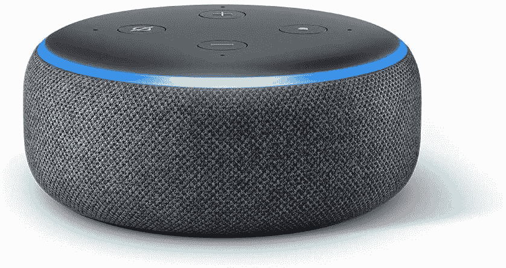

# 如何在你的 Echo 音箱上启用 Alexa 的男声 Ziggy

> 原文：<https://www.xda-developers.com/how-to-enable-male-voice-amazon-echo-speakers/>

亚马逊的 Echo 系列扬声器在大多数家庭中都很受欢迎。它们价格实惠，对大多数人来说音质足够好，而且它们很聪明。所有的 Echo 扬声器都内置了亚马逊的语音助手 Alexa。Alexa 可以回答你的问题，播放你最喜欢的歌曲，从亚马逊为你订购东西，并做许多其他很酷的事情。直到现在，Alexa 只会用女性的声音和你交流。然而，这不再是事实，因为亚马逊刚刚在亚马逊回声扬声器上引入了一种新的男性声音，称为 Ziggy。

 <picture></picture> 

Amazon Echo Dot

首先由 [*环境*](https://www.the-ambient.com/news/alexa-male-voice-now-available-ziggy-2675) 发现，亚马逊的回声扬声器现在有了男声。虽然这项功能已经在谷歌助手和 Siri 等竞争对手的语音助手上存在了一段时间，但直到最近，你在 Alexa 上只有一个默认选项。新的男声伴随着一个新的醒词——*瑞格。*启用男声是一个相当简单的过程。所以，如果你有兴趣尝试一下，这里有一些你可以做的方法。

## 如何在回声扬声器上启用男声

在我们开始这些步骤之前，请注意，这项功能正在逐步向用户推出，您可能还无法使用。如果您找不到更改声音的选项，建议您等待几天，然后再试一次。此外，截至目前，启用男性语音的功能仅在美国推出，因此，如果你想改变语音，并且位于其他地方，你可以在 Alexa 应用程序内改变你的位置，然后按照这些步骤操作。

有两种方法可以做到这一点——最简单的方法是说出唤醒短语， *Alexa* ，或者你设置的任何东西，然后说*“改变你的声音”*这样应该比较理想，助理要有男声。如果这种方法不起作用，您可以按照以下步骤在您的回声扬声器上启用男声:

*   在智能手机上打开*亚马逊 Alexa* 应用。

*   前往底部的*设备*选项卡，选择 *Echo & Alexa* 。
*   选择要更改声音的设备。如果您有多个设备，并希望更改所有设备上的声音，您必须为每个扬声器重复该过程。

*   接下来，点击左上角的*设置*图标。
*   向下滚动直到你找到写着 *Alexa 的声音的选项。点击它，选择*新建*。*

*   Alexa 现在应该有男声了。如果您希望将唤醒词更改为 Ziggy，选择*唤醒词*并点击 *Ziggy* 。

* * *

你现在可以在亚马逊 Echo 扬声器上使用男声了。如果你想把它变回原来的声音，你必须重复同样的步骤，但是在声音选项中选择*原来的*而不是*新的*。