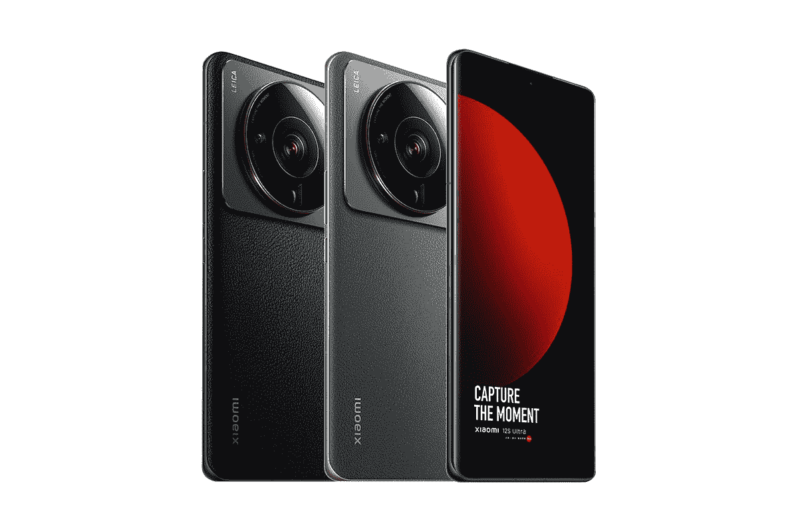
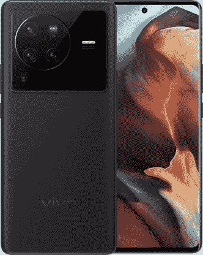
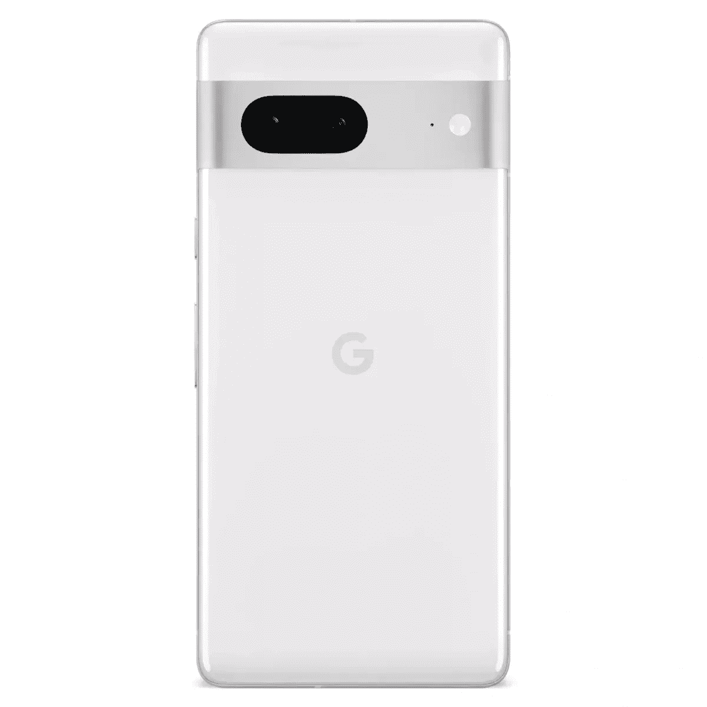
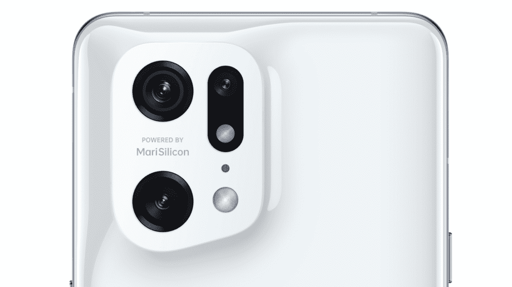
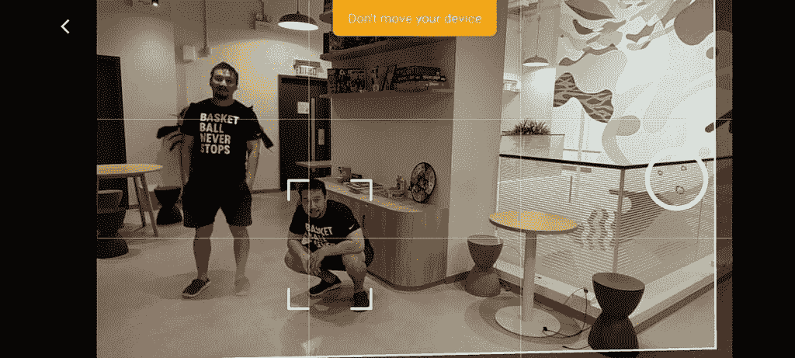

# 2023 年最佳智能手机相机

> 原文：<https://www.xda-developers.com/how-to-get-a-front-facing-camera-on-your-vibrant/>

用最好的相机挑选手机曾经是一件容易的事。在智能手机的早期，iPhone 的摄像头远远好于 Android 的产品。然后[大牌安卓品牌](https://www.xda-developers.com/best-android-phones/)迎头赶上，在 2010 年代中期的几年里，三星一直占据着桂冠。

在这十年的后半段，我认为谷歌和华为分别主导了手机摄影的软件和硬件部分。但从 2020 年左右开始，其他品牌通过投入更多资源加快了他们的数字成像游戏；苹果更重视计算摄影，三星在相机硬件方面借鉴了华为一两页。

今天的手机相机已经变得如此强大和多样化，以至于不可能只说一部手机是绝对最好的，因为所有最好的智能手机都有很好的相机-许多都有一两个独特的技巧。所以在我看来，评价这些相机最好的方法就是把它们分解成不同的拍摄类别。

我们在 XDA 已经测试了几乎每一款上市的智能手机——甚至是不知名的、只针对中国的手机——下面是我们针对每一种特定需求的最佳相机的分类。

## 多功能性最佳相机系统:三星 Galaxy S22 Ultra

三星的 Galaxy S21 Ultra 几乎在 2021 年的所有时间里都保持着这一头衔，因此很自然地取代这一位置成为最佳整体系统。没有其他手机有能力覆盖像 Galaxy S22 Ultra 那样多的地面，从扫描 120 度超宽镜头一直到可维修的实际可用的 30 倍变焦。Galaxy S22 Ultra 实际上可以从 30 倍变焦到 100 倍，但我们认为超过 30 倍的照片在细节上看起来太软了，不值得作为优势。

Galaxy S22 Ultra 的主摄像头是一个大型传感器，108MP 摄像头，可以拍摄全 1.08 亿分辨率和 1200 万像素的镜头。三星使用一种名为“自适应像素”的新技术，将 108MP 和 12MP 图像合并成一幅具有“超大像素”的图像。结果是拍摄的照片比大多数其他手机相机更明亮、更生动、保留更多细节。

还有其他有用的拍摄模式和选项:例如，让 Galaxy S22 超接近某个物体，微距模式就会启动，而无需你做任何事情。在低夜场景下拍摄，夜间模式自动开启。变焦到 20 倍及以上，“变焦锁定”功能使取景器保持静止，尽管手在发抖——这一功能对拍摄月亮很有用。

Galaxy S22 Ultra 相机系统并不完美——它往往会使自拍过于清晰，存在非常微妙的快门延迟，我们实际上认为谷歌 Pixel 6 和 Vivo X70 Pro Plus 的主相机产生的动态范围略好。但是，如果你想要最好的整体，最通用的系统，在任何一个类别中都不会失败，这就是这个系统，只有这个列表中的下一款手机在合理的范围内挑战王座。

 <picture></picture> 

Samsung Galaxy S22 Ultra

Galaxy S22 Ultra 带回了去年的超级多功能相机系统，并进行了全面的细微改进，以实现一个更加完美的相机系统，可以做到这一切。

## 最佳日间照片相机:谷歌 Pixel 7 Pro

如果你想要一台可以瞄准的相机，轻按快门按钮，确信你拍出了精彩的照片，我们的选择是[谷歌 Pixel 7 Pro。](https://www.xda-developers.com/google-pixel-7-pro-review/)Pixel 6 系列的 50MP GN1 传感器和 1/1.31 英寸的大传感器回归，但经过第二年的完善，以及谷歌张量 G2 芯片，它比以往任何时候都更好，具有快速自动对焦，响应快门，以及在任何光线条件下都能在每次拍摄中找到完美平衡的能力。更大的传感器也意味着相机会自然地吸收光线，并具有较浅的对焦窗格，因此大多数前景中有清晰主体的镜头周围都会有美观的散景，以将主体(或物体)与背景分开。

当然，谷歌的计算摄影能力仍然在这里支持令人敬畏的传感器，所以即使你在逆光拍摄，也可以期待具有惊人 HDR 的适当平衡的照片。如果你的照片碰巧有不想要的元素(可能是框架中的垃圾桶，或者有人走进镜头)，谷歌的魔法橡皮擦也可以从背景中抹去不想要的干扰。它并不总是奏效，但当它奏效时，它确实是神奇的。看看下面这些照片样本。

 <picture></picture> 

Google Pixel 7 Pro

Pixel 7 Pro 是谷歌有史以来最好的手机，拥有精致、优质的设计和谷歌第二代硅芯片，以及一如既往的出色摄像头。

## 白天拍照也很棒的相机:小米 12S Ultra

小米 12S Ultra 可能是目前最令人印象深刻的主摄像头硬件，一个使用 1 英寸索尼 IMX989 传感器的 50MP 主摄像头。这是目前智能手机领域最大的传感器，它允许小米的顶级手机拍摄几乎 DLSR 级别的散景照片，以及一个可以吸收如此多光线的传感器，你真的不需要夜间模式。更大的传感器带来了如此多的动态范围和数据，以至于拍摄更加有机，而不需要像其他手机那样过度锐化。这有助于小米与徕卡合作处理图像，因此照片具有强烈的对比氛围，非常美观。还有一对 4800 万像素的摄像头，覆盖了 ultra-wie 和 5X 变焦焦距范围，它们都是可靠的表演者。然而，在曝光方面，自拍相机可能有点不稳定。

12S Ultra 落后于 Pixel 7 Pro 的原因是，尽管其主摄像头的天花板较高，但它的地板也较低，有时会以 Pixel 7 Pro 从未有过的方式发出光线。

 <picture></picture> 

Xiaomi 12S Ultra

##### 小米 12S Ultra

小米的 12S Ultra 拥有一个巨大的 1 英寸传感器，采用徕卡光学技术——它不负众望。

## 夜间或弱光照片的最佳相机:Vivo X80 Pro

我们最近做了一个[全面的相机测试](https://www.xda-developers.com/vivo-x80-pro-review/)，得出的结论是 Vivo X80 Pro 可以说是今年最好的相机手机，它主要归功于它在弱光环境下的实力。使用定制的 GNV 传感器，Vivo X80 Pro 主摄像头可以凭空吸收光线，由于专用的 V1+ ISP 芯片，Vivo 的 HDR 非常好，甚至超过了苹果和谷歌。

对于城市中的一般夜间照片，Vivo X80 Pro 可以产生无噪声、清晰和充满活力的图像，而无需求助于夜间模式。

超宽相机也很强大——因为其他手机品牌的超宽相机没有这么强大，这使得这一类别的质量差距更大。看看 iPhone 13 Pro 和 Galaxy S22 Ultra shots 与 Vivo X80 Pro 相比熄灭所有灯的方式。

再加上一个高于平均水平的变焦系统(没有 Galaxy S22 Ultra 那么好，但仍然比 iPhone 13 Pro 好)，你就有了最好的智能手机相机来拍照。

 <picture></picture> 

Vivo X80 Pro

##### Vivo X80 Pro

Vivo X80 Pro 可以说是目前市场上最好的主相机，这是一款全能相机，可以拍摄亚洲城市的霓虹灯或拍摄平衡的室内美食。超广角和人像镜头也很强，唯一的弱点是低于标准的潜望镜变焦镜头。

## 最佳人像相机:谷歌 Pixel 7 和 Pixel 7 Pro

谷歌的计算摄影是首屈一指的，显而易见的是，多年来，尽管只使用了一个摄像头，谷歌的 Pixel 手机仍然能够拍摄出具有散景效果的最佳人像(而其他手机则宣传使用专用深度传感器来完成这项任务)。以下样本由 Pixel 7 Pro 拍摄，但标准 Pixel 7 将产生相同的镜头。

将 Pixels 与其他手机区分开来的是，谷歌的计算智能还可以在无生命物体周围产生令人信服的散景，而其他手机(特别是 iPhones)实际上只能在人脸周围拍摄人像。

但是因为 Pixel 7 系列有一个带大型图像传感器的主相机，这意味着即使你不想在人像模式下拍摄，如果你的主体/对象离镜头足够近，你仍然可以获得一些令人满意的自然散景。

如果你想在智能手机照片中使用散景，Pixel 7 系列是最好的选择。

 <picture></picture> 

Google Pixel 7

##### 谷歌 Pixel 7 系列

谷歌的新 Pixel 7 和 Pixel 7 Pro 比去年的型号有了很大的改进。两款手机都升级了内部结构，设计也略有不同。

## 最佳超宽相机:OPPO Find X5 Pro

OPPO Find X5 Pro 拥有市面上最好的超宽摄像头，因为它没有把超宽摄像头当成二次镜头。Find X5 Pro 的 50MP 超宽相机使用完全相同的索尼 IMX766 作为主相机。虽然主摄像头由于具有更快的光圈和更小的覆盖面积而仍然略胜一筹，但 Find X5 Pro 的主摄像头和超宽摄像头之间的图像清晰度和动态范围差距小于大多数其他手机。

因为 Find X5 Pro 超宽传感器的像素密度非常高，所以它们保留了足够的细节，可以与主摄像头保持同步。我喜欢这两款手机，我可以捕捉标准宽照片，然后是超宽照片，我知道这两张照片在清晰度、动态范围和色彩科学方面是一致的。

如果你经常拍摄全景照片，OPPO Find X5 Pro 的超宽将始终为你提供最佳效果。

 <picture></picture> 

OPPO Find X5 Pro

##### Oppo Find X5 Pro

Oppo Find X5 Pro 拥有 2022 年发布的任何手机中最好的超宽摄像头。

## 最佳自拍相机:Vivo V21

Vivo 的 V 系列一直将前置摄像头放在高于一切的位置， [Vivo V21](https://www.xda-developers.com/vivo-v21-5g-review/) 的 44MP 自拍摄像头，带两个闪光灯和 OIS，在这里摘得桂冠。

然而，这不仅仅是硬件——Vivo 的自拍软件也提供了精细的控制，从背景模糊的程度到几种不同的闪光灯选项，再到可以应用数字化妆的过度美化模式。请注意，在下面的第三和第四张照片中，我是在非常刺眼的背光下拍摄的，但自拍仍然成功地突出了我的脸，而没有吹灭背光。

内置的 OIS 减少了弱光自拍(当相机减慢快门速度或打开夜间模式时)或边走边说风格的视频日志中潜在的模糊镜头。

## 最佳变焦相机:三星 Galaxy S22 Ultra

正如我们已经在“最佳整体”类别中被宠坏的一样， [Galaxy S22 Ultra](https://www.xda-developers.com/samsung-galaxy-s22-ultra-review/) 拥有最强大的变焦系统。这要归功于由 3 倍长焦相机和 10 倍潜望镜镜头组成的双变焦系统。这意味着 Galaxy S22 Ultra 可以产生 3 倍和 10 倍焦距的光学变焦，后者是市场上几乎所有其他手机无法比拟的。以 10 倍光学变焦图像为基础，Galaxy S22 Ultra 也可以产生惊人清晰的 20 倍和 30 倍图像。

如果你住在一个人口稠密的城市，从远处拍摄许多有趣的事情，Galaxy S22 Ultra 带来了无与伦比的便利。

## 最佳视频相机:iPhone 14 Pro/Pro Max

现在，大多数旗舰智能手机都可以拍摄高质量的视频，但 iPhone 14 系列，尤其是 Pro 手机，仍然占据优势，因为它拥有稳定性、适应曝光变化的能力以及使用看起来有点自然的数字散景拍摄的选项的最佳组合。 [iPhone 14 Pro 和 Pro Max](https://www.xda-developers.com/apple-iphone-14-pro-max-review/) 还可以在拍摄过程中在所有三个镜头之间无缝切换，这意味着你可以从超宽镜头一直切换到 3 倍变焦甚至更高，视频看起来基本上是流畅的，不会出现你在 Galaxy S22 Ultra 中切换相同镜头时出现的明显抖动。

但是我们特别喜欢电影模式，如前所述，这种模式会在主题周围产生人工散景。iPhone 14 系列的新功能是以 24fps 的速度拍摄电影模式，这进一步给镜头带来了电影氛围。这不会欺骗专业人士的眼睛，但对于未经训练的眼睛来说，这段视频看起来比典型的平面智能手机视频更专业，更有深度。自己看下面的样本。

iPhone 14 Pro Max 是苹果最大最好的智能手机，在典型的苹果时尚中，它既是一个发电站，也是一个耐力怪兽。

## 最佳拍照软件和功能:小米 12S Ultra

如果我们只是在谈论相机应用程序的 UI，那么在不同拍摄模式之间循环有多容易？相机的响应速度如何？我会把胜利给一加的相机应用。但是一旦我们考虑到产生不同图像的附加功能，那么我认为现在没有任何相机软件可以接近小米的。

小米的 [MIUI 12](https://www.xda-developers.com/download-miui-12-stable-update-rolling-out-several-xiaomi-redmi-mi-poco-devices/) 和它的相机应用程序有一个全面的手动模式，具有对焦峰化、直方图和快速拨号来调整 ISO 和快门速度。常规相机界面易于使用，所有按键包括变焦拨盘和自拍相机交换都在拇指范围内。但正是额外的拍摄模式让该软件使用起来如此有趣。例如，小米的相机应用程序包括一个“人工智能天空编辑器”，允许用户为任何显示天空的照片添加滤镜。

这个功能可能很容易变得俗气和花哨，但结果实际上是非常真实和美观的。

另一个有趣的技巧是克隆，这让最近的小米手机可以在一个镜头中快速克隆同一主题的多个实例。当然，有电脑照片编辑软件，甚至可能有应用程序可以做到同样的功能，但小米将这些功能内置到相机应用程序中，使其更容易使用。

 <picture></picture> 

The clone feature is part of Xiaomi's camera app.

它适用于照片和视频。

## 结论:智能手机摄像头越来越好了

有一句流行的谚语:“最好的相机是你随身携带的。”对于我们几乎所有人来说，那就是智能手机摄像头——我们很幸运生活在一个智能手机摄像头变得如此强大的时代。当然，专业摄影师总会对智能手机能够取代真正相机的想法嗤之以鼻。但是对于大多数人来说，已经是这样了。当你去旅游景点时，你会看到更多的智能手机相机或数码单反相机吗？

显然，如果你想要一个涵盖所有基础的最通用的系统，那么 [Galaxy S22 Ultra](https://shop-links.co/1741738010066746168?u1=e35b07a4-be49-4ff6-9b5c-00e547c865ca) 就是你要找的那个。但是，如果你想要所有条件下的最佳照片，那么 Pixel 7 Pro 或 Vivo X80 Pro 在低夜和超宽拍摄方面甚至击败了 Galaxy S22 Ultra。同样，如果你是 iOS 的长期用户，不想换，iPhone 14 系列仍然是一款高度精致的相机，拥有一些最好的 HDR 技术。

问题是，总会有一款新的智能手机承诺在相机方面取得新的突破，所以每隔几个月检查一下这个列表，看看是否有新人取代了现有的冠军！