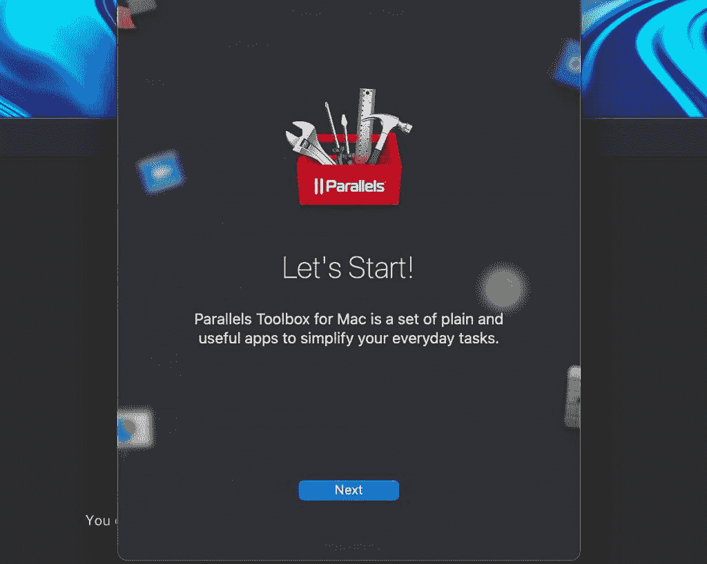
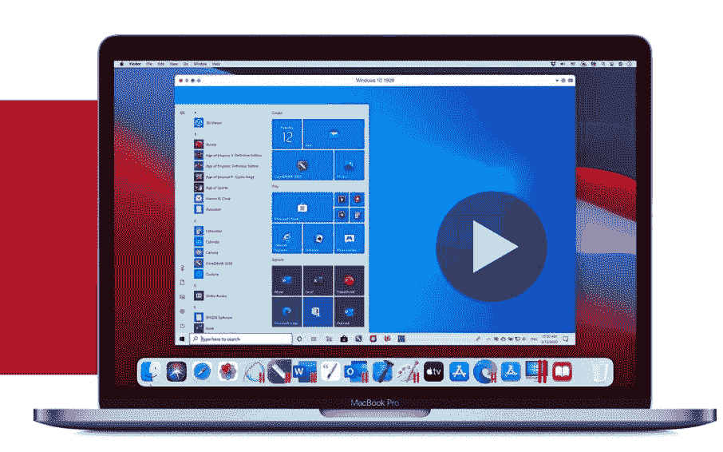

# 如何用 Parallels 在苹果 Mac 上安装微软 Windows 11

> 原文：<https://www.xda-developers.com/how-to-install-windows-11-parallels-for-intel-mac/>

毫无疑问，macOS 很棒。它有着现代的外观，在苹果的硬件上运行速度惊人。也就是说，有时候你需要使用 Windows，即使是在你的 Mac 上。Parallels Desktop 18 是与 macOS 并行运行 Windows 的流行软件的最新版本。有许多程序仍然只能在 Windows 上运行。您可能还需要运行一些 Windows 应用程序来工作。对于那些喜欢在笔记本电脑上玩游戏的人来说，在 Mac 上运行一些 PC 游戏的能力是一个额外的好处。 [Parallels Desktop 18 for Mac](https://www.anrdoezrs.net/links/100122946/type/dlg/sid/UUxdaUeUpU4811/https://www.parallels.com/products/desktop/) 最吸引人的功能之一是能够在苹果硬件上运行 Windows 11。在本教程中，我们将向您展示如何在 Parallels Desktop 18 for Mac 上安装 Windows 11。如果你使用 Chrome 操作系统，看看另一个关于在 Chrome 操作系统上安装 Windows 的教程[。](https://www.xda-developers.com/windows-10-chrome-os/)

## 安装 Parallels Desktop 18

在 Mac 上安装 Windows 11 的第一步是下载 Parallels 18 Desktop。您可以通过前往 [Parallels 18 试用页面](https://www.anrdoezrs.net/links/100122946/type/dlg/sid/UUxdaUeUpU4811/https://www.parallels.com/products/desktop/trial/)并点击**下载免费试用版**按钮来完成。

Parallels Desktop 18 安装程序 DMG 文件将出现在您的**下载**文件夹中，您可以双击该文件夹开始安装。

您可能会收到警告，Parallels Desktop 是您从互联网下载的应用程序。这是出于安全目的的标准 Apple 对话框。只需点击**打开**继续。

双击内部有窗口显示的方框图标(见下文)。此时，安装程序将下载整个 Parallels Desktop 18 软件包以准备安装。

接下来，您需要接受 Parallels 18 软件许可协议。您也可以选择与 Parallels 共享信息，帮助提高软件的稳定性。如果您不想共享此信息，只需取消选中该框。

现在 Parallels 已经安装在您的机器上，您需要下载 Windows 11。好消息是 Parallels 会为您处理整个 Windows 11 下载流程。

## 下载并安装 Windows 11

Parallels 18 安装助手会显示一个下载 Windows 11 的对话框。请记住，您也可以使用 Parallels 运行其他操作系统，如 Linux 或旧版本的 macOS。这意味着您可以在安装 Parallels 18 时跳过这一步。

选择**安装 Windows** 选项后，Parallels 将开始下载 Windows 11。正如您所料，下载量相当大。根据您的网速，这一步可能需要相当长的时间。

Windows 11 完全下载后，您需要接受一些权限来完成安装，并使用 Parallels 18 设置 Windows 11。下面的麦克风权限可能看起来有点奇怪，但这只是运行 Windows 11 启动过程的一个要求。

接受权限后，Windows 11 将完成启动过程，这也可能需要大约 10 分钟，具体取决于您使用的 Mac。

最后，您会看到一个带有大的绿色复选标记的完成屏幕。Windows 11 现已安装并作为虚拟机在 Parallels Desktop 18 for Mac 中运行。

要在虚拟机中实际使用 Windows 11，您需要阅读并接受更多与数据隐私相关的协议。这些都是相当标准的法律术语，但你应该阅读它们，以了解使用这个软件你会遇到什么。

接受这些隐私协议后，Windows 11 将打开 Microsoft Edge 并显示 Parallels 18 闪屏，表明您已成功安装 Windows。这一页上实际上有一些有用的信息，所以让我们来看看一些有用的提示。

第一个建议是安装你想要使用的所有必要的 Windows 应用程序。

下一个建议是选择 Windows 如何出现以及如何与 macOS 和其他 Mac 应用程序交互。选项有融合模式或全屏模式。我建议在做出选择之前，考虑一下你打算如何在 Mac 上使用 Windows。

如果你想偶尔运行一两个 Windows 应用，Coherence 模式很好，因为你可以忘记你已经安装了 Windows。另一方面，如果你打算大部分时间使用 Windows，全屏模式可能是最好的。您可以在这一步选择合适的模式。

最后一个对话框只是提到所有的 Mac 文件都可以在 Windows 用户配置文件文件夹中访问。这是 Parallels 最好的功能之一，因为它允许你无缝地同时使用 macOS 和 Windows。你甚至可以选择将 macOS 中的文件设置为默认在 Windows 应用中打开，这真的很酷。

此时，我建议花几分钟时间安装 Parallels Toolbox for Mac and Windows。该程序实际上是一个独立的产品，但是与 Parallels Desktop 18 捆绑在一起。这些工具箱允许您在 macOS 和 Windows 上完成几个常见任务。

## 

将弹出一个窗口，并提供安装 Mac 和 Windows 工具箱。安装这些程序非常快，如果你打算经常在 macOS 和 Windows 之间切换，它们也非常有用。Mac 版的工具箱有相当多的选项，如演示模式、图像大小调整和从 Mac 上卸载程序的能力。

Windows toolbox 有点受限，它提供了下载视频、暂停工作以及仪表板中其他各种截图工具的功能。

## 个性化 Parallels 的 Windows 设置

现在您已经在 Mac 上安装了 Windows 11，您应该在 Parallels Desktop 18 中为 Windows 配置一些设置。为此，请前往 Mac 顶部的**操作**菜单。从该菜单底部选择**配置**选项。

当配置菜单打开时，您可以针对不同的使用情况配置 Windows 安装。这将改变 Mac 上为 Windows 11 保留的总存储量。

您还可以在此菜单中更改 Windows 的启动和关闭方式、电池节能优化以及共享选项。花一些时间来调整每个标签中的这些设置是值得的，尤其是如果你打算在 Windows 和 macOS 之间来回切换的话。

最后，请记住，如果你不打算长时间使用 Windows，暂停它是一个好主意。虽然 Parallels Desktop 18 比以往任何时候都更加优化，但它在运行时仍会占用大量系统资源。如果你只打算在几个程序上使用 Windows，而大部分时间在 macOS 上，这是非常重要的。

在这一点上，你应该可以在 Mac 上运行 Windows 11 了。Parallels Desktop 18 是一款优秀的产品，[尤其适合学生](https://www.xda-developers.com/best-apple-products-for-students/)。到目前为止，我对运行 Parallels Desktop 18 的整体体验非常满意。我个人更喜欢 coherence 模式，在这种模式下，我可以并排使用 Mac 和 Windows 应用程序。你现在可以在任何 Mac 上享受 Windows 11，这是一件大事。

 <picture></picture> 

Parallels Desktop 18 for Mac

##### Parallels 桌面

Parallels Desktop 18 for Mac 支持 Windows 11、macOS Ventura 和 Apple Silicon 硬件。所有这些功能都带来了额外的性能改进，使其成为迄今为止最好的 Parallels Desktop。

*为什么需要在 Mac 上安装 Windows 11？请在下面的评论区告诉我们。*