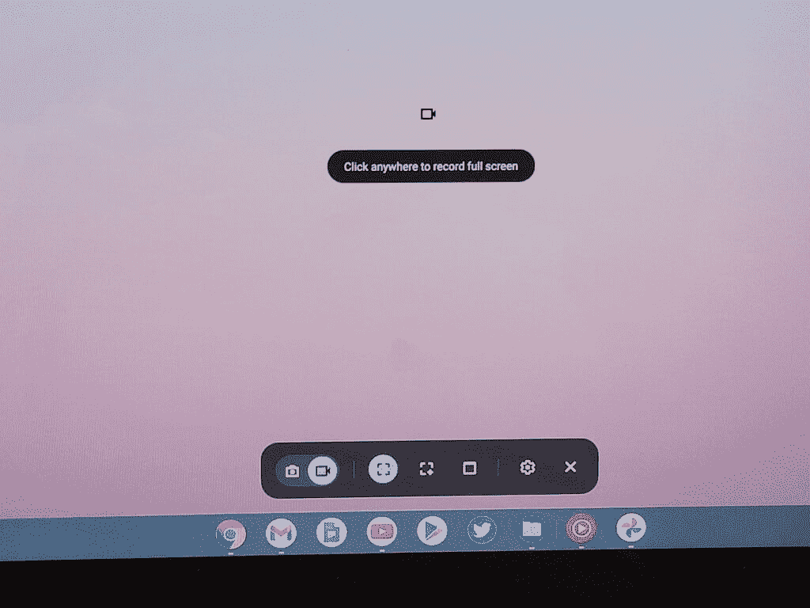
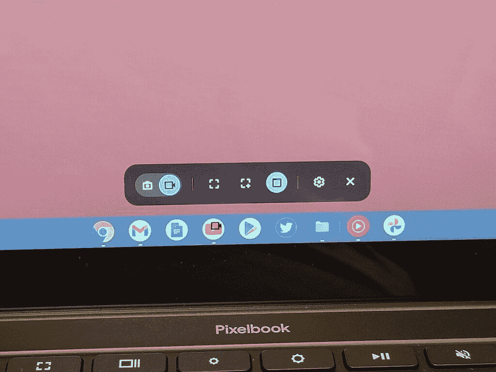

# 如何用两种简单的方法在 Chromebook 上录制屏幕

> 原文：<https://www.xda-developers.com/how-to-record-screen-chromebook/>

在你的新 Chromebook 上录制屏幕对于教程或者只是向朋友展示一些东西非常有用。有时你甚至需要在工作或学校录制演示文稿。幸运的是，ChromeOS 内置了屏幕录制功能。如果你想要更多的选项，你可以使用一些漂亮的第三方应用程序和扩展来精确编辑你的录音。

ChromeOS 中的原生屏幕记录器相当新，所以你可能以前没有用过。在本教程中，我们将向您展示内置记录器是如何工作的，并为额外的定制和编辑提供最佳的第三方选项。

## 使用 ChromeOS 屏幕录制器在 Chromebook 上录制屏幕

使用 ChromeOS 内置的屏幕捕捉功能是在 Chromebook 上记录屏幕的最简单方法。这就是你如何做到这一点。

1.  若要开始，请点按右下角架子上的时钟，以打开快速设置面板。
2.  接下来，点击*屏幕截图*按钮。
3.  屏幕截图工具栏将出现在屏幕底部。确保选择视频图标进行屏幕录制。如果你只是想捕捉一个截图而不是视频，可以使用相机图标。
4.  您可能还想使用右侧的设置按钮打开麦克风访问。这将记录音频与您的屏幕记录，这是非常有用的教程。

有几种不同的方法可以录制屏幕。您可以选择录制全屏幕、部分屏幕或特定窗口。让我们来看看这些是如何工作的。

### 录制全屏幕和录制部分屏幕

### 

如果您想要录制全屏幕，请选择屏幕捕获工具栏中间最左边的图标。此选项将记录您屏幕上的所有内容。要开始录制，您可以单击屏幕上的任意位置。要仅录制屏幕的一部分，您需要选择想要录制的屏幕部分。这可以是你喜欢的大小，但请记住，如果你选择的区域太小，视频可能会看起来很奇怪。拖动选择所需区域后，点击*记录*开始记录。

### 录制特定窗口/应用程序

### 

有时，您可能只想在特定窗口或应用程序中录制。如果你用 Chromebook 演示游戏或在工作或学校演示，这是一个很好的选择。要录制特定的窗口，请单击您想要录制的应用程序的图标，您就可以开始了。

在每种情况下，您都会在 dock 的右下角看到三秒钟的倒计时。倒计时结束后，录音立即开始。您可以通过点击 dock 右上角的红色停止按钮来停止录制。停止录制后，您会收到通知，告知您可以在下载文件夹中查看屏幕录制内容。

如果你喜欢[键盘快捷键](https://www.xda-developers.com/chrome-os-keyboard-shortcuts/)，你也可以使用 *CTRL+SHIFT+Show Windows* 调出屏幕截图工具。调出工具栏后，剩下的过程与上述步骤相同。

## 使用 Screencastify 在 Chromebook 上录制屏幕

Screencastify 是一个非常棒的 Chrome 扩展，适合高中或大学水平的教师和教授。当你只是想让你的屏幕录制更上一层楼的时候，它也是完美的。您可以使用画中画网络摄像头支持录制您的屏幕。如果你制作 YouTube 视频，这个应用程序非常适合讲座或一般的教程视频。

不幸的是，超过 5 分钟的视频需要订阅费。在录制更长的视频时，你仍然可以免费使用该应用程序，但它们将被添加水印。

除了通过网络摄像头提供画中画功能，您还可以获得一系列编辑选项，轻松地对您的录制内容进行裁剪、剪切、模糊处理或添加文本。编辑功能也仅限于 5 分钟导出，除非您升级。

对于希望收集学生提交的视频的教育工作者来说，Screencastify 还提供了与谷歌教室的集成，可以毫不费力地收集学生的作业。这些提交的内容会自动保存到 Google Drive，并集成了隐私控制，教师会收到每次提交的通知。

毫无疑问，Screencastify 是 ChromeOS 最好的第三方屏幕记录器，但它相当昂贵。有三个独立的升级选项。*录制*升级可以让你无限制地录制，*编辑*升级可以让你无限制地编辑和导出时间，*提交*升级可以让你无限制地收集学生提交的视频。这些计划分别花费 49 美元、49 美元和 99 美元。但是有教育折扣，打这些价格的 40%。

## 结论

当你在 Chromebook 上进行屏幕录制时，这些是你的最佳选择。对于简单的录制，内置的截屏工具栏非常好用。您可以轻松录制短视频并上传或分享给朋友。如果您需要更高级的编辑功能或想要嵌入网络摄像机镜头，Screencastify 是一个不错的选择。对于那里的老师来说，如果你使用谷歌教室和视频作业作为你课程的一部分，一定要看看 Screencastify 教育折扣。

欢迎在评论中提出任何问题，并查看我们的 [ChromeOS 设置指南](https://www.xda-developers.com/chrome-os-settings-guide/)以获得更多关于开始使用 Chromebook 的提示。