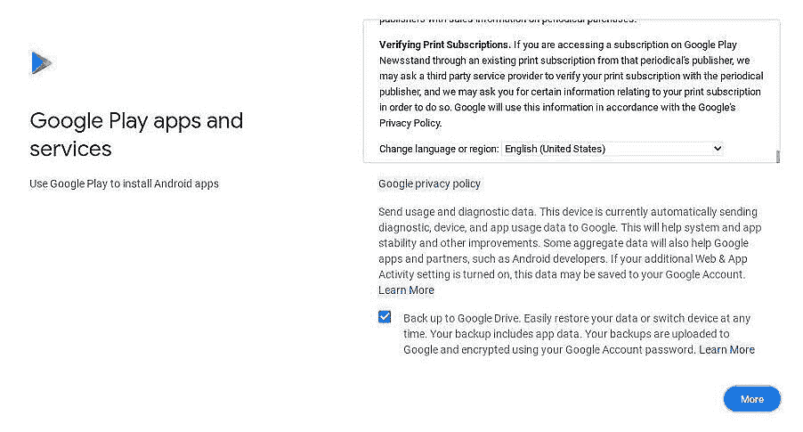

# 如何设置您的新 Chromebook

> 原文：<https://www.xda-developers.com/how-to-set-up-chromebook/>

如果你最近从 Mac 或 PC 转向 ChromeOS，你可能已经注意到设置有点不同。当迁移到一个新的操作系统和 UI 时，需要一些提示和技巧是很自然的。好消息是 ChromeOS 非常用户友好，而且非常强大。无论您是开发人员还是普通用户，可用的定制确实令人印象深刻。Chromebook 上的一些基本功能，如截图或设置通知，也有所不同。

在本文中，我们将从头到尾看看如何设置运行 ChromeOS 的 Chromebook、Chromebox 或[平板电脑。](https://www.xda-developers.com/install-chrome-os-non-chromebook-pc-tablet/)

## 基本的 ChromeOS 设置

在我们开始之前，请确保您的 Chromebook 电池电量充足。如果你的 Chromebook 目前没有多少电量，可能值得连接一个电源插座。以下步骤详细介绍了完整的初始引导菜单，并包括一些退出演练后的附加提示。

1.  打开 Chromebook 的电源。
2.  输入与您的 Google 帐户关联的电子邮件地址。请注意，您不需要在末尾输入域名。
3.  选择**下一步。**
4.  输入与您的 Google 帐户相关的密码。
5.  选择**下一步。**
6.  请注意，如果您的 Google 帐户使用双因素身份验证，您需要在此步骤中输入验证码。
7.  此时，您将有机会查看自动同步到 Chromebook 的内容。我们建议在设置选项后检查**查看同步选项。**
8.  下一个屏幕显示 Google Play 服务条款。确保选择**更多**并向下滚动阅读所有条款，查看更多选项。
9.  你可以选择禁用 Google Drive 备份，但这可能不是一个好主意，除非你有其他备份解决方案。您还可以选择停用定位服务。这是个人偏好，但如果你想使用谷歌服务，如地图，最好让它保持启用状态。
10.  我们建议您在设置 后勾选**查看您的 Google Play 选项，以便稍后查看重要权限。**
11.  现在，选择**接受。**
12.  接下来，用语音匹配设置你的谷歌助手。

初始设置到此结束，但是还有很多选项和设置需要探索。您可以选择浏览您的新机器，或者退出并手动查看设置。

## 其他设置步骤

Chromebooks 预装了一些 Android 应用，这些需要更新。如果这些应用程序还没有自动更新，下面是第二组步骤，您可以通过它们来更新这些应用程序。

1.  点击 Chromebook 上的启动器。它是屏幕左侧的圆形图标。
2.  搜索谷歌 Play 商店。
3.  点击应用程序右上角的个人资料图标。
4.  点击**管理应用程序&设备。**
5.  点击**更新可用。**
6.  允许 Android 应用程序下载和更新。您也可以手动点击**更新**按钮。

这些应用更新后，您可以搜索新的应用。只需点击返回按钮或关闭谷歌 Play 商店应用程序并重新打开它。然后，在顶部的搜索框中，键入您要查找的应用程序的名称。它会自动安装并添加到您的 ChromeOS 启动器中。

确保登录所有你喜欢的社交媒体应用或 Chrome 扩展，你应该可以进行基本的使用。这就是全部了。开箱设置新的 Chromebook 非常简单和直观。你需要做的主要事情是一个谷歌账户和一个互联网连接。确保使用您首选的云服务来备份工作或学校所需的任何文件。

如果你想更多地定制你的设置，请查看我们完整的 ChromeOS 设置指南和我们完整的 to ChromeOS 键盘快捷键指南。你也可以抓取一些[可爱的新安卓应用](https://www.xda-developers.com/android-apps-chrome-os)，开始时尚地使用你的 Chromebook。