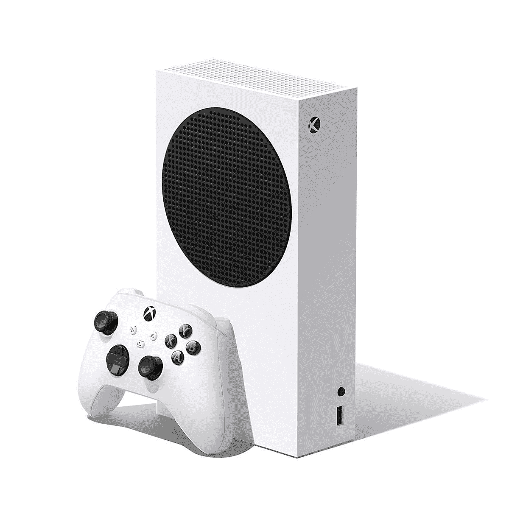

# 如何在你的 Xbox 上用谷歌助手替换 Kinect

> 原文：<https://www.xda-developers.com/how-to-use-google-assistant-xbox/>

继 Kinect 之后，Xbox 内置了对亚马逊 Alexa 语音控制的支持，效果非常好。但是，如果你使用谷歌助手和一个扬声器，如[谷歌巢音频](https://www.xda-developers.com/google-nest-audio-review/)代替呢？这一消息同样积极，谷歌助手享受与 Alexa 相同的待遇。就像亚马逊的扬声器一样，没有直接的硬件连接。相反，你使用云的力量和谷歌助手的行动。

正如你所料，这两者并不完全相同。但是无论你用哪一个，总体执行都是一样好的。不过，谷歌助手的设置过程有点不同，所以让我们一步一步来。

## 开始之前

在你开始之前，有几件事你应该确定是有序的。首先是你的 Xbox 使用的是最新的固件更新。除非您保持 Xbox 更新，否则您将无法在线使用它。稳定的数据连接是实现这一目标的关键。

之后，确保你的支持 Google Assistant 的扬声器与你的 Xbox 在同一个无线网络上，并且你使用正确的 Microsoft 帐户登录到控制台。你还需要在手机或平板电脑上安装谷歌 Home 应用程序，用于安卓(Android)系统(T1)或 T2(iOS)系统(T3)。

## 在 Xbox 主机上启用数字助理

理论上，你不应该**让**去做这件事，但是谨慎的做法是无论如何都要确保成功。在 Xbox 主机的“设置”菜单中，有一个启用数字助理的选项。要启用该功能，请按照下列步骤操作。

1.  按控制器上的 Xbox 按钮。
2.  导航至指南中的**设置**。
3.  选择**设备&连接。**
4.  选择**数字助理。**
5.  勾选**启用数字助理**。

其余的都是在你的移动设备上的 Google Home 应用程序中完成的，所以是时候去那里了。

## 在 Google Home 应用程序中链接您的 Xbox 和 Google Assistant

在开始之前，你需要确保你已经用你想使用的谷歌账户登录了谷歌主页应用。一旦你完成了这一步，剩下的就很简单了。

1.  选择左上角的 **+** 。
2.  选择**设置设备**。
3.  选择与谷歌协同工作的**选项。**
4.  选择 **Xbox** 。
5.  使用您的 Microsoft 帐户登录，并按照提示选择要链接的控制台。

如果你只有一个 Xbox 主机，那么你可以把它命名为 Xbox，但是如果你有多个，那么命名将是至关重要的。Xbox 动作将需要能够区分控制台，您提供的名称将用于做到这一点。

现在链接后，谷歌助手将能够用你的声音控制你的 Xbox 主机上的功能。一些基本要素包括:

*   嘿谷歌，打开 Xbox
*   嘿谷歌，在 Xbox 上玩光环无限
*   嘿谷歌，在 Xbox 上截图

你可以在谷歌助手和你的 Xbox 上使用更多的语音命令。微软有一个[完整列表](https://support.xbox.com/en-GB/help/hardware-network/digital-assistant-voice-commands/voice-commands-with-digital-assistants)，当你学习使用这个特性时，它值得你用书签标记。

 <picture></picture> 

Xbox Series S

##### 微软 Xbox 系列

微软最便宜的新一代游戏机以更小、更实惠的包装带来了 X 系列的许多好处。