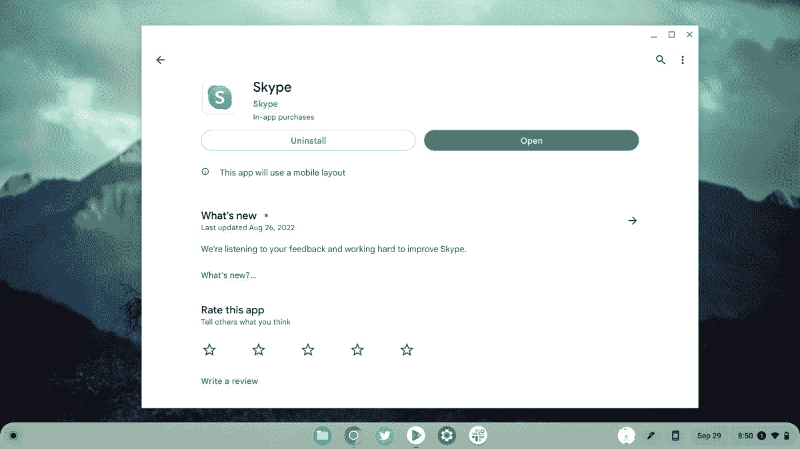
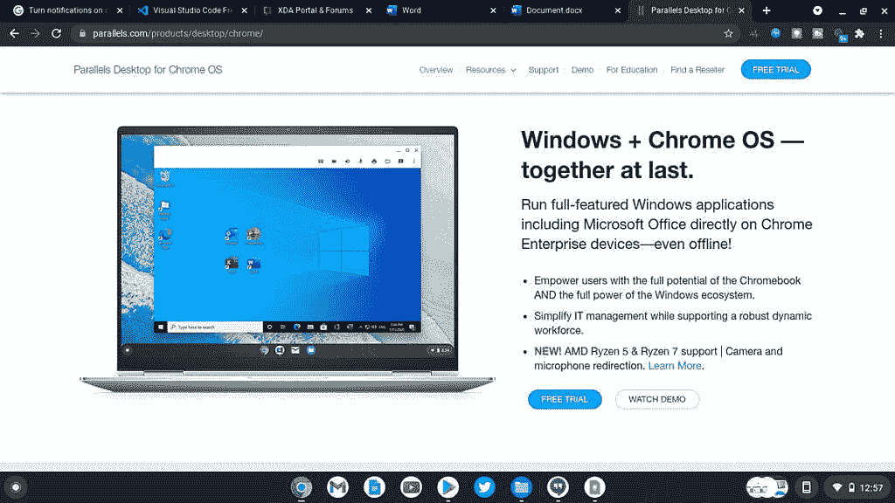

# Skype 可以在 Chromebook 上使用吗？

> 原文：<https://www.xda-developers.com/how-to-use-skype-chromebook/>

# Skype 可以在 Chromebook 上使用吗？

在本文中，我们将讨论在 Chromebook 上运行 Skype 的能力。web 应用程序和 Android 应用程序选项均已讨论。

Skype 是世界上最受欢迎的视频会议应用之一。如果你使用最好的 Chromebooks 之一作为日常工作或学校的设备，你可能会想运行 Skype。除了业务通话外，您还可以将 Skype 用作信使服务，与家人和朋友保持联系。虽然 Skype 不提供原生 ChromeOS 应用程序，但在 Chromebook 上运行 Skype 有几个可行的选项。

## 通过网络应用程序运行 Skype

在 Chromebook 上运行 Skype 的最佳选择是通过[微软 Skype 网络应用套件](https://web.skype.com/)。您可以在浏览器中使用 Skype 轻松发送即时消息和进行视频通话。这种方法也很自然，因为你的 Chromebook 是为云计算而设计的。

网络应用的一个主要优势是你不需要安装任何东西，节省了你设备上的存储空间。即使您无法使用手机或桌面应用程序，Skype 也随时准备提供完整的体验。只需登录[web.skype.com](https://web.skype.com/)，使用功能齐全的 [Skype 浏览器内应用](https://web.skype.com/)开始工作。它提供了所有你喜欢的功能，并且只需点击一下就可以使用。

## 通过 Android 应用程序运行 Skype

如果你喜欢在 Chromebook 上本地运行 Skype 应用程序，微软也为 Skype 提供了一个 Android 应用程序。总的来说，Android 版本的 Skype 应用程序在 ChromeOS 上运行得相当好。所有关键功能都包括在内，如即时消息和视频通话。安装 Skype Android 应用程序也很简单。

1.  打开谷歌 Play 商店，点击上面的方框下载 Skype。
2.  安装应用程序。
3.  安装完成后，轻扫或点击你的应用抽屉。
4.  找到并打开应用程序，登录，你就可以开始了。

与 Chromebook 硬件的整体集成针对 Skype Android 应用程序进行了非常好的优化。你仍然可以使用大多数 Chromebooks 提供的触摸界面。这个应用程序也运行良好

  [ChromeOS powered tablets](https://www.xda-developers.com/install-chrome-os-non-chromebook-pc-tablet/)

。[EMBED _ APP]https://play . Google . com/store/apps/details？id = com . Skype . raider[/EMBED _ APP]

## 通过 Parallels 运行 Skype Windows 应用程序

也许您想运行 Skype 的完整 Windows 版本？使用 Parallels Desktop for ChromeOS 也可以做到这一点。需要注意的是，目前 Parallels Desktop for ChromeOS 仅面向企业客户。对于商业用户来说，这无疑是一个值得考虑的有用选项。Parallels 软件在 Chromebook 的一个容器中运行 Windows 10 的完整版本。在 ChromeOS 设备上安装完整版 Windows 后，您可以轻松下载并运行完整版桌面版 Skype 应用程序。这种方法有一些主要优点。最重要的是，您保留了每个 Windows 用户都熟悉的组织良好的桌面界面。

name = " nano-product-box " product link = " https://www . anrdoezrs . net/links/100122946/type/DLG/sid/7a 87 ecae-54e 8-4634-9c 61-bcc4 f 358 baed/https://www . Parallels . com/products/Desktop/chrome/" data-lnk orig = " https://www . Parallels . com/products/Desktop/chrome/" product name = " Parallels Desktop for ChromeOS " product image 这款软件可以让你在 Chromebook 上运行完整版的 Windows。”buttontext= "在 Parallels.com 购买"]

在 Chromebook 上运行 Skype 有几个很好的选项。如果你是个人用户，网络应用或安卓应用可能是最好的。商业用户可能想要探索使用 Parallels Desktop 在 ChromeOS 上运行 Windows 11 的选项。无论哪种方式，如果你为了工作整天打视频电话，考虑一个好的

  [docking station](https://www.xda-developers.com/best-docking-stations-chromebooks/)  

简化您的工作流程。