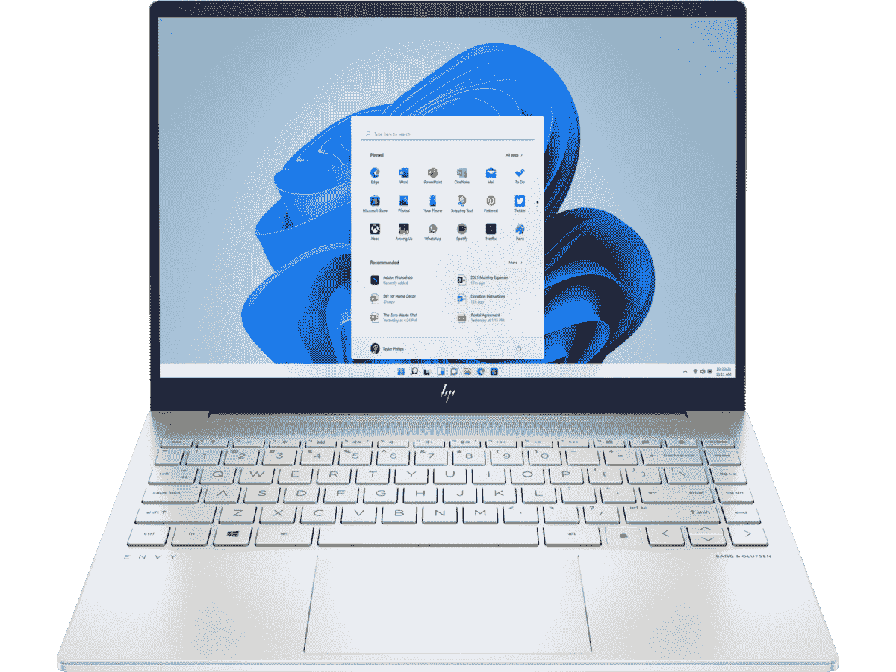

# 惠普 7 月黑色星期五的优惠包括 Envy 笔记本电脑最高 390 美元的折扣等

> 原文：<https://www.xda-developers.com/hp-black-friday-july-390-off-envy-laptops-more/>

亚马逊并不是唯一一家试图通过黄金日吸引所有人注意力的零售商。其他公司也来凑热闹，如果你想在新电脑、新显示器和配件上省钱，惠普有各种各样的 7 月黑色星期五优惠活动。通常情况下，大多数交易都是在采用最新一代处理器的设备上进行的，但你可以在某些笔记本电脑上获得高达 400 美元的折扣，如果你喜欢游戏，你甚至可以在 omn icuring l 游戏台式机上获得 700 美元的折扣。

让我们从这里开始——om ---- l 是一款强大的游戏台式机，由英特尔酷睿 i7-11700K 驱动，这是一款 8 核 16 线程 CPU，能够提升至 5GHz。它还配有 Nvidia GeForce RTX 3080 Ti 显卡，这是目前你能买到的最强大的 GPU 之一。除此之外，您还可以获得 32GB 的 3200 MHz DDR 4 内存(有两个空的 SODIMM 插槽用于扩展)，加上 512GB 的 NVMe 固态硬盘和 2TB 的硬盘用于存储，为您提供充足的空间来玩游戏和其他任何您想要的东西。通常，它的售价为 2499.99 美元，但你现在只需 1799.99 美元就可以买到，所以你可以以更合理的价格获得充足的电力。

如果你对笔记本电脑更感兴趣，也有一些不错的选择。一个亮点是惠普 Envy 14，它从 1489.99 美元降至仅 1099.99 美元。它配备了英特尔酷睿 i7-11390H 处理器和 Nvidia GeForce RTX 3050 GPU，这意味着如果你愿意调低一些设置，你实际上可以在上面运行一些游戏。它还配备了 16:10 宽高比和 2，2K (2240 x 1400)分辨率的 14 英寸显示屏，这也使它成为提高工作效率的理想笔记本电脑。考虑到它是一台 14 英寸的笔记本电脑，它甚至有充足的端口供应。对于这个降低的价格，这简直是一个伟大的交易，即使它没有最新的硬件。

*   <picture></picture>

    惠普 Envy 14(390 美元起)

    ##### 惠普 Envy 14

    惠普 Envy 14 是一款性能惊人的笔记本电脑，采用 35W 英特尔处理器和 Nvidia RTX 显卡。此外，它有一个 2.2K 分辨率的 16:10 显示屏，非常适合完成工作。所有这些在正在进行的销售中不到 1100 美元。

*   <picture></picture>

    惠普 Envy x360 15 美元

    ##### 惠普 Envy x360 15

    如果你喜欢一些额外的多功能性，惠普 Envy x360 是一款配备英特尔酷睿 i7-1195G7 和其他高端规格的可转换笔记本电脑，它是受欢迎的它有一个高级的构造和一个大显示屏，现在只需 849.99 美元。

这些交易的另一个亮点是 HP Envy x360 15，这是我个人最喜欢的一款，因为它是一款敞篷车。它由英特尔酷睿 i7-1195G7 驱动，配有 16GB 内存和 512GB 固态硬盘。它有一个 15.6 英寸的显示屏，长宽比为 16:9，自然也支持触摸和笔输入。如果你想要敞篷车的灵活性，这是一个很好的设备，尽管它有第 11 代处理器，但它仍然足够快，可以使用几年。这种配置的官方建议零售价为 1，159.99 美元，但你可以减去 310 美元，使其仅为 849.99 美元。

这些只是一些亮点，但在惠普的网站上还有很多很棒的交易。以下是惠普 7 月黑色星期五其他优惠活动的汇总:

**笔记本电脑和个人电脑:**

*   [惠普 Envy 17(第 11 代英特尔酷睿 i7，16GB 内存，512GB 固态硬盘)-849.99 美元](https://shop-links.co/1779874344767354060?u1=3c1920b5-787d-4951-9be6-fedb9e6ca076)(通常为 1199.99 美元)
*   [惠普 Pavilion 15t(第 11 代英特尔酷睿 i7-1195G7，16GB 内存，512GB 固态硬盘)-629.99 美元](https://shop-links.co/1779874345827712209?u1=a5388ba7-0cfa-44be-a0bd-0b18c4baa0d7)(通常为 979.99 美元)
*   [惠普 Pavilion 15t(第 11 代英特尔酷睿 i5-1135G7，8GB 内存，512GB 固态硬盘)-499.99 美元](https://shop-links.co/1779874346535916686?u1=2bc3d50b-38c3-4aba-9faf-bae5b6c563b3)(通常为 899.99 美元)
*   [惠普 11 平板电脑(英特尔奔腾银色 N6000，8GB 内存，128GB 固态硬盘)-349.99 美元](https://shop-links.co/1779874347582387283?u1=349018cd-8c00-4410-8f79-f39b6ba6e598)(通常为 599.99 美元)
*   惠普 Chromebook x2(高通骁龙 7c，8GB 内存，128 GB eMMC)-419.99 美元(通常为 679.99 美元)
*   [惠普 Pavilion 27 一体机(AMD 锐龙 7 5700U，12GB 内存，512GB 固态硬盘，1TB 硬盘)-1149.99 美元](https://shop-links.co/1779874346899143885?u1=22efc6b4-44ae-4c9a-b1f7-ea29523c4489)(通常为 1249.99 美元)
*   [惠普 Envy 台式机 TE01-2250xt(英特尔酷睿 i5-11400，8GB 内存，256GB 固态硬盘)-479.99 美元](https://shop-links.co/1779874348641541421?u1=06bede39-7c43-4777-9476-e8a81ebe8ce3)(通常为 599.99 美元)

**显示器:**

**配件和外设:**

这涵盖了广泛的用例，所以您很有可能在这里找到自己喜欢的东西。正如你可能猜到的那样，最突出的肯定是位于顶端的个人电脑，但在这个列表中也有一些很棒的设备。例如，HP 11 平板电脑看起来是一款很棒的经济型平板电脑，配有坚固的显示屏和规格。售价 349.99 美元，这实际上是一款非常棒的设备。