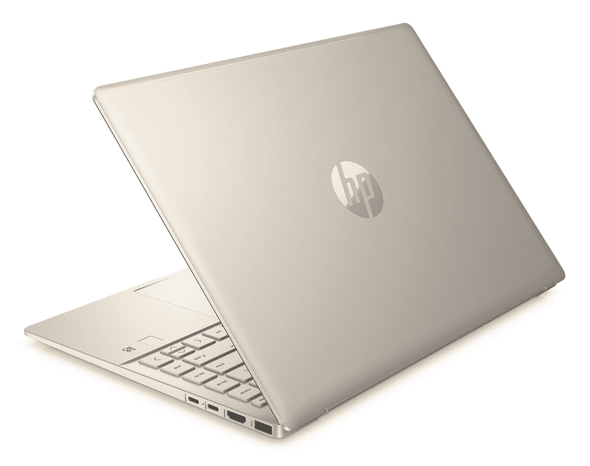
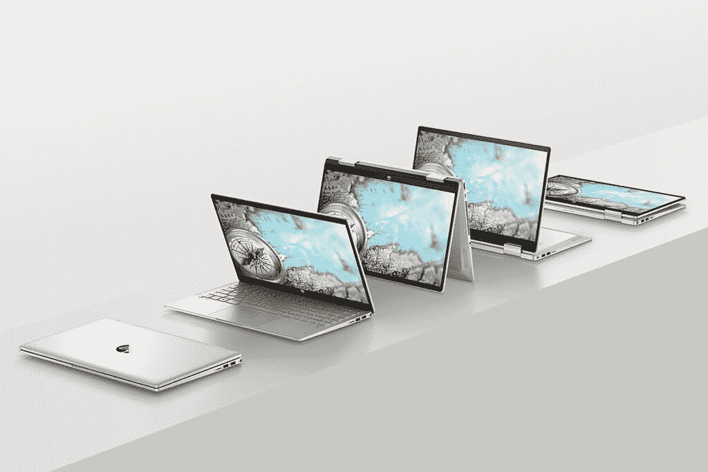

# 惠普推出了带有 90Hz 有机发光二极管显示屏的新型主流 Pavilion 笔记本电脑

> 原文：<https://www.xda-developers.com/hp-mainstream-pavilion-laptops-90hz-oled/>

上周，[惠普](https://www.xda-developers.com/best-hp-laptops/)发布了春季高端消费者笔记本电脑，现在是时候推出一些新的主流笔记本电脑了。今天，该公司宣布推出惠普 Pavilion Plus 14 和 Pavilion x360 14。

## 惠普展馆+14

HP Pavilion Plus 14 是您想要的任何东西。您可以通过最高配置英特尔酷睿 i7-12700H 来获得它，因此它配备了完整的 45W CPU。如果这太多了，你可以用 28W 的 P 系列处理器甚至 15W 的 U 系列芯片来获得它。您可以根据您的使用情况对其进行定制。显卡选项包括 Iris Xe、NVIDIA GeForce MX550 和 GeForce RTX 2050。

 <picture></picture> 

HP Pavilion Plus 14

另一个需要注意的大问题是 14 英寸 16:10 显示屏。它有两种选择。在低端，有一个防眩光，300 尼特 2，240x1，400 选项。在高端，你可以用 2，880x1，800 90Hz 的 OLED 面板来获得它，这对像这样的主流产品来说是一件大事。

有机发光二极管显示器有单独点亮的像素，所以黑色是真正的黑色，没有背光，颜色可以更鲜艳。这是一个通常为高端笔记本电脑保留的功能，所以很高兴看到它在产品线中出现。该产品的屏幕与机身的比例也达到了 87.21%。

另一个产品是一个 500 万像素的网络摄像头，它将出现在 HP Pavilion Plus 14 和 Pavilion x360 14 中。这将为您提供 1080p 视频，但也为自动取景留出了空间，自动取景可以移动视野以聚焦您。

它预装了惠普调色板，可以让你将屏幕投射到 Android 或 iOS 平板电脑上，然后你可以用它来画画。

惠普 Pavilion Plus 14 将于 5 月 25 日上市，起价 799 美元。它有太空蓝、暖金、矿物银、淡粉色和天然银，但只有一部分进入美国市场。

 <picture></picture> 

HP Pavilion Plus

##### 惠普 Pavilion Plus

HP Pavilion Plus 14 可以根据您的需要进行配置，最高可配有 H 系列处理器、RTX 显卡、90Hz 有机发光二极管显示屏等。

## 惠普 Pavilion x360 14

惠普 Pavilion x360 14 没有配备有机发光二极管显示屏。事实上，它仍然是 16:9，分辨率为 1080p。然而，它有可选的 5G，惠普说它支持几乎所有的频段。这意味着，如果您在旅途中随身携带，您将始终保持联系。

 <picture></picture> 

HP Pavilion x360 14

它配备了英特尔的第 12 代 U 系列处理器，考虑到可转换的外形，这可能更实用。它还配备了相同的 500 万像素网络摄像头和自动取景功能。惠普调色板就在那里，但由于这是一个可转换的，你也可以用它来直接在设备上绘图。

惠普 Pavilion x360 14 将于今年夏天上市，起价为 599 美元。