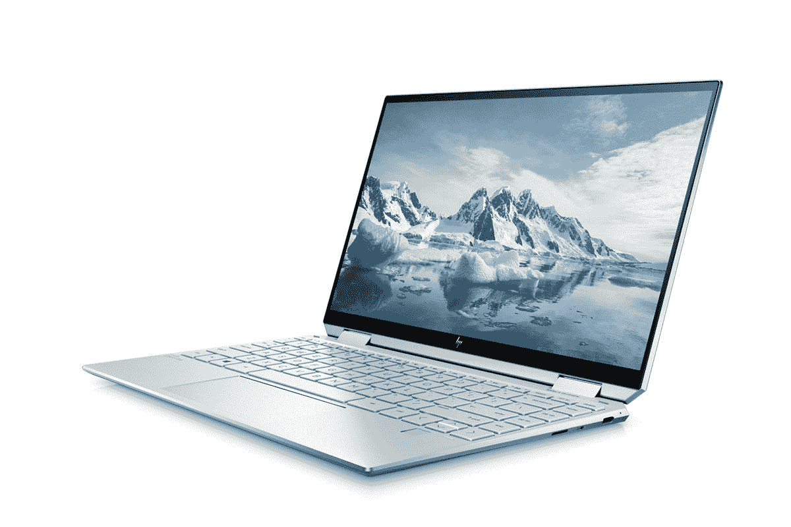
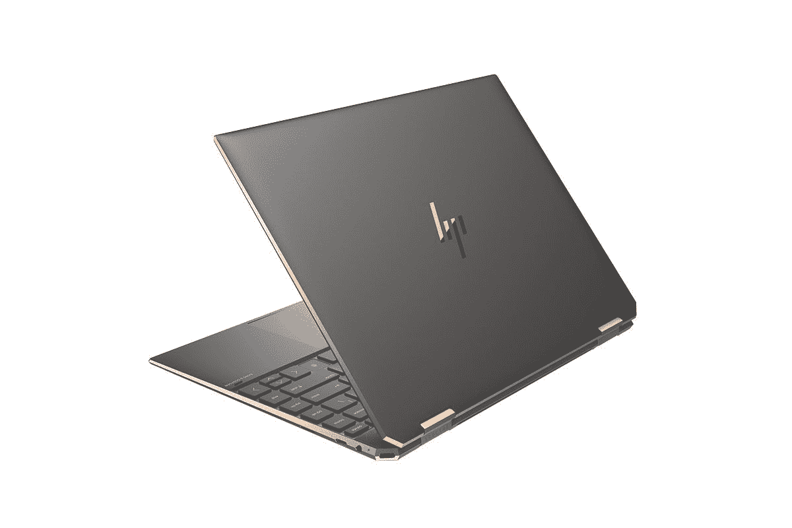
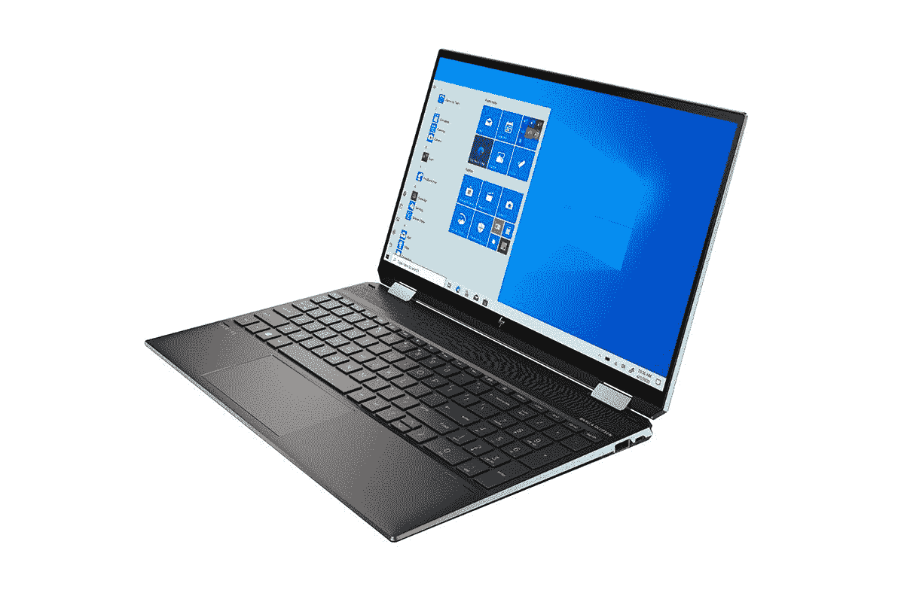

# 惠普 Spectre x360 笔记本电脑是否提供有机发光二极管显示屏？

> 原文：<https://www.xda-developers.com/hp-spectre-x360-oled/>

惠普制造了一些目前市场上最优秀的笔记本电脑【the Spectre x360 系列是其高级敞篷系列。该公司目前总共提供三种型号，即 Spectre x360 13、Spectre x360 14 和 Spectre x360 15。在这三种配置中，有多种配置可供选择，允许客户根据自己的需求选择合适的硬件。

## 惠普 Spectre x360 有有机发光二极管显示屏吗？

有机发光二极管显示器仍然是最好的面板之一，尤其是在笔记本电脑上。这是因为它们比传统的 LED 面板更亮，具有出色的对比度和深黑色。惠普为所有型号的 Spectre x360 提供有机发光二极管屏幕选项。你需要注意的是，有机发光二极管面板的制造成本仍然很高，所以如果你想为任何一款 Spectre x360 配置有机发光二极管屏幕，都是有代价的。

根据您选择的型号，您可以拥有不同大小的面板。例如，Spectre x360 13 配备了 13.3 英寸的 4K UHD (3840 x 2160)有机发光二极管触摸屏，峰值亮度为 400 尼特，DCI-P3 覆盖率为 100%。Spectre x360 14 采用了 13.5 英寸、3K2K (3000 x 2000)有机发光二极管触摸屏，峰值亮度也达到了 400 尼特。Spectre x360 15 是该系列中最大的一款，也有 OLED 面板，准确地说是 AMOLED，具有 4K UHD (3840 x 2160)分辨率和类似的 400 尼特峰值亮度。

 <picture></picture> 

HP Spectre x360 13

##### HP 频谱 x360 13

HP Spectre x360 13 是最好的可变形超极本，采用了高端设计，并可选配有机发光二极管触摸屏。

 <picture></picture> 

HP Spectre x360 14

##### HP 频谱 x360 14

HP Spectre x360 14 是最好的二合一笔记本电脑之一，配备了更高的 2K3K 有机发光二极管显示屏和最新的英特尔第 11 代 Tiger Lake CPU 选项。

 <picture></picture> 

HP Spectre x360 16

##### HP 频谱 x360 15

惠普 Spectre x360 的 15 英寸版本是当今你能买到的最好的 15 英寸笔记本电脑之一，它配有华丽的 4K 有机发光二极管显示屏。

这三种型号都采用了英特尔最新的第 11 代 Tiger Lake 处理器，Spectre x360 13 和 Spectre x360 14 采用了酷睿 i5-1135G7 或酷睿 i7-1165G7。较大的 15 英寸型号仅适用于 Core i7-1165G7。这三款产品都配备了高达 16GB 的内存和 2TB 的 PCIe NVMe M.2 固态硬盘存储，以及将固态硬盘与 32GB 英特尔 Optane 内存配对的选项。

惠普还在整个 Spectre x360 系列上提供了 Thunderbolt 4，它基本上支持通过 USB-C 和各种坞站供电，并允许您连接一个 8K 或两个 4K 外部显示器。说到这里，我们还有一份关于 Spectre x360 系列的[最佳外部显示器](https://www.xda-developers.com/spectre-x360-monitors/)和[最佳鼠标的综述。如果你正在寻找一台新的笔记本电脑，这里有一份 2021 年最好买的笔记本电脑的综述。此外，我们还有一份](https://www.xda-developers.com/spectre-x360-mice)[最佳笔记本电脑名单，这些笔记本电脑配备了最新的 Thunderbolt 4](https://www.xda-developers.com/best-thunderbolt-4-laptops/) 端口，可用于现代连接选项。