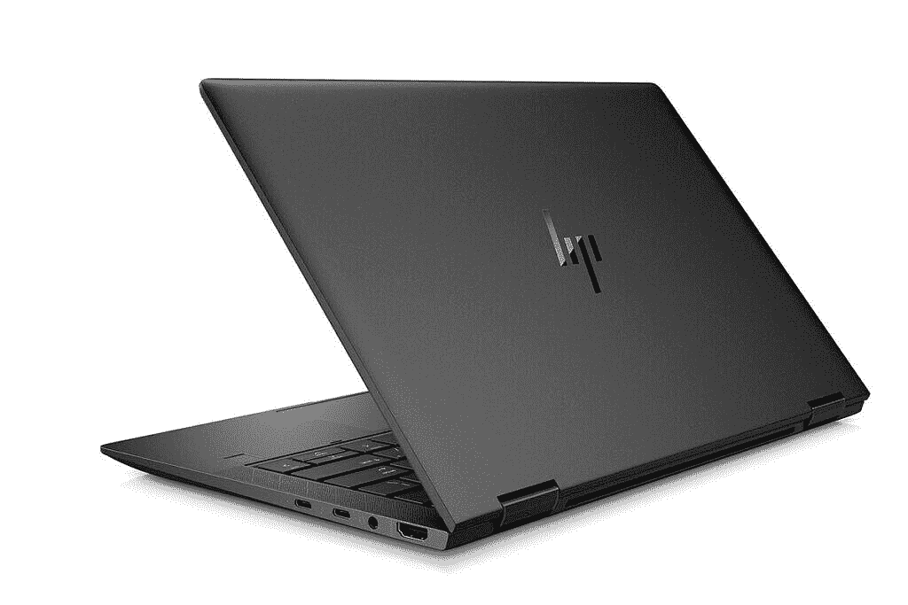
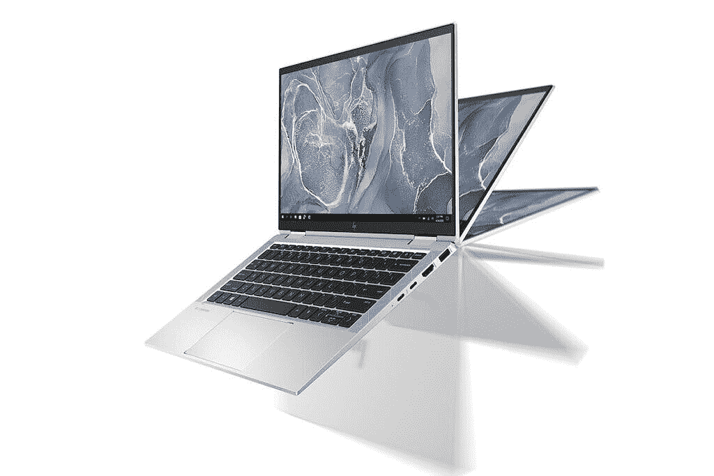
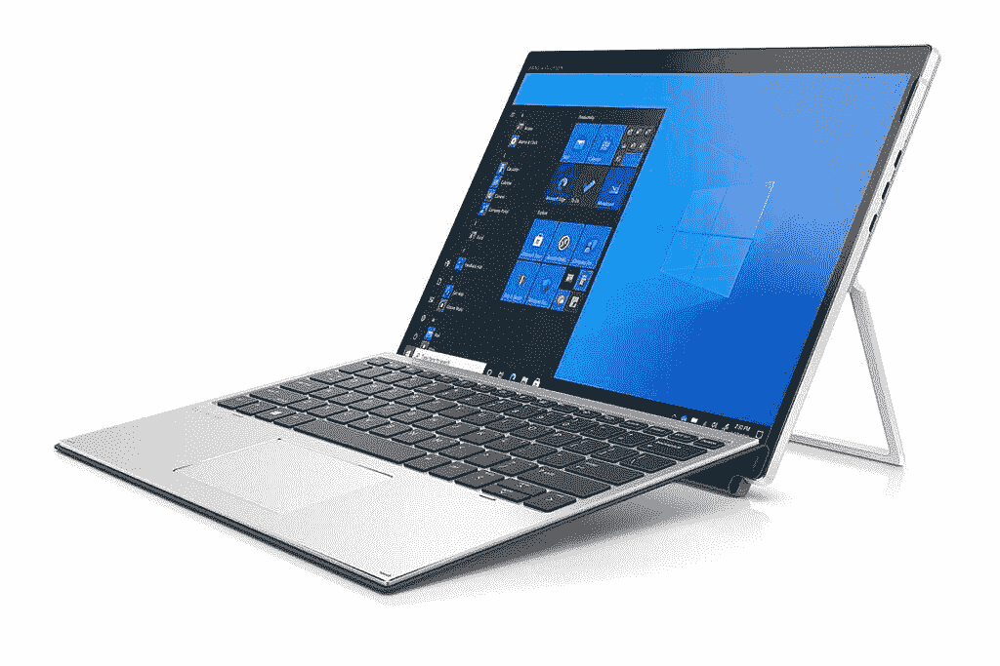
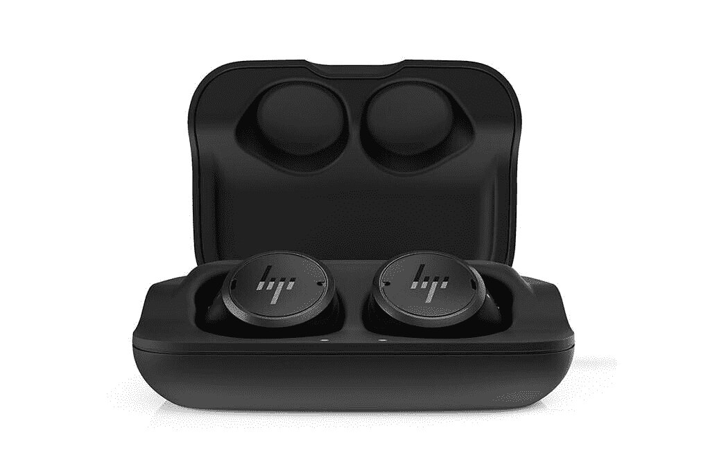

# 惠普在 CES 2021 上发布新的 Envy 14 和各种精英笔记本电脑

> 原文：<https://www.xda-developers.com/hp-unveils-new-envy-elite-dragonfly-elitebook-laptops-2-in-1-elite-folio-more-ces-2021/>

惠普在 CES 2021 上推出了其更新的笔记本电脑系列，包括 Elite 系列下的新型号、新的 Envy 14 以及惠普 Elite 无线耳塞。像所有其他原始设备制造商一样，惠普也在利用[英特尔第 11 代 Tiger Lake 处理器](https://www.xda-developers.com/intel-tiger-lake-11th-gen-core-i3-i5-i7-xe/)和英特尔 Iris Xe 显卡。精英系列下有六款新的笔记本电脑，包括 HP Elite Dragon G2、HP Elite 蜻蜓 Max、HP EliteBook x360 1030 G8、HP EliteBook x360 1040 G8、HP Elite x2 G8 笔记本电脑和 HP EliteBook 840 G8 Aero。惠普还推出了 Elite Folio，这是一款采用高通芯片组的新型平板电脑。

## 羡慕 14 2021

首先说一下羡慕 14。这款笔记本配备了 14 英寸 WUXGA (1，920 x 1，200 像素)分辨率的触摸 IPS 显示屏。它由英特尔第 11 代酷睿 i5-1135G7 处理器提供支持，除了集成的英特尔 Iris Xe 显卡，该笔记本还可以容纳带有 Max-Q 显卡的 NVIDIA GeForce GTX 1650 Ti。至于内存和存储，有 16GB 的 DDR4 内存，和 256GB 的 SSD 存储。其他值得注意的功能包括带相机快门的 720p 高清相机、集成的双阵列数字麦克风、由 Bang 和 Olufsen 调谐的双扬声器以及背光键盘。连接选项包括 Wi-Fi 6 和蓝牙 5，端口选项包括 Thunderbolt 4、两个 USB Type-A、HDMI 2.0。4 芯 63.3 瓦时电池据说可以持续 16.5 小时，惠普表示，这款笔记本电脑针对音频通话进行了优化，因为它带有人工智能降噪功能，可以在视频聊天、音频通话和录音期间使用扬声器、耳机或麦克风时静音背景噪音。

### 定价和可用性

惠普 Envy 14 将于 2021 年 1 月上市，价格为 999 美元起。这款笔记本将通过惠普的在线商店出售。

* * *

## 惠普精英 2021

### 惠普精英龙 G2 和惠普精英蜻蜓 Max

精英系列将随着一系列新型号的推出而得到大规模更新。惠普 Elite Dragon G2 和惠普 Elite 蜻蜓 Max 都是可变形 2 合 1 笔记本电脑。两款手机都配有 13.3 英寸显示屏，而精英版蜻蜓 G2 的重量不到 1 千克。这两款处理器也运行在采用全新英特尔 Xe 显卡的最新第 11 代英特尔酷睿处理器上。这些笔记本电脑可以配置高达 32GB 的内存，四个基于人工智能的音频优化的宽范围麦克风，以及一个 500 万像素的红外网络摄像头，带有手动快门以保护隐私。

 <picture></picture> 

HP Elite Dragonfly Max

### 惠普 EliteBook x360

接下来是 HP EliteBook x360 1030 G8 和 HP EliteBook x360 1040 G8，这两款产品均采用第 11 代英特尔酷睿 i5 或 i7 处理器，配有英特尔 Iris Xe 显卡。EliteBook x360 1030 G8 配有 13.3 英寸 FHD 分辨率或 UHD 显示屏，而 EliteBook x360 1040 G8 配有 14 英寸 FHD 或 UHD 显示屏。这两款笔记本电脑都可以配置 32GB 的内存和高达 2TB 的固态硬盘存储。就像上面的两台笔记本电脑一样，这些也是可转换的，可以在各种模式下使用，如帐篷模式、平板模式等。这些还带有 Wi-Fi 6 和蓝牙 5 支持。

 <picture></picture> 

HP EliteBook x360 1030

### 惠普 EliteBook 840 G8 Aero

我们还有 EliteBook 840 G8 Aero，它采用传统的笔记本电脑设计，采用最新的第 11 代英特尔酷睿处理器和 UHD 显卡。这可以配置高达 64GB 的 RAM 和 2TB 的 SSD。您还可以获得 Wi-Fi 6 和 5G 连接，一个集成的 720p 高清摄像头和一个隐私快门。这款笔记本还在盖子外面配备了面向世界的第三个麦克风，顶部发射扬声器和人工智能音频支持。

### 惠普精英 X2 G8

惠普还推出了 Elite x2 G8 笔记本电脑，有点像 Surface 平板电脑，带有可拆卸的空中键盘和显示器支架。这款便携式机器可以配置第 11 代英特尔酷睿 i3/i5/i7 处理器，搭配高达 16GB 的 RAM 和高达 2TB 的 SSD 存储。13 英寸触摸屏显示器提供 400 尼特或 1000 尼特亮度的 FHD 分辨率或 450 尼特亮度的 3，000 x 2，000 分辨率选项。顶部还有大猩猩玻璃 5，用于改善屏幕保护。其他功能包括 Wi-Fi 6 和蓝牙连接，以及可选的 LTE 和 GPS。惠普还为这款笔记本提供了来自 Tile 的集成蓝牙跟踪器。

 <picture></picture> 

HP Elite X2 G8

### 惠普 Elite Folio 平板电脑

最后是 Elite Folio 平板电脑。这是惠普罕见的基于 ARM 的 Windows 设备之一，采用高通骁龙 8cx Gen 2 5G 计算平台。据称，该芯片组比英特尔第十代酷睿 i5 处理器的系统性能提高了 18%。它采用 13.5 英寸触摸显示屏，分辨率为 FHD (1920 x 1280)，带有可选的 HP Sure View Reflect 隐私面板。据说它在播放视频时的电池寿命为 24.5 小时，同时还支持惠普快速充电，据称可在 90 分钟内充电 90%。

### 惠普精英无线耳塞

该公司还宣布了精英无线耳塞。根据惠普的说法，这些是世界上“最先进的耳塞”，具有个性化音频调谐、可调噪声消除和声音状况预设功能。这些耳塞可以使用 Windows 10、iOS 或 Android 的专用应用程序，从 PC 上的电话会议无缝切换到手机上听音乐。

 <picture></picture> 

HP Elite Wireless earphones

### 定价和可用性

惠普尚未透露其新系列笔记本电脑的价格，但该公司已经透露了上市时间表。HP Elite 蜻蜓 G2、HP Elite 蜻蜓 Max、HP EliteBook x360 1030 G8 和 HP EliteBook x360 1040 G8 将于本月上市。惠普 EliteBook 840 Aero G8 预计将于 3 月上市，而惠普 Elite x2 G8 预计将于 4 月上市。