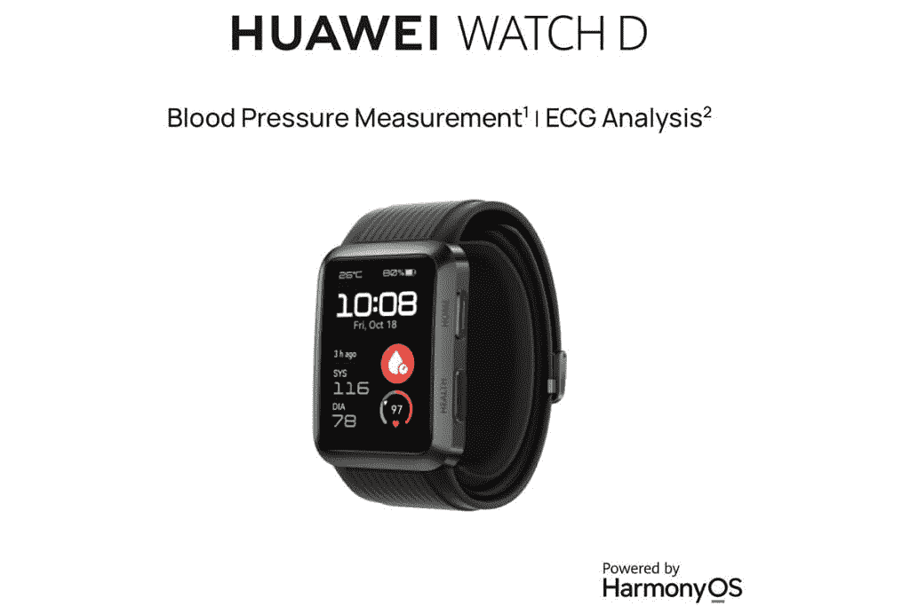

# 华为宣布向英国推出过多的健身可穿戴设备

> 原文：<https://www.xda-developers.com/huawei-announces-wearables-eu/>

华为今天在米兰举行了发布会

[Huawei Mate Xs 2](https://www.xda-developers.com/huawei-mate-xs-2-hands-on/)

和

[Huawei GT Watch 3 Pro](https://www.xda-developers.com/huawei-watch-gt-3-pro-global-launch/)

可能会得到大部分的关注，也有其他更实惠的可穿戴设备宣布。虽然这些产品中的一些已经在世界其他地方首次亮相，但这将是第一次大量的这些产品被引入英国市场。所以事不宜迟，让我们开始吧。

## 华为 Band 7

很难相信华为手环已经是第七代了。华为 Band 7 是之前所有产品的巅峰之作——充满动力，设计精巧。华为 Band 7 采用 1.47 英寸 AMOLED FullView 显示屏，非常紧凑，厚度不到 10 毫米。华为 Band 7 可以定制以适应用户的需求，具有三种不同的表盘模式。还有超过 4000 个主题可供选择，为您增添一点趣味。就其跟踪功能而言，华为 Band 7 将利用华为的 TrueSeen 4.0 跟踪系统，用于连续准确地测量心率。华为 Band 7 在英国还没有售价，但在欧洲的零售价为€59 英镑。

## 华为手表 Fit 2

华为手表 Fit 2 的到来为时尚和功能提供了完美的高潮。华为 Watch Fit 2 采用 1.47 英寸 AMOLED FullView 显示屏，凭借 480 x 360 的分辨率提供了出色的观看体验。华为 Watch Fit 2 自带扬声器和麦克风，用户可以通过手腕接听电话。这款手表还将支持离线音乐播放，音频直接存储在手表上。尽管华为手表 Fit 2 看起来很帅，但它也可以用来改善健康。华为 Watch Fit 2 将配备一个健康助手，可以跟踪活动、水摄入量、睡眠等。华为 Watch Fit 2 将于 6 月 15 日起以 129.99 英镑的价格上市。那些从 5 月 30 日开始通过华为在线商店预购该设备的人将能够免费获得一对华为 FreeBuds 4i。

## 

## 华为 Watch D

华为 Watch D 不是你的标准健身手表，而是一款专注于监测血压的设备。华为宣称，华为 Watch D 的尺寸和重量是传统血压计的 1/6。华为 Watch D 还利用了创新技术，配备了一个迷你泵，可以产生高达 40 千帕的气压，使该设备的测量压力高达 230 毫米汞柱。现在，尽管华为 Watch D 的重点是监测血压，但它能够通过心电图传感器测量心率、睡眠、SpO2 和压力。华为 Watch D 可以跟踪正常的日常活动，以及运动等更剧烈的活动。也许与传统智能手表最大的区别是，华为 Watch D 一次充电可以持续七天。

## 华为 S 标签

华为 S-TAG 是一款小型跟踪设备，具有专业品质的 9 轴传感器，旨在提供卓越的灵敏度，能够跟踪跑步者及其形态。华为 S-TAG 结构紧凑，是一款功能强大的完美配件。

华为的可穿戴设备将全部进入英国市场，还有华为的 Mate Xs 2 和华为的 GT Watch 3 Pro。