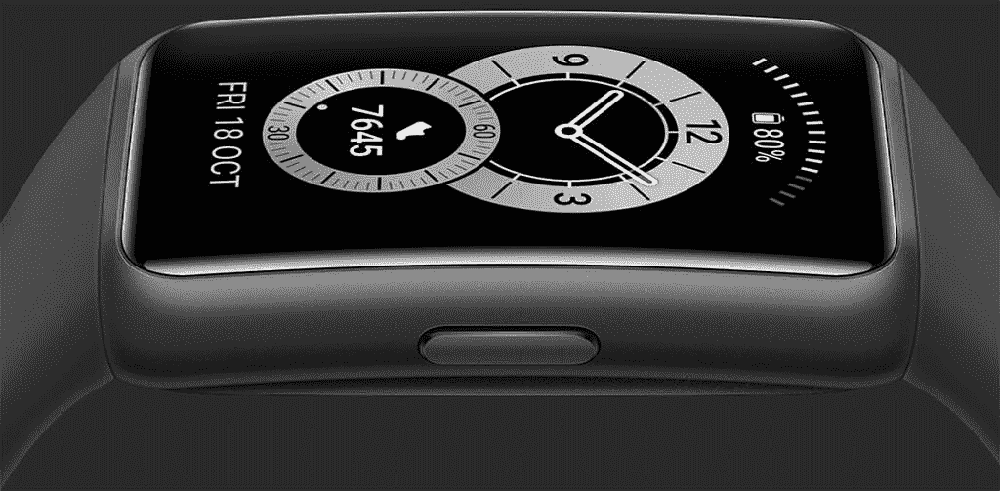
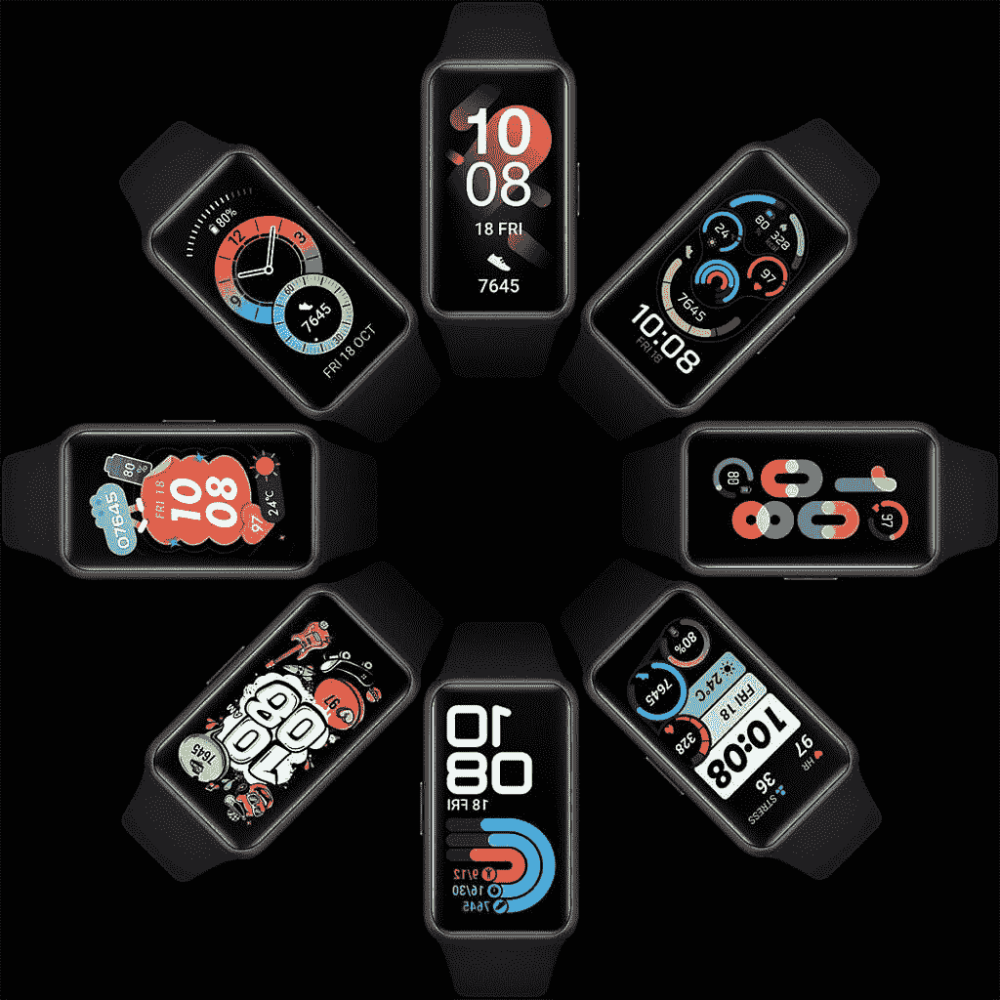
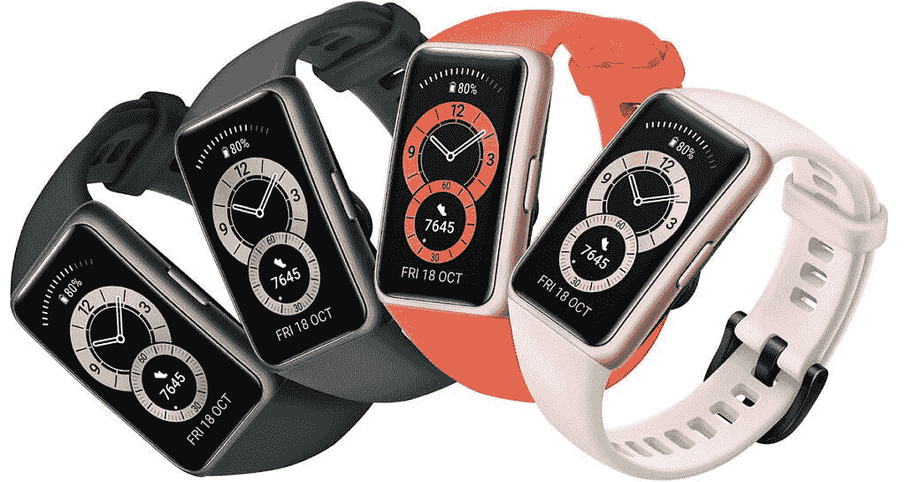

# 华为 Band 6 引领智能手环设计潮流

> 原文：<https://www.xda-developers.com/huawei-band-6/>

在健身追踪器和智能手表领域，华为在智能手环领域不断创新。华为手环系列采用了智能手环的紧凑尺寸和功能，并将其发挥到了极致。最新加入的是华为 Band 6。这款智能手环引入了更大的全景显示屏、更长的电池续航时间和更多的锻炼模式。

 <picture></picture> 

HUAWEI Band 6

自上一个型号(Band 4)以来，已经进行了许多改进。更大的显示屏使 Band 6 成为一款完全不同的产品。电池寿命增加了一倍多，使 Band 6 总共可以使用 14 天。您还将获得更多的健身跟踪功能，更多的颜色选择，更好的耐用性和快速充电。新款快速磁力充电器简化了 Band 6 的充电方式。对于 Band 4 的拥有者来说，Band 6 绝对值得升级。

* * *

## 全景显示

新的华为 Band 6 拥有 1.47 英寸的大显示屏，比之前的型号大 148%。这种全视图显示屏在较小的智能手环和目前可用的较大智能手表之间建立了一种中间地带。即使显示屏尺寸增加，也不会牺牲 Band 6 的整体紧凑外形。这是因为屏幕与机身的比例增加了 42%。该乐队现在有更多的时间出现在银幕上。

有了这个额外的屏幕空间，Band 6 就能向你展示更多你想要的数据。您可以期待更大的照片，更多的运动统计数据，以及恒定的心率监测可以显示惊人的细节。使用四向触摸屏控件，轻松导航这些数据。这也意味着表盘与你的智能手环更相关。更多的屏幕空间意味着更多的定制机会，以及让你的 Band 6 看起来像你想要的样子的能力。华为的 Watch Face Store 拥有你想要的所有设计，将它们应用到你的 Band 6 上就像刷一下一样简单。

 <picture></picture> 

HUAWEI Band 6 Watch Faces

* * *

## 带颜色

华为 Band 6 有四种不同的颜色可供您选择。由紫外线处理的硅树脂材料制成，这种带子对皮肤是友好的。超轻的设计让你可以整天戴着它。或者甚至在你睡觉的时候，没有任何不适。

**以下是表带 6 的颜色选项:**

*   **石墨黑**
*   **森林绿**
*   **琥珀日出**
*   **樱粉色**

 <picture></picture> 

HUAWEI Band 6 Colors

* * *

## 更长的电池和更多功能

Band 6 最大的改进之一是两周的电池续航时间。充一次电，这款智能手环可以持续使用 14 天。这使得它成为在离网情况下跟踪您的健身、心率或位置的理想智能手环。当你的电池电量不足时，你可以把它放在充电器上，只需充电五分钟，就可以多使用两天。

除了新的更长的电池寿命，你会发现华为 Band 6 还具有健身和健康功能。全天候心率监测将帮助您执行对您的健康最重要的事情之一，即跟踪您的心脏。TruSeen 4.0 心率监测技术使用光学镜头和基于人工智能的数据处理，全天 24 小时准确监测您的心率。当您的心率低于或高于安全水平时，您会收到警报。朝着健康监测迈出积极的一步是开始使用 Band 6 的好方法。

凭借 Band 6 的所有新功能，您可以将这款新设备视为手腕的完整智能伴侣。以下是新智能手环的一些功能:

*   全天候心率监控
*   全天 SpO2 监测
*   TruRelax 压力监控
*   TruSleep 2.0 睡眠追踪
*   月经周期跟踪
*   两周电池寿命
*   96 种健身模式
*   1.47 英寸全视角屏幕
*   快速磁性充电器

要充分利用 Band 6，请将其与华为健康应用配合使用。你可以使用下面的链接以 349.00 的价格买到华为 Band 6。

[**拿到华为手环 6**](https://consumer.huawei.com/en/wearables/band6/)

###### 我们感谢华为赞助这篇文章。我们的赞助商帮助我们支付与运行 XDA 相关的许多费用，包括服务器成本、全职开发人员、新闻撰稿人等等。虽然您可能会在门户内容旁边看到赞助内容(这些内容将始终被标记为赞助内容),但门户团队对这些帖子不承担任何责任。赞助内容、广告和 XDA 仓库完全由一个独立的团队管理。XDA 绝不会通过接受金钱来赞扬一家公司，或以任何方式改变我们的观点或看法，从而损害其新闻诚信。我们的意见不能被收买。