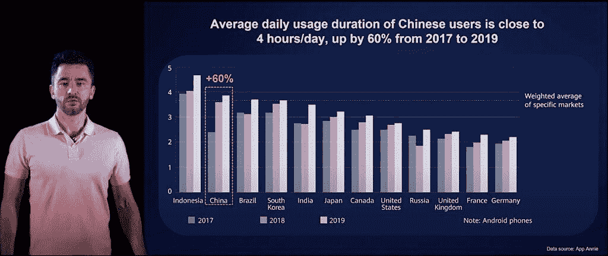
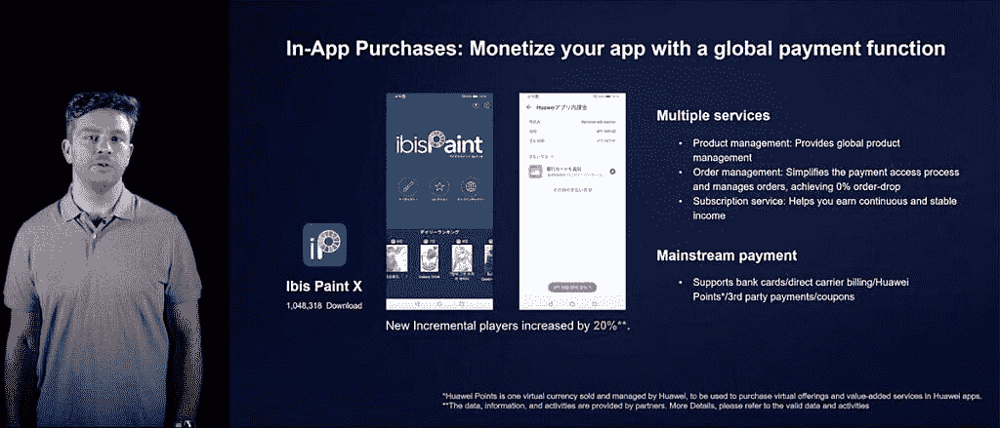
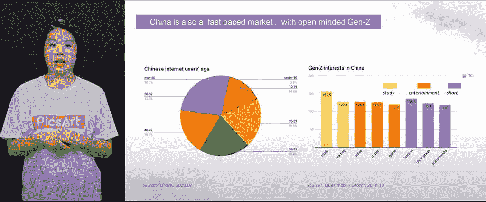
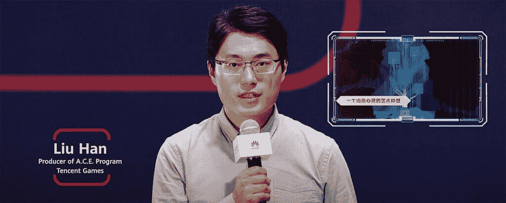

# 在中国发展，用应用程序库取胜-华为开发者网络研讨会总结

> 原文：<https://www.xda-developers.com/huawei-developer-webinar-recap/>

随着应用的增长和受众的扩大，世界各地的开发者都在打入中国市场。为了帮助开发者了解如何在这个市场发展，华为举办了“在中国发展，用应用图库赢得发展”网络研讨会。本次网络研讨会于 2020 年 11 月 9 日在线发布，可在下方查看其完整内容。在本文中，我们将回顾网上研讨会中所有最重要的时刻。

## 中国蓬勃发展的移动互联网行业

在本次网络研讨会的第一部分，Ilya Fedotov[华为全球生态系统营销负责人]谈到了中国移动互联网领域的增长。中国目前有 9.4 亿互联网用户，以及 9.32 亿移动互联网用户。Android 手机占中国手机市场的 83.8%，iOS 手机约占 7.5%。

下图显示了全球不同国家的平均每日电话使用量。中国位居第二，仅次于印度尼西亚，每天使用近四个小时。

 <picture></picture> 

Ilya Fedotov [Head of Global Ecosystem Marketing for Huawei]

Ilya 继续引用 XDA 开发者的研究，该研究表明市场准入和收入是全球开发者的主要关注点。这些领域通常被认为是试图向海外扩张的开发商面临的难题。华为的 AppGallery 是制作在中国拥有最大受众的盈利应用的最佳方式之一。华为手机占中国 5G 智能手机的 63%。这给 AppGallery 带来了巨大的优势，也是开发者从他们的应用中获利的绝佳机会。

解释了特别许可，以及什么类型的应用程序需要中国政府的特别许可。这些类型的应用程序包括金融、医疗、媒体和娱乐、新闻、游戏等。

## 进入中国市场前你需要知道的

在接下来的部分，Gavin king hall Were[华为副总裁，BD 解决方案全球负责人]将与您分享进入中国市场之前您需要知道的事情。他查看了收入统计数据，显示 2020 年 1 月至 6 月，中国移动游戏市场的收入达到 156 亿美元。

中国游戏玩家倾向于喜欢图形性能好、游戏性创新、游戏性丰富的游戏。我们研究了许多这类统计数据，这些数据可以极大地帮助开发者了解中国玩家对他们游戏的反应。

 <picture></picture> 

Gavin Kinghall Were [Huawei VP, Global Head of BD Solutions]

会议继续讨论华为 HMS Core 的所有优势。他谈到了不同的套件如何帮助开发者创造出吸引中国市场的精彩游戏。要探索更多 HMS 套件和主题，请查看[华为开发者 XDA 论坛](https://forum.xda-developers.com/android/huawei-developers)。

## PicsArt 如何在中国取得意想不到的成功

PicsArt 是在中国获得巨大成功的应用程序之一，这是一款手机照片编辑应用程序。为了讲述 PicsArt 如何在海外获得大量观众并在中国获得超过 2 亿次下载的故事，[PicsArt 中国区总经理 Jennifer Liu 介绍了他们与华为的合作经验以及她对中国用户获取的见解。

进入中国市场，翻译是第一步。Jennifer 谈到了为你的应用程序选择一个好的中文名称的重要性。她还谈到了针对中国趋势的营销。当来自中国的用户打开 PicsArt 应用程序时，他们会希望看到中国文化中流行的编辑滤镜和效果。为中国准备你的应用不仅仅是翻译它，你必须为不同的文化和不同的兴趣做准备。

 <picture></picture> 

Jennifer Liu [PicsArt China, General Manager]

上图显示了中国互联网用户的不同人口统计数据。理解这类信息对你的应用程序的成功至关重要。利用本地平台是接触你想要的人群的最佳方式。这包括微博、抖音、哔哩哔哩等服务。

AppGallery 的用户反馈和见解对 PicsArt 的成功非常有帮助。您还可以利用 AppGallery 的全面营销工具来扩大应用的覆盖范围。

## 小组讨论:如何在中国发行游戏

事实证明，游戏在中国应用市场尤其受欢迎，2020 年上半年的销售额超过 150 亿美元。他们继续看到中国和世界各地的快速增长。网上研讨会还邀请了中国著名游戏发行商的代表，如腾讯游戏、乐逗科技、金科文化科技和飞鱼科技。他们能够加入关于在中国发行手机游戏的小组讨论。

[caption align = " align none " width = " 900 "]

刘汉[腾讯游戏节目制作人][/caption]所有这些演讲者都能够讨论不同的想法和技术，这些想法和技术将有助于中国市场的新开发者。网上研讨会最终时长 1 小时 15 分钟，对全世界的开发者来说是一个很好的资源。

* * *

###### 我们感谢华为赞助这篇文章。我们的赞助商帮助我们支付与运行 XDA 相关的许多费用，包括服务器成本、全职开发人员、新闻撰稿人等等。虽然您可能会在门户内容旁边看到赞助内容(这些内容将始终被标记为赞助内容),但门户团队对这些帖子不承担任何责任。赞助内容、广告和 XDA 仓库完全由一个独立的团队管理。XDA 绝不会通过接受金钱来赞扬一家公司，或以任何方式改变我们的观点或看法，从而损害其新闻诚信。我们的意见不能被收买。