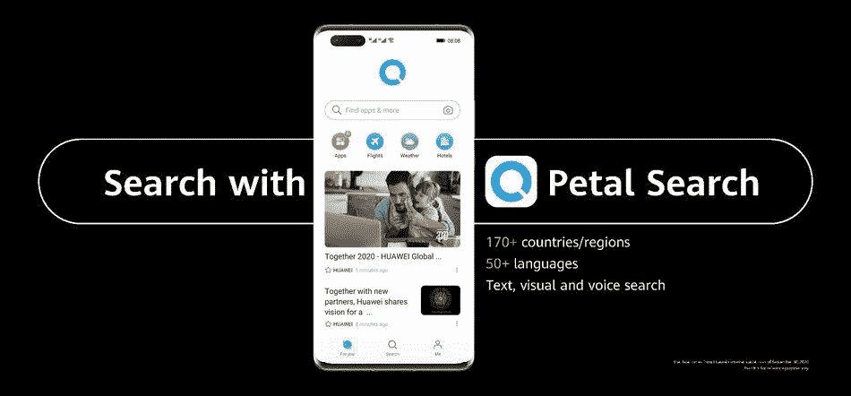

# 华为推出花瓣地图，并将花瓣搜索转变为谷歌镜头的替代方案

> 原文：<https://www.xda-developers.com/huawei-launches-petal-maps-transforms-petal-search-google-lens-alternative/>

华为一直在加倍努力开发自己的应用生态系统来替代谷歌的 GMS，其解决方案采取的形式是 [HMS 和 HMS Core](https://www.xda-developers.com/huawei-hms-core-android-alternative-google-play-services-gms/) 、 [AppGallery](https://www.xda-developers.com/appgallery-huawei-alternative-google-play-store-android/) 和[花瓣搜索](https://www.xda-developers.com/petal-search-download-apps-huawei-honor-smartphones-hms/)。其中，花瓣搜索相对来说是最新加入的，最初的目标是作为一个搜索引擎，并为应用分发和发现增加华为 AppGallery。现在，华为正在[将](https://www.prnewswire.com/news-releases/huawei-launches-petal-search-petal-maps-huawei-docs-and-more-301158046.html)花瓣搜索转向更专注的谷歌镜头替代方案，该公司还推出了花瓣地图，作为谷歌地图等其他地图解决方案的替代方案。

### 花瓣搜索

花瓣搜索作为一个应用分发聚合器或搜索引擎开始了它的旅程，专注于寻找 Android 应用。花瓣搜索的体验围绕着一个搜索小工具，用户可以在主屏幕上点击，打开搜索栏，在线查找应用程序和游戏。

 <picture></picture> 

Search with Petal Search

现在，[花瓣搜索](https://consumer.huawei.com/en/mobileservices/search/)也获得了更多的搜索功能，试图根据呈现的图像识别内容。例如，你现在可以点击屏幕截图上的图像识别图标，找出应用程序是什么，并找到可靠的来源将其下载到你的华为手机上。类似的功能也可以扩展到其他实体物品上——你可以将相机对准它，手机就会识别出这是什么物品，并尝试向你显示它的产品列表。此外，当图像或艺术品出现时，它还可以显示维基百科摘录、新闻文章，甚至音乐。该功能似乎与谷歌镜头非常相似。

### 花瓣贴图

此外，华为还推出了花瓣地图，作为谷歌地图的替代产品。AppGallery 已经有几个在线地图选项，但这是华为提供的自己的产品，以防你不喜欢其他选项。

https://consumer-img.huawei.com/content/dam/huawei-cbg-site/common/mkt/mobileservices/petalmaps/video/video_full.mp4

正如预期的那样，[花瓣地图](https://consumer.huawei.com/en/mobileservices/petalmaps/)带有 2D 和 3D 视图导航，动态逐步导航，路由选项包括最快路线，以及显示实时交通的能力。它提供 140 多个国家和地区的数据，并支持多种语言，具有英语、法语、西班牙语、德语、意大利语和普通话的语音通知。