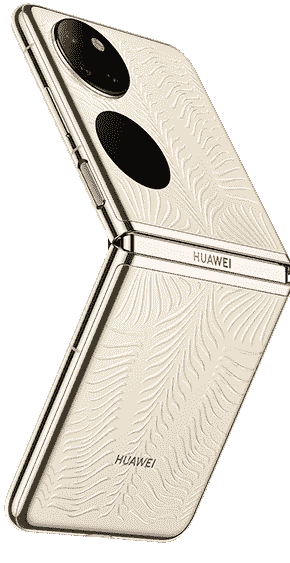
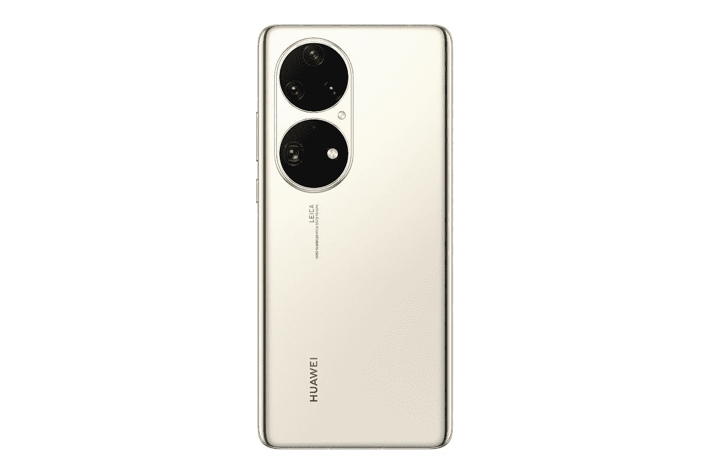
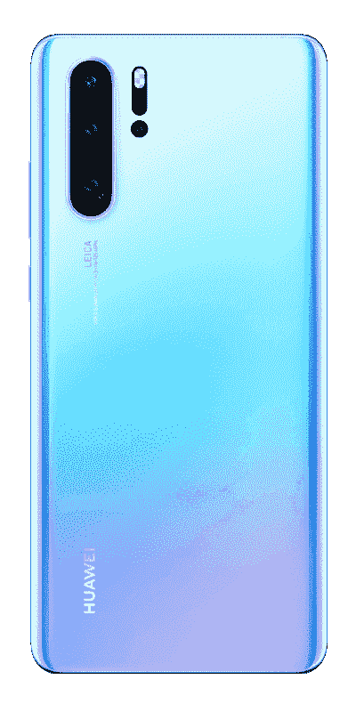
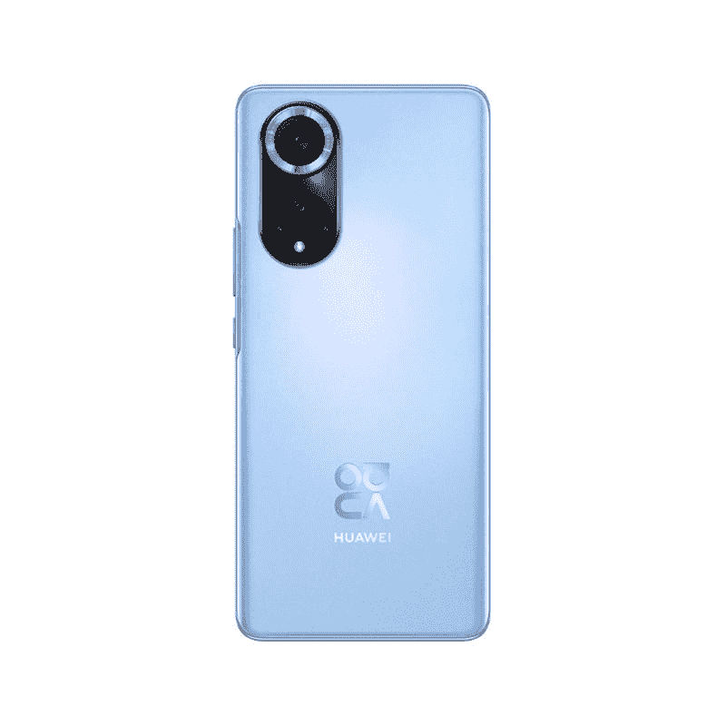
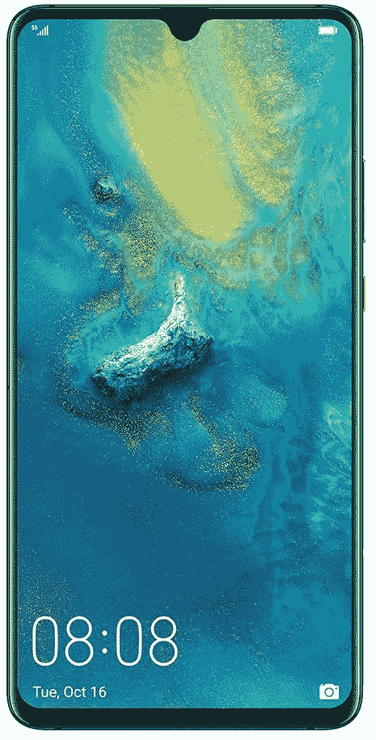

# 2023 年最佳华为手机

> 原文：<https://www.xda-developers.com/huawei-mate-10-pro-android-p/>

如果不解决房间里的大象，很难谈论华为智能手机，所以我们不妨立即解决它。由于美国持续的制裁，过去两年半发布的任何华为智能手机都无法运行 YouTube 和 Google Docs 等基本的谷歌应用程序。美国政府对华为的指控非常严重，所以如果你相信其中 20%的指控，你会希望与华为设备无关。如果你属于这一阵营，去看看我们的[最佳安卓手机](https://www.xda-developers.com/best-android-phones/)或[最佳智能手机](https://www.xda-developers.com/best-android-phones/)名单，看看其他品牌的选择。

然而，如果你不相信美国对华为的评估——美国政府也没有拿出多少确凿的证据——或者如果你愿意冒一些风险来探索尖端的智能手机硬件，那么这篇指南就是为你准备的。我们已经测试了过去几年中发布的每一款华为智能手机，这是我们根据您的需求和需要选择的细分。

**浏览本指南:**

## 最佳尖端硬件:华为 Mate X2

华为 Mate X2 是一款大多数阅读本文的人不会购买的手机。不仅仅是不能运行谷歌移动服务(GMS)。它只在中国官方销售，官方零售价格相当于 2700 美元，但由于供应短缺，只能以 3500 美元的转售价格购买。

不过，如果你是一个对可折叠技术感兴趣的移动技术爱好者，Mate X2 值得关注，因为它显然是目前市场上最好的可折叠硬件。我有幸测试了迄今为止发布的每一款主流可折叠手机，华为 Mate X2 的硬件比目前市场上的其他可折叠手机领先一代。

我们之前在三星 Galaxy Z Fold 2 和小米 Mix Fold 等可折叠手机中看到的所有缺点，例如屏幕中间明显的折痕，不太旗舰的相机系统，以及折叠时留下微小间隙的铰链，都在 Mate X2 中消除了。

当它折叠起来时，Mate X2 感觉就像一部普通的平板手机，只是更厚更重。展开后，屏幕比 Galaxy Z Fold 2 和小米 Mix Fold 中看到的屏幕更无缝。相机系统与华为 P40 Pro Plus 中的系统基本相同，所以你得到的是 10 倍光学变焦镜头，而不是其他可折叠的变焦镜头。

同样，没有 GMS 及其疯狂的定价意味着这款手机几乎没有主流吸引力，但如果你现在想要绝对最前沿的智能手机硬件，华为 Mate X2 就是它。

## 也很棒:华为 P50 Pocket

 <picture></picture> 

Huawei P50 Pocket

华为的首款翻盖可折叠手机也是该榜单上的最新手机，于 1 月初发布。它带来了华为在 Mate X2 上推出的许多可折叠突破，比如更难注意到折痕的显示屏，以及不像三星的可折叠显示屏那样不留空隙的折叠形式。

由于美国的制裁阻止华为开发自己的芯片(显然也阻止了收购 5G 芯片)，P50 Pocket 运行在不支持 5G 的骁龙 888 上。尽管如此，这款 SoC 今天仍然有能力，这款手机的其他一切都是一流的:你有 6.9 英寸 120Hz 有机发光二极管显示屏，三摄像头系统，由 40MP，f/1.8 摄像头和 13MP 超宽摄像头和 32MP“超光谱”摄像头组成，用于增强颜色配置文件。P50 Pocket 还获得了与华为 P50 Pro 相同的 XD Optics 计算摄影引擎。

就像 P50 口袋一样，你也可以使用主相机系统进行自拍，因为当设备折叠时，外部有一个小显示屏可以显示相机取景器和其他小部件。尽管 P50 Pocket 的厚度很薄(7.2 毫米)，但它装有 4，000 毫安时的电池，应该可以提供高于平均水平的电池寿命。

 <picture></picture> 

Huawei P50 Pocket

##### 华为 P50 口袋

华为 P50 Pocket 是一款翻盖式可折叠产品，就像 Samusng 的 Galaxy Z Fold 3 和摩托罗拉 Razr 一样，但由于华为的 XD 光学系统，它可能有更好的相机系统。

## HMS 最佳搭配:华为 P50 Pro

在美国制裁前的几年里，华为智能手机赢得了各地科技网站的好评，主要是因为它们拥有超越所有人的引领潮流的相机。如果你现在想要绝对最新的华为相机技术，那就是华为 P50 Pro，它将于 2021 年底在中国发布，但最近宣布面向欧洲和东南亚市场。

配备 50MP f/1.8 主摄像头，13MP 超宽摄像头，64MP 潜望镜变焦镜头和 40MP 单色传感器，相机硬件一如既往地令人印象深刻，但让 P50 Pro 的相机发光的是这款手机首次亮相的新 XD 光学相机算法。本质上，XD Optics 是华为版的计算摄影，它出色地制作了逼真的色彩。

不幸的是，P50 Pro 运行在一个过时的 4G 专用高通骁龙 888 SoC 上(这是由于制裁)，虽然这使手机与其他 2021 年的旗舰相比处于劣势，但它仍然是一个非常强大的芯片组，对于普通用户来说绰绰有余。

再加上独特的摄像头模块设计、120Hz 有机发光二极管屏幕和全天电池续航时间，华为 P50 Pro 是华为硬件的又一精品。如果你同意使用华为的移动服务而不是谷歌的，这款手机就是你要找的。

 <picture></picture> 

Huawei P50 Pro

##### 华为 P50 Pro

华为 P50 Pro 是华为目前最好的平板产品。

## 最佳谷歌应用:华为 P30 Pro

如果你真的需要谷歌移动服务，并且仍然想使用华为手机，P30 Pro 是一款不错的选择。在禁令宣布前两个月发布，直到今天，它仍得到谷歌的全力支持。然而，P30 Pro 现在已经快三岁了，所以它开始显示出它的年龄，特别是带有凹槽的 60Hz 有机发光二极管屏幕。但它的相机系统今天仍然存在，因为在发布时，它可以说是当时最具开创性的相机系统。P30 Pro 是第一款提供潜望镜变焦镜头的手机，它的 40MP RYYB 传感器可以在黑暗的场景中吸收光线，这是当时其他手机无法做到的。

麒麟 980 芯片今天仍然表现良好，电池寿命仍然非常好(特别是因为屏幕只有 60Hz)。最终，建议买一部三年的旧手机有点难，但如果你必须拥有一部谷歌的华为手机，那么这就是了。它 599 美元的价格现在可以被认为是负担得起的。

 <picture></picture> 

Huawei P30 Pro

##### 华为 P30 Pro

华为 P30 Pro 拥有麒麟 980 处理器，虽然是一个老化的平台，但仍然是一个非常强大的 SoC。同样值得注意的是，它是最后一批搭载谷歌应用程序的华为智能手机之一，这使得它在 2020 年仍然是一款引人注目的设备。

## 最佳中端:华为 Nova 9

 <picture></picture> 

Huawei Nova 9

华为 Nova 9 于 2021 年底发布，是一款时尚时尚的中游侠，提供 6.5 英寸 120Hz 屏幕，50MP 主摄像头，配有 8MP 超广角摄像头，以及骁龙 778 芯片。对于一个中型游侠来说，Nova 9 相当漂亮，弧形屏幕周围的边框很少，闪亮的彩色玻璃背面(或者纯黑色版本，如果你喜欢)，相对轻薄，重量为 175 克，厚度为 7.8 毫米。4300 毫安时的电池也足够为手机供电一整天。

骁龙 778 芯片在 2022 年仍然是一个坚实的 SoC，尽管这款手机像华为最近的所有产品一样，不支持 5G。一对 200 万像素的宏观和深度传感器也几乎没有用，但总体而言，如果你不介意没有谷歌接入，Nova 9 是一款有能力的手机。

 <picture></picture> 

Huawei Nova 9

##### 华为 Nova 9

华为 Nova 9 是该公司首批使用高通 SoC 的手机之一，它还采用了轻薄的设计，具有漂亮的沉浸式屏幕

## HMS 最佳预算:华为 P Smart 2021

华为 P Smart 2021 是一款由麒麟 710A 驱动的经济型设备，拥有高达 4GB 的内存和 128GB 的内部存储。你有一个 6.7 英寸的 IPS 液晶面板，刷新频率为 60Hz，还有一个 48MP 主摄像头的摄像头系统。然后是 5,000mAh 电池，与麒麟 710A 搭配应该可以提供全天的电池寿命。

当然，它没有谷歌应用程序，所以你会受到与列表中一些设备相同的限制。但如果你对涉足 HMS 生态系统感到好奇，并且没有钱购买旗舰产品，这是你的最佳选择。

 <picture></picture> 

Huawei P Smart 2021

##### 华为 P 智能 2021

华为 P Smart 2021 是华为的一款经济型设备，它将 HMS 的体验带到了预算范围内，配有麒麟 710A、4 GB 内存、Android 10 和高达 128 GB 的存储空间。它还配有 5000 毫安时电池和 48MP 四后置摄像头。

## 最佳巨型华为手机:华为 Mate 20 X

华为 Mate X2 拥有 7.2 英寸的屏幕，对于那些想要大屏幕体验的人来说，这是一款巨型手机。虽然有点笨重，但我可以确认它仍然适合我的大多数成年男性裤子口袋，并且由于华为出色的单手模式，单手使用并非不可能。在其他地方，你可以获得几乎所有与华为 Mate 20 Pro 相同的功能，因此，期待一个覆盖广角、超广角和长焦焦距的强大相机系统，麒麟 980 SoC，以及真正长的电池寿命。这款手机甚至支持美国的一些 5G 频段，因此这将作为电影流媒体和移动游戏机来使用。

 <picture></picture> 

Huawei Mate 20 X

##### 华为 Mate 20 X

华为 Mate 20 X 有一个巨大的 7.2 英寸显示屏，虽然笨重，但对于观看视频和其他内容来说是一个福音。它也具有与其他 Mate 20 设备相同的大部分内部结构，并且还具有 5G 连接功能。

华为手机一直提供令人兴奋的硬件，但谷歌禁令使软件成为许多西方用户的一个大问题。如果你选择的是不支持谷歌的设备(如 P50 Pro)，我们建议你在点击购买之前做一些研究，了解你能运行什么，不能运行什么。

然而，如果你正在购买一部支持谷歌移动服务的老款华为手机，或者如果你不使用谷歌的应用生态系统也没关系，那么这里列出的手机将以低于苹果或三星产品的价格提供强大的硬件和摄影能力。

我们个人认为[华为 P30 Pro](https://www.amazon.com/HUAWEI-Factory-Unlocked-International-Version/dp/B07Q2WPMNB/?tag=xda-39j9ta1-20&ascsubtag=UUxdaUeUpU582&asc_refurl=https%3A%2F%2Fwww.xda-developers.com%2Fbest-huawei-phones%2F&asc_campaign=Short-Term) 是这里最好的购买，因为它仍然完美地运行谷歌移动服务，并且它在发布时是如此领先，以至于即使在今天，与 2021 年的平板旗舰相比，它也不会感觉太过时。如果你想要一部平板手机， [Mate 20X](https://www.amazon.com/Dual-SIM-Factory-Unlocked-Android-Smartphone/dp/B07TWXJLQF/?tag=xda-39j9ta1-20&ascsubtag=UUxdaUeUpU582&asc_refurl=https%3A%2F%2Fwww.xda-developers.com%2Fbest-huawei-phones%2F&asc_campaign=Short-Term) 是所有品牌中最大的手机之一。

你觉得我们的选择怎么样？请在评论中告诉我们。