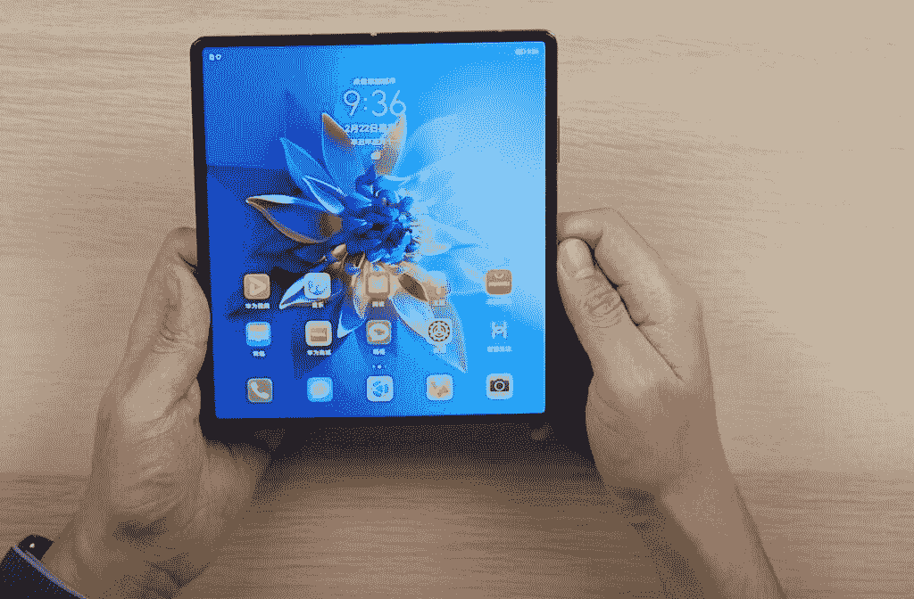
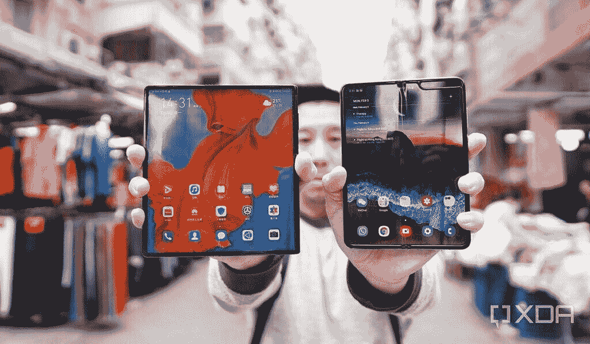
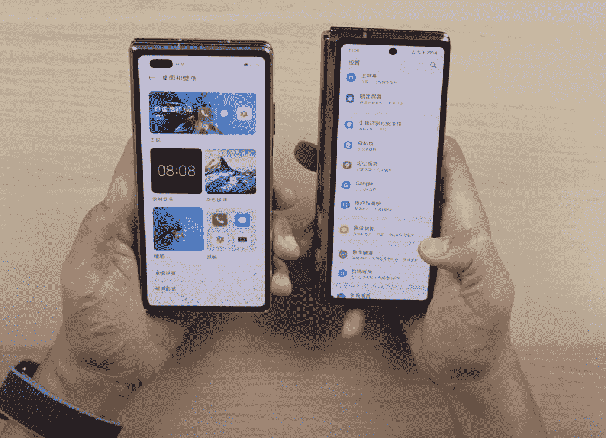

# 华为 Mate X2 证明了三星在可折叠方面一直是正确的

> 原文：<https://www.xda-developers.com/huawei-mate-x2-proves-samsung-right-foldables/>

本周，华为推出了其第三款可折叠手机 [Mate X2](https://www.xda-developers.com/huawei-mate-x2-launched-china/) ，它似乎是一款令人敬畏的硬件，这对于华为来说是[意料之中的事情](https://www.xda-developers.com/huawei-mate-40-pro-hands-on-preview/)。从铰链完全折叠的方式，到不太明显的折痕，到华为设法将[潜望镜变焦镜头](https://www.xda-developers.com/periscope-camera-vs-telephoto-camera/)塞进折叠设备，这些都是超越三星 Galaxy Z Fold 2 的硬件成就。

然而，房间里的大象是无法回避的:华为 Mate X2 是华为折叠哲学的倒退。

 <picture></picture> 

The Huawei Mate X2 in a hands-on video by Chinese reviewer Vincent Zhong.

折叠单片可弯曲玻璃只有两个方向:向内折叠，屏幕靠近用户；或者向外，显示器侧远离用户向后弯曲。华为的前两款可折叠设备 [Mate X](https://www.xda-developers.com/huawei-mate-x-first-impressions/) 和[Mate XS](https://www.xda-developers.com/huwaei-mate-xs-foldable-hands-on/)采用了向外折叠的方式，而三星迄今为止的三款可折叠设备[都采用了相反的折叠方式](https://www.xda-developers.com/samsung-galaxy-z-fold-2-review/)。

 <picture></picture> 

The Huawei Mate X and the Samsung Galaxy Fold, aka the first foldables from Huawei and Samsung.

每当两种哲学出现时，每一方都有其支持者和反对者。在科技媒体中，包括我自己在内的大多数作者/评论者更喜欢三星的向内折叠方式，因为柔性屏幕在折叠时受到保护。

但是有相当多的评论者更喜欢外翻式，主要是因为他们不喜欢内翻式需要在外面有第二个更小的屏幕。

对于 Mate X2，华为承认向内折叠是更好的折叠方式。在我看来，这通常不会是一个问题，如果不是华为消费者老板理查德·于在 2019 年世界移动通信大会上批评向内折叠的方法。当他批评需要第二块屏幕时，我出席了新闻发布会。

 <picture></picture> 

The Huawei Mate X2 and the Galaxy Z Fold 2, in a screenshot of a hands-on by video reviewer Vincent Zhong.

我已经在现实世界中广泛使用了华为和三星之前的可折叠手机，作为我的日常司机，体验有天壤之别。对于华为 Mate XS，我在现实世界中使用它从未感到完全舒适，因为柔软、可塑、可弯曲的屏幕总是暴露在外。我觉得我必须时刻呵护这个设备。每当我把它放在桌面上的时候，我都会轻轻地放，这样屏幕就不会被刮伤或碰坏。

有了 Galaxy Fold 或 Galaxy Z Fold 2，我可以更放心地使用它，因为设备最重要/脆弱/昂贵的部分在不使用时得到了保护。我可以把一个折叠的 Galaxy Z Fold 2 塞进我的包口袋，或者只是把它放在桌子上，而不需要特意表现得很温柔。

也就是说，我真的很喜欢我在华为 Mate X2 身上看到的东西。外部(次要)6.4 英寸屏幕的纵横比为 21:9，仍然略窄，但远不及 Galaxy Z Fold 2 的 25:9。

正如前面提到的，华为找到了一种方法，将它最好的旗舰相机系统塞进了 Mate X2，而三星则妥协了，在 Galaxy Z Fold 2 上使用了比 Galaxy Note 20 Ultra 更差的相机系统。由于双重折叠结构，铰链也不太明显，类似于摩托罗拉可折叠 Razr 系列中的铰链。

 <picture></picture> 

The Huawei Mate X2 and the Galaxy Z Fold 2, in a screenshot of a hands-on video reviewer Vincent Zhong.

当然，Mate X2 目前只在中国销售，如果没有非官方的黑客攻击，它将无法运行谷歌的核心服务，所以中国以外的大多数人很难使用它，即使他们决定进口一台。

但作为一款可折叠硬件，这可能是迄今为止最令人印象深刻的一款——它非常清楚地证明了三星一直以来的折叠理念是正确的。Android 市场因实验而繁荣，但认识到什么更好地工作会重置房间，并推动创新朝着更集中的方向发展。随着 Mate X2 现在使用顶级硬件折叠，我们可以期待三星在自己的可折叠产品上冒更多的风险。或许作为一种反应，三星现在给用户一个 100 天退货政策，让他们试用 Galaxy Z Fold 2，让我们一瞥这种集中竞争在一天结束时能为消费者带来什么。

你怎么看？你认为哪种方法对可折叠的更好？