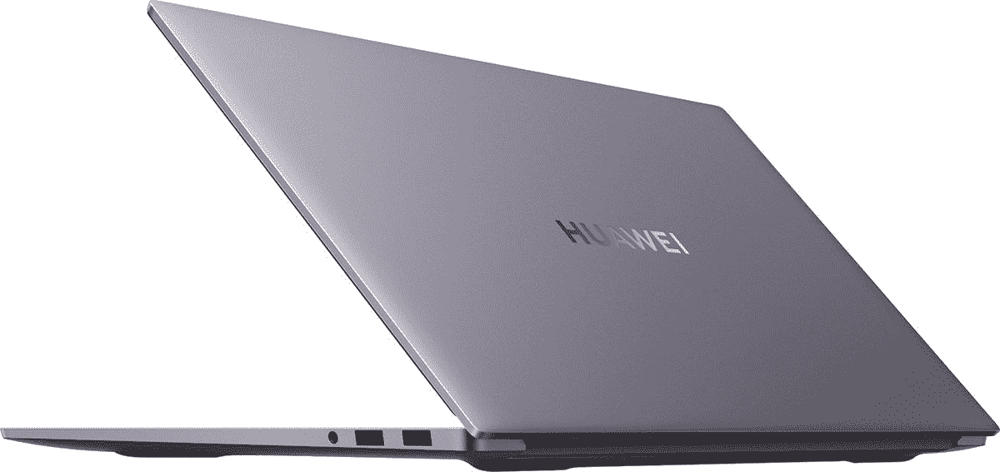
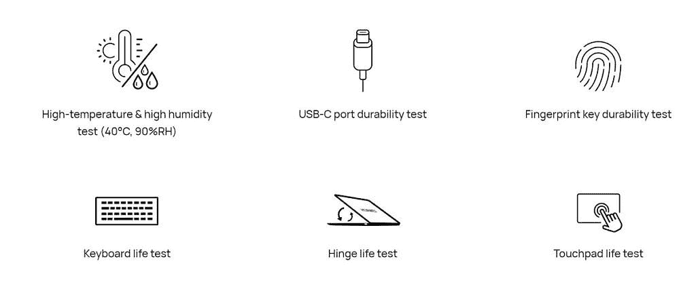

# 华为 MateBook D 16 是一款 16.1 英寸的性能怪兽

> 原文：<https://www.xda-developers.com/huawei-matebook-d-16/>

毫无疑问，华为 MateBook D 16 是笔记本电脑中较大的一款。这款 16.1 英寸设备是一款功能强大的计算机，它提供的屏幕空间是一个真正的媒体和生产力发电站。但它能够在不牺牲便携性的情况下做到这一点，而便携性通常是拥有这种尺寸笔记本电脑的缺点之一。尽管显示屏很大，但华为 MateBook D 16 的厚度仅为 18.4mm，重量为 1.74 kg。无论您去哪里，都可以随身携带这款笔记本电脑，不会让您感到沉重。

* * *

## 超薄时尚的外形

与我们见过的其他华为笔记本电脑一样，MateBook D 16 的设计看起来专业而简单。更大的屏幕尺寸意味着您有更多的空间来安装舒适的键盘和大型触控板。您会发现使用全背光键盘打字是一种奇妙的体验。

 <picture></picture> 

HUAWEI MateBook D 16

两个扬声器位于笔记本电脑的两侧，键盘中隐藏着一个弹出式网络摄像头，右侧有一个指纹传感器。D 16 有几个 USB 端口，包括:

*   USB-C x2
*   USB 3.2 x2
*   3.5 毫米音频插孔
*   HDMI 端口

两个风扇位于笔记本电脑的底部，在保持设备冷却方面发挥了很大的作用。作为冷却系统的一部分，有两个大风扇，你会认为它们相当吵。事实并非如此，因为这些风扇只有 0.2 毫米厚。这为您提供了强大的气流，使您的系统保持凉爽，同时具有非常安静的噪音输出。

所有这些设计特点不仅增加了笔记本电脑的视觉吸引力，而且经过了广泛的测试，以确保电脑非常耐用。

 <picture></picture> 

HUAWEI MateBook D 16 Durability Tests

* * *

## 卓越性能

像这样的笔记本电脑的性能和制造质量一样重要。借助超大 FHD 显示屏，您将需要确保能够利用它来完成视频编辑、照片编辑、文字处理和媒体消费等任务。因此，请查看这款笔记本电脑的性能规格，让它成为您的主电脑。

*   AMD 锐龙 5 4600H 处理器
*   AMD 锐龙 7 4800H 处理器

在这两种强大的 AMD 处理器选项中进行选择，为您的计算机提供动力。借助 AMD 镭龙显卡，您可以在出门在外时使用资源密集型程序，如 Adobe creative 软件。对于 RAM，您将有 16GB 来帮助您同时运行多个强大的应用程序。512GB NVMe PCIe 固态硬盘为这款超级便携的机器带来了大容量存储。凭借 56 瓦时的电池续航时间，您可以在需要再次插入电源之前完成长时间的工作。

为了实现额外的性能，MateBook D 16 使用了快捷键，可以解锁更多的资源，但代价是更长的电池寿命。这对于任何时候你发现自己需要一点额外的推动来让你的项目超越边缘是完美的。

至于连接选项，所有最新的蓝牙和 wifi 技术将使您以最快的速度保持连接。当与您的 MateBook 结合使用时，华为出色的 Share 软件可以释放您的华为手机的新功能。通过将手机连接到电脑，你可以传输文件和使用多屏协作功能。

华为共享软件

**无线网络**

*   IEEE 802.11 a/b/g/n/ac/ax
*   2.4 GHz 和 5 GHz
*   2 个外接
*   支持 WPA/WPA2/WPA3

华为 MateBook D 16 的价格超级有竞争力，尤其是这个屏幕尺寸的高端笔记本电脑。从€899，99 开始，你可以开始配置你自己的 MateBook D16 [这里](https://consumer.huawei.com/en/laptops/matebook-d-16-amd)。

###### 我们感谢华为赞助这篇文章。我们的赞助商帮助我们支付与运行 XDA 相关的许多费用，包括服务器成本、全职开发人员、新闻撰稿人等等。虽然您可能会在门户内容旁边看到赞助内容(这些内容将始终被标记为赞助内容),但门户团队对这些帖子不承担任何责任。赞助内容、广告和 XDA 仓库完全由一个独立的团队管理。XDA 绝不会通过接受金钱来赞扬一家公司，或以任何方式改变我们的观点或看法，从而损害其新闻诚信。我们的意见不能被收买。