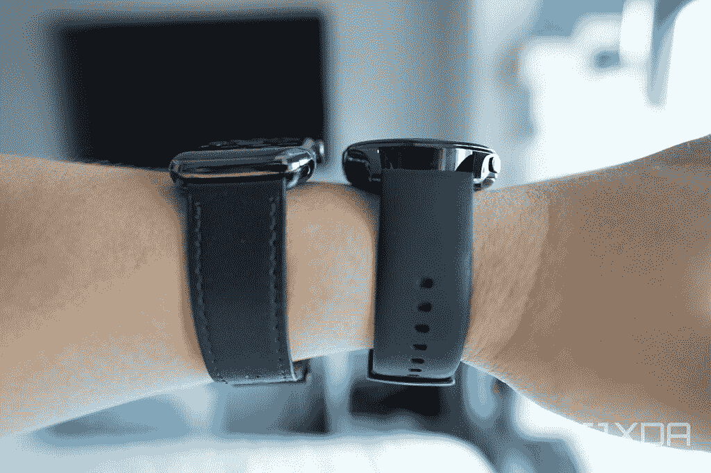
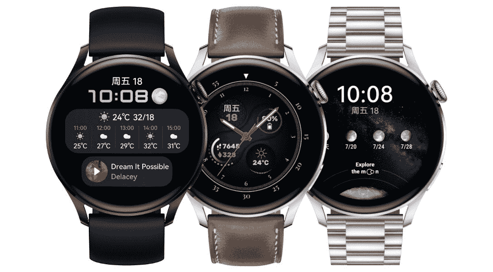

# 华为 Watch 3 点评:硬件漂亮，但鸿蒙系统需要时间

> 原文：<https://www.xda-developers.com/huawei-watch-3-review/>

上个月，华为举行了一次虚拟发布活动，正式在全球推出鸿蒙系统，这是该公司为回应美国政府的禁令而开发的新操作系统。在发布软件的同时，华为还宣布了一系列新硬件，它们将成为首批运行新操作系统的华为产品，包括[华为 Watch 3](https://www.xda-developers.com/huawei-watch-3-pro/) 系列。

到底什么是鸿蒙系统？XDA 的亚当·康威已经在[的 MatePad Pro](https://www.xda-developers.com/harmonyos-on-huawei-matepad-pro-impressions/) 平板电脑上进行了测试，发现从美学角度来看，它并没有彻底背离华为之前基于 Android 的操作系统 EMUI。嗯，我一直在测试新的运行鸿蒙系统的华为 Watch 3，新 OS 的智能手表版本和华为以前的 LiteOS 软件的区别也很难把握。但这不一定是件坏事。

***关于本次评测:**华为给我们发来了华为 Watch 3 进行评测。然而，他们没有对这一审查的内容提出任何意见。*

## 华为 Watch 3:设计和硬件

华为当然是一个引起许多不同意见的科技品牌。但是如果有一件事每个人都同意的话，那就是华为制造了非常好的硬件。这家公司在我们今天看到的手机中开创了许多相机硬件技术，多年来已经制作了一些漂亮的设备，华为 Watch 3 是另一个。

与 2015 年发布的第一款华为手表相比，Watch 3 的整体设计理念没有太大变化:它仍然是一个由不锈钢制成的圆形机身，背面混合了一点陶瓷，整体外观类似于传统的手表。

这款机型的新功能是增加了一个可以按压或旋转的数字表冠(是的，就像在 [Apple Watch](https://www.xda-developers.com/galaxy-watch-3-vs-apple-watch-6/) 上一样)，以及一个略微弯曲的有机发光二极管屏幕，它与机身无缝融合，在导航 UI 时提供了更流畅、更自然的滑动体验。

1.43 英寸的有机发光二极管显示屏清晰而充满活力，PPI 为 326，更好的是:最大亮度达到 1000 尼特，与 Apple Watch 6 一样亮，在阳光直射下明显比我的 Fitbit Sense 和 [TicWatch Pro 3 更容易看到。](https://www.xda-developers.com/mobvoi-ticwatch-pro-3-review/)屏幕也以 60Hz 的频率刷新。

表带是可拆卸的，根据您选择的型号，有橡胶、皮革或米兰式表带可供选择。

手表 3 内部是常见的传感器，如光学心率传感器和加速度计，可以跟踪从心率到锻炼的一切，但还有一个新的体温和 Spo2 传感器，可以跟踪潜在的发烧和血氧水平。

还有 16GB 的存储空间，以及一个发出响亮声音的扬声器。以所有这些硬件为代价的是一款厚度为 12.15 毫米的厚手表。这一点加上 46 毫米的大外壳使华为 Watch 3 成为一款阳刚之气的手表，戴在纤细的手腕上可能看起来很奇怪。

 <picture></picture> 

The Huawei Watch 3 (right) is a bit thicker than the Apple Watch 6 (left).

## 华为 Watch 3:软件和性能

如上所述，华为 Watch 3 是首批在鸿蒙系统上运行的全球发布的华为产品之一，但如果华为没有在软件中突出鸿蒙系统的名字——在手表上，鸿蒙系统在启动时会有自己的账单屏幕——我不确定大多数人会不会注意到软件已经改变了。

在很大程度上，这里运行的软件在美学上看起来与过去几年在华为智能手表上运行的 LiteOS 相似，只是鸿蒙系统更加精致，并带来了几个以前华为可穿戴设备没有提供的新功能。

比如华为 Watch 3 上的动画，观感*非常流畅。*这部分是因为 60Hz 屏幕，但也是因为软件得到了很好的优化。下拉快捷切换菜单(从屏幕顶部向下滑动)时的动画看起来特别平滑，让我想起了我第一次使用一加 7 Pro(这是首批配备更高刷新率显示屏的智能手机之一)。除了 Apple Watch，我测试过的其他智能手表都没有如此流畅和美观的动画。

还有华为的应用商店，名为 App Gallery，内置于手表中，允许在设备上搜索和下载应用程序。不幸的是，手表上的应用程序库现在非常简单，几乎列出了所有不知名的应用程序。

幸运的是，华为 Watch 3 包括了你追踪锻炼、睡眠、监测皮肤温度和打语音电话所需的所有基本应用程序(该设备支持 eSIM，尽管我没有尝试过这项功能)。

这些健康跟踪应用程序中的大多数不仅会向你显示最后的结果，还会让你浏览几周前的结果。对于睡眠，它甚至显示深度睡眠细分，包括深度睡眠或浅睡眠的时间。

我把华为 Watch 3 和 Apple Watch 6 以及 Fitbit Sense 一起戴了半天，所有的基本指标跟踪如步数和心率都差不多，这应该意味着华为的传感器足够准确。

然而，鸿蒙系统在 Watch 3 上决定展示其应用程序的方式是对 Apple Watch 的直接克隆——我只是不喜欢公然抄袭苹果的设计美学，苹果的产品如此主流，以至于它只会引起人们对设计非原创性的注意。

以前华为智能手表的其他优缺点仍然适用于新的可穿戴设备。让我们从好的方面开始:华为 Watch 3 一次充电可以轻松运行四整天(相比之下，Apple Watch 6 和 Galaxy Watch 3 最多只能运行一天半)。华为 Watch 3 还支持无线充电，这使得充值更加容易。

不好的一面是，这款新手表仍然只能接收静态通知，无法与之互动。比如在 Apple Watch 上，如果我收到电报信息，可以直接在手腕上回复；我在华为 Watch 3 上做不到。

## 华为 Watch 3:结论

尽管推出了全新的操作系统，但我对华为 Watch 3 的体验与我测试之前华为智能手表的体验相似——这意味着我喜欢优质、华丽的硬件，但对软件感到失望。特别是，我真的需要我的智能手表能够响应通知，因为如果我戴着一个有点笨重的设备，我需要它能够让我少检查我的手机。否则，如果我只是需要健身跟踪，我可以戴一个更小/更时尚的健身品牌，像高超的[华为/](https://www.xda-developers.com/honor-band-6-review/) [荣誉乐队 6](https://www.xda-developers.com/honor-band-6-review/) 。

但也有人喜欢将奢侈手表作为时尚配饰佩戴，华为 Watch 3 是目前最经典、最帅气的圆形智能手表之一。

 <picture></picture> 

Huawei Watch 3

##### 华为手表 3

华为最新的智能手表提供了华丽的屏幕，超长的电池寿命，以及具有增长潜力的新操作系统。