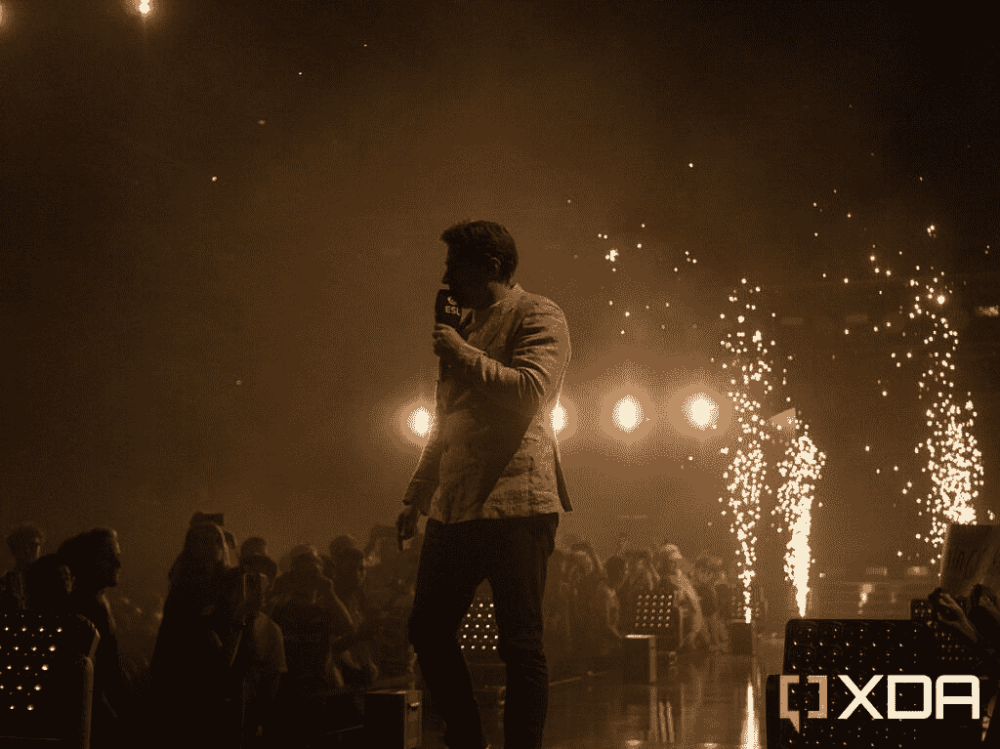
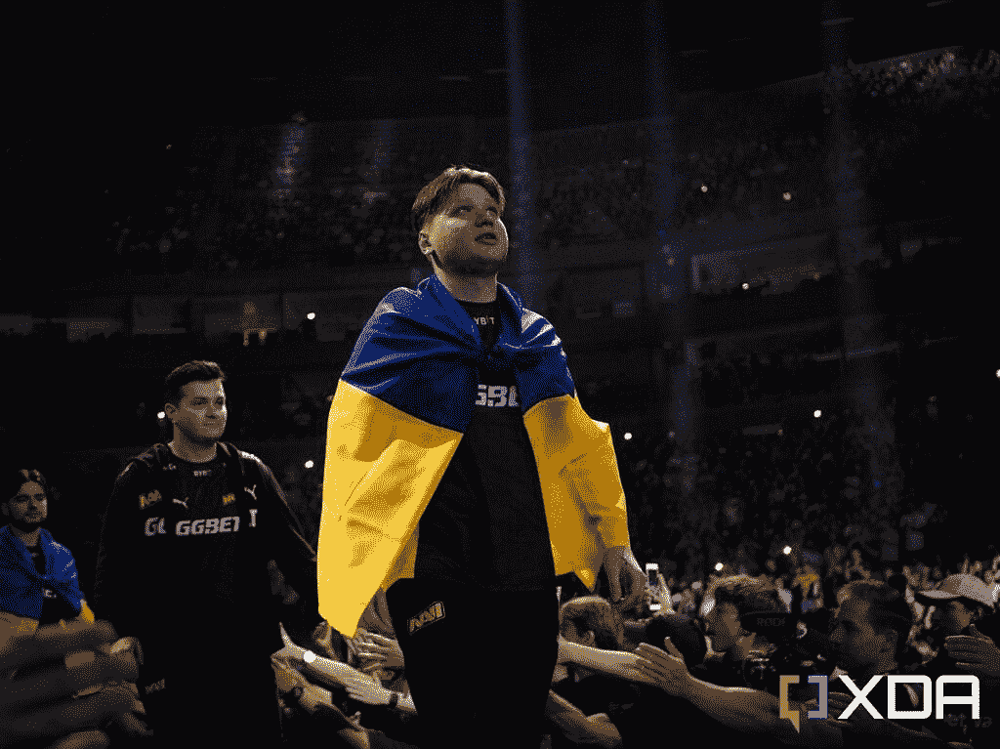

# IEM 科隆反恐精英大教堂隆重回归

> 原文：<https://www.xda-developers.com/iem-cologne-2022-recap/>

我们都有一个最喜欢的游戏，对我来说，这个游戏就是*反恐精英*。我从 2012 年开始玩*反恐精英:全球攻势*，从 2014 年开始作为观众电竞观看。我看的第一个活动是 ESL One:科隆 2014，从那以后，我就迷上了。最近，我参加了在朗盛竞技场举行的最近一次 ESL 科隆活动，这次活动现在被称为 IEM 科隆，这是一次令人惊奇的经历。被誉为游戏中最棒的人群，我一进入就被迷住了。

举例来说，*反恐精英*是这个星球上最古老的电子竞技游戏之一。它的最初测试版于 1999 年 6 月发布，是对最初的*半衰期、*的修改，后来它成为了一个独立的游戏。从那时起，Valve 已经发布了该系列的两个主要产品；*反恐精英:2004 年来源*，2012 年*反恐精英:全球攻势*。全球攻势的目的是合并前两个游戏的社区，因为一些玩家认为原版的反恐精英优于 2004 年发布的版本。

任何人都可以在*反恐精英*中组织锦标赛，可以是你和朋友组织的锦标赛，也可以是类似 ESL 赛事的大型全制作。IEM 科隆不是由 Valve 官方赞助的，不像在安特卫普举行的 [PGL 大赛这样的大型赛事，但它可以说是一年中除大型赛事之外最大的赛事之一。就在球员休息之前，这意味着这是我们至少一个月内最后一次看到这些球员。](https://www.xda-developers.com/counter-strike-pgl-major-antwerp-recap/)

 <picture></picture> 

OJ Borg, stage host, introducing the final

## IEM 科隆锦标赛结构

IEM 科隆经历了三个阶段:比赛阶段，小组赛和季后赛。比赛阶段和小组赛阶段都在科隆凯悦酒店闭门进行，尽管比赛在网上直播供观众收看。

然而，季后赛是在朗盛竞技场的舞台上直播的。这是一个能够容纳 18，500 人的大型场馆，活动门票在周末全部售罄。有落地式座位，然后是三个环形座位，环绕着竞技场的外围。底层座位直接通向舞台，中间有一条供采访者和选手进入时使用的走道。它也被用来向观众展示奖杯。

我出席的第一天是整个周五，这也是在竞技场比赛的第一天。虽然通常周五会空无一人，但我惊讶地发现竞技场居然爆满。人群喧闹，粉丝们显然玩得很开心。

## 反恐精英大教堂

朗盛竞技场年复一年被戏称为“反恐精英大教堂”，原因有二。首先，科隆有一座巨大的大教堂，这座城市因此而闻名，其次，这个场地是标志性的。如前所述，ESL 多年来一直在科隆的朗盛竞技场举办*反恐精英*赛事，并且每年都举办游戏中有史以来最好的比赛之一。今年也不例外。

科隆是我之前去过的一个城市，也算不上什么旅游城市。那里挤满了从世界各地飞来参加的人。我和几个朋友去了一家酒吧，我们喝了几杯，并和从芬兰飞来参加活动的人聊了聊——后来，我们也加入了一些美国人。

至于竞技场，那是一次不可思议的经历。粉丝们不停地喊着口号，观众们难以置信地关注着舞台上发生的一切。在比赛开始前几个小时，我看到人们排队进入体育场，人们开始穿过走道，与他们最喜欢的球员击掌，因为他们将走上舞台进行比赛。奖杯由 Nicholas“nit r0”Cannella 带出，他是 2019 年最后一次实体科隆活动的获奖者之一。

球迷们也可以参加竞技场周围的许多活动，包括由 DHL 和 ESEA 赞助的比赛。ESL 也有一个喷枪展台，在那里你可以免费获得你最喜欢的球队的临时纹身，并为 premium pass 持有者组织签名会议，如果他们想要，可以让他们的任何 merch 或其他项目签名。一张标准的周末票总共只花了€94 英镑，对于球迷来说，这还不算太贵。节日和其他周末活动通常花费更多。

## IEM 科隆 2022 决赛:纳维 vs 法泽部落

 <picture></picture> 

Oleksandr "s1mple" Kostyliev, considered the best player in the world

重提同样的决赛从 PGL 主要在安特卫普，这是再次纳威 vs Faze 氏族采取阶段。这一次是五局三胜的决赛，从头到尾花了大约七个小时。它也走了全程，所有五张地图都以令人难以置信的紧密方式播放。ESL 也是一个表演秀，因为决赛以一个十分钟的仪式开场，庆祝过去几年里在这个舞台上的一些最好的时刻。

游戏本身是不可思议的，两个队都玩了一种混乱的风格*反恐精英*。当第一队达到 16 回合时游戏就赢了，而当 Navi 有了 15 回合而 Faze 战队有了 4 回合时，地图似乎基本上结束了。然而，Faze Clan 设法将比分一路追至 15-15，并将其带入加时赛，竞技场变得疯狂。

最终，Faze Clan 在第五张地图中以一种扣人心弦的方式完成了比赛。最终比分是 16-14(这是最接近的比分)，结束了舞台上长达几个小时的战斗。随后，该活动的舞台主持人 OJ Borg 采访了这些球员。很难理解他们在说什么，因为粉丝们在整个过程中不断鼓掌欢呼。

这些活动是我如此热爱反恐精英的原因，我总是很感激能够参加。这部电影的粉丝和制作人员一直都很棒，在爱尔兰，我花了很多时间在这个社区上。我曾经交过的一些最好的朋友都是通过这个游戏认识的，在科隆，成千上万的球迷来到同一个城市，分享一个共同的爱好。

## 反恐精英将何去何从

IEM 科隆成为有史以来最受关注的反恐精英赛，这并不是一个主要的比赛，不难看出为什么。自从在全球范围内回归现场活动以来，这款游戏引起了人们的兴趣，并使它重新成为电子竞技的焦点。我听说了许多第一次看比赛的人的故事，他们以前从未看过比赛，许多人对比赛的理解没有长期观众那么深刻。

不过这是最好的部分，因为有了*反恐精英*，可以直观地看到发生了什么，并在不了解战术深度的情况下理解它。我曾经带我父亲在我们附近的电影院看了一场 ESL One 科隆决赛，虽然他以前从未玩过这个游戏，但他凭直觉就能理解经济的意义，并看到球员的反应时间。

2022 年 IEM 科隆奥运会可能是许多人看到的第一个事件，就像我在 2014 年看到的一样，它可能会让人们着迷多年。这些活动将人们聚集在一起，让你探索一个新的城市，体验新的文化。我总是很兴奋地想知道这项运动的未来，随着像 ESL 这样的大型组织推动表演艺术对大型电子竞技比赛的意义，我现在比以往任何时候都更兴奋。