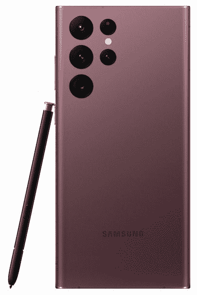
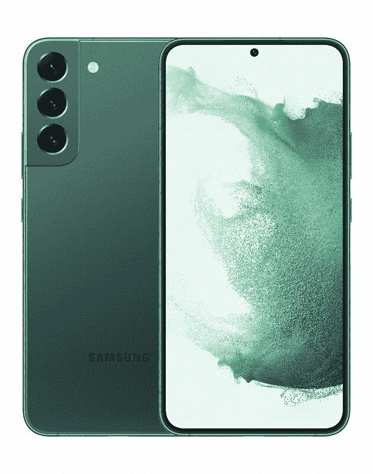
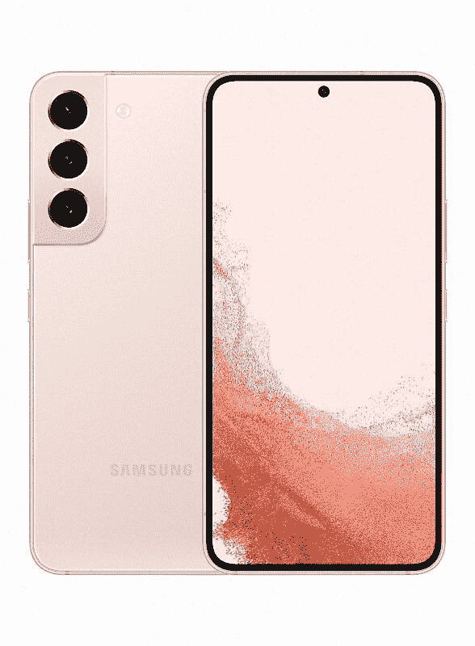
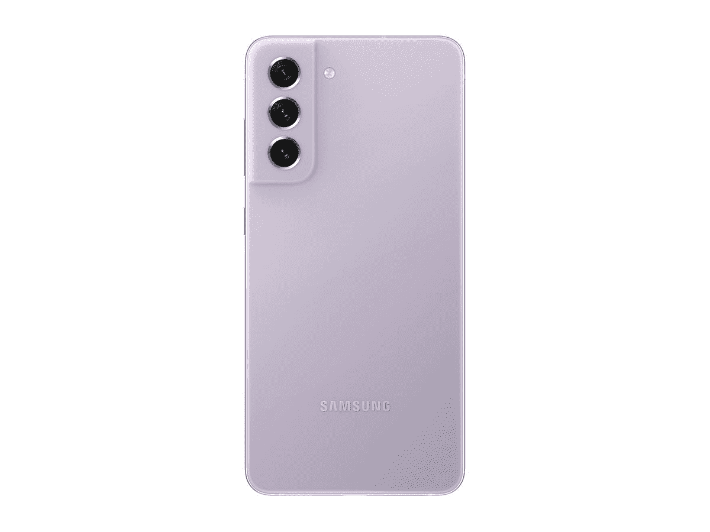
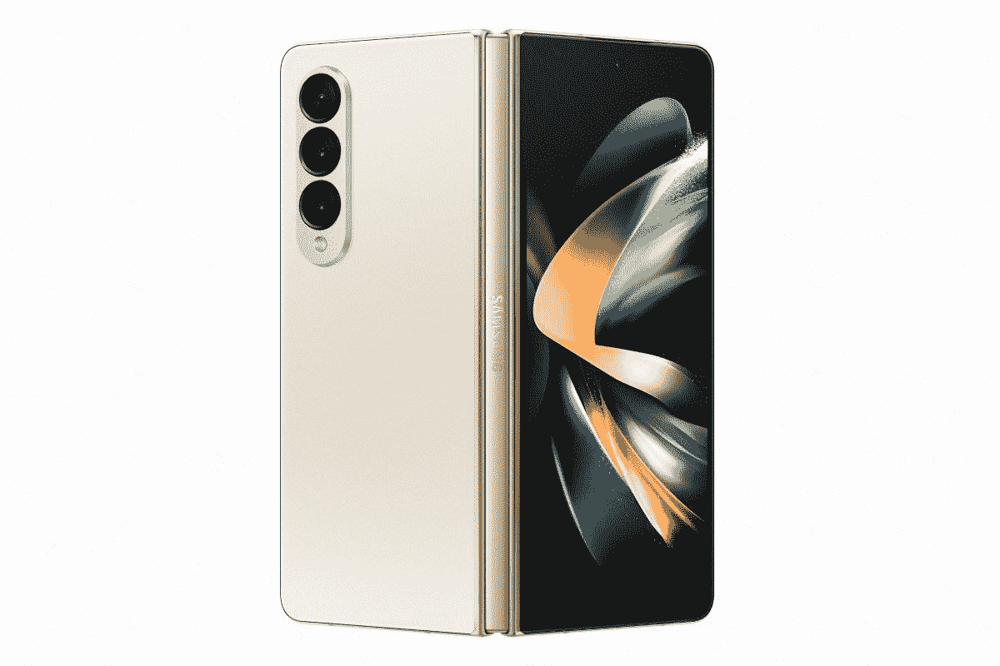
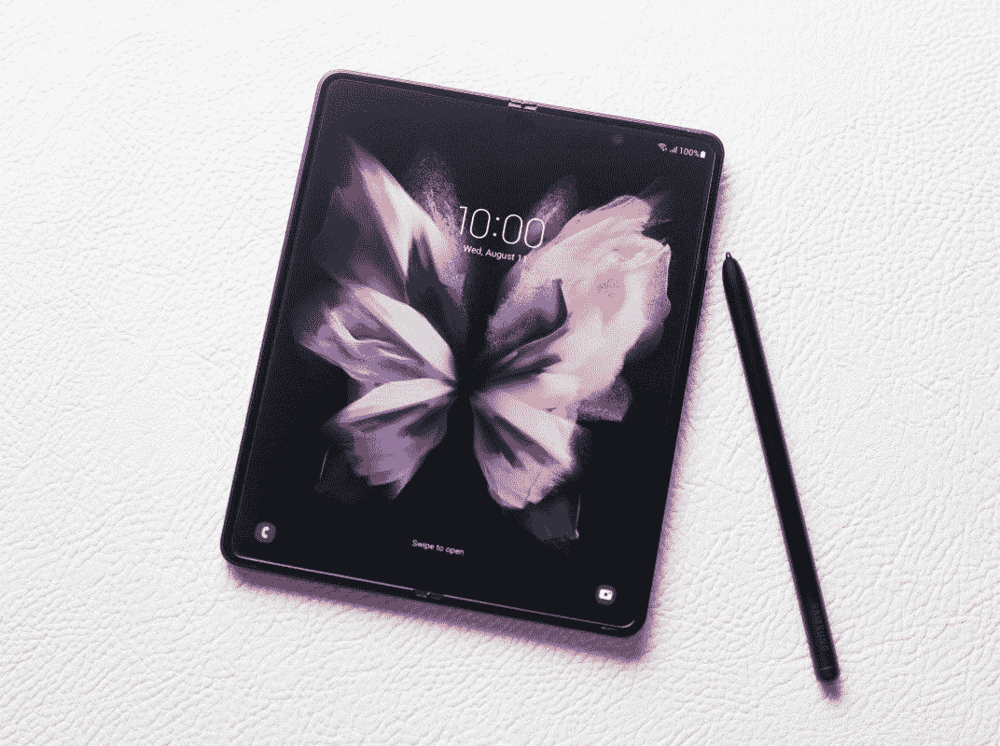
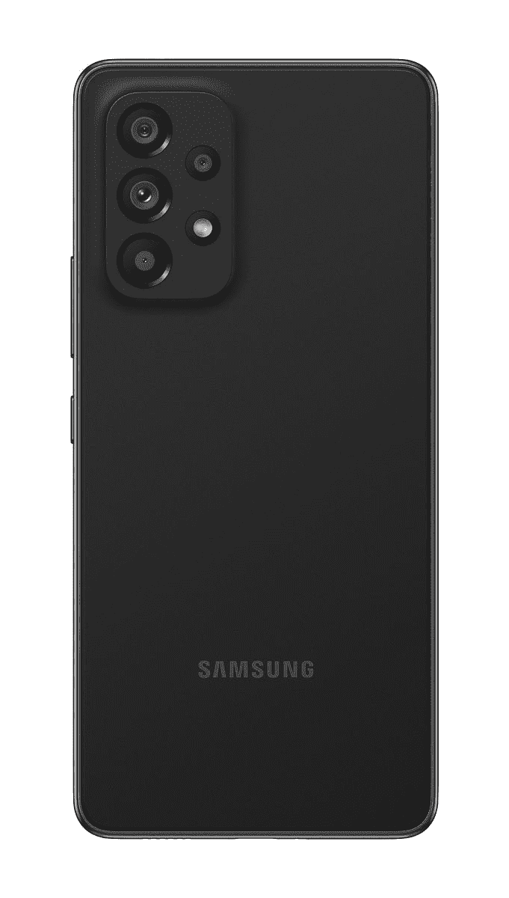

# 2023 年最佳三星 Galaxy 手机

> 原文：<https://www.xda-developers.com/improve-your-overall-galaxy-experience-with-galaxy-tuner-korean-models-only/>

三星是世界上第一大手机品牌，这是有充分理由的。这家韩国科技巨头不仅生产最高端的平板旗舰机和尖端的可折叠手机，还生产功能强大的中档和经济型手机。因此，无论您的预算如何，三星都有适合您的产品。如果你发现选择的数量太多，不要担心——我们在 XDA 已经测试了近几年发布的每一款三星手机，我们随时准备提供帮助。

当然，如果你愿意使用三星以外的产品，我们有一份指南，介绍了[最佳安卓手机](https://www.xda-developers.com/best-android-phones/)，甚至还有[最佳 iPhones 手机](https://www.xda-developers.com/best-iphone/)。

## 最佳综合:三星 Galaxy S22 Ultra

三星的 Galaxy S22 Ultra 不仅是去年优秀的 Galaxy S21 Ultra 的继任者，也是 Galaxy Note 20 Ultra 的继任者。在这两个方面，手机都让它出了公园。Galaxy S22 Ultra 在 Galaxy S21 Ultra 已经令人敬畏的多功能相机系统的基础上进行改进，对硬件进行了细微的改进，同时对其计算摄影引擎进行了重大改造。结果是一个 10 倍变焦镜头，可以产生比以前更清晰和更好的变焦镜头；具有更好的动态范围和低光能力的主照相机；和更流畅的视频稳定性。超宽相机也一如既往地有用。

此外，Galaxy S22 Ultra 延续了 Note 系列的传统，将 S-Pen 作为手机的一部分。去年的 S21 Ultra 也支持三星的手写笔，但它是单独购买的，手机没有插槽来容纳笔。Galaxy S22 Ultra 的 S-Pen 可以放入一个插槽，就像以前的 Note 设备一样。但这还不是全部，三星还提高了 S-Pen 的性能，将延迟降低到 2.8 毫秒，以获得更真实的草图和笔记体验。

在其他地方，Galaxy S22 Ultra 运行在新的高通骁龙 8 Gen 1 或 Exynos 2200 上，尽管这些芯片不再是 Android 中最好的芯片，但即使在 2022 年底，它们仍然足够强大。虽然 5000 毫安时的电池大小与之前相同，但 Galaxy S22 Ultra 的电池续航时间更长，因为手机屏幕是第二代 LTPO 面板，可以更智能地找到合适的刷新率，以提高能效。

Galaxy S22 Ultra 还将获得四年的软件更新保证，五年的安全补丁，以及一种精致的软件体验，提供 Android 12 的最佳功能以及一系列三星特有的功能，如 DeX。除了这款手机不会折叠之外，Galaxy S22 Ultra 是目前三星手机工艺的巅峰。

 <picture></picture> 

Samsung Galaxy S22 Ultra

三星 Galaxy S22 Ultra 是三星的终极手机，结合了 S 和 Note 系列的最佳产品，是一款强大的机器，擅长工作和娱乐。

## 第二好的手机:三星 Galaxy S22 Plus

如果你对 S-Pen 没有太大的用处，而宁愿节省一点钱，那么 [Galaxy S22 Plus](https://www.xda-developers.com/samsung-galaxy-s22-plus-review/) 是一个极好的替代选择。你仍然会得到一个华丽的 120Hz AMOLED 屏幕，一个非常好的相机系统，高通骁龙 8 Gen 1 SoC，一个玻璃和铝结构，以及三星的抛光和多功能软件，可以说它可以做更多的事情，而不仅仅是股票 Android。例如，你可以在 OneUI 中的一个可调整大小的浮动窗口中打开应用程序，这在 stock Android 中是无法做到的。这一点，加上三星 DeX，使 Galaxy S22 Plus 成为比 Pixel 更好的多任务处理设备。

您还可以获得与 Ultra on Plus(甚至普通版)相同的软件承诺，因此最终不会做出任何妥协。软件上唯一的区别就是省略了 S Pen 的特性，因为这款手机不支持手写笔。

事实上，许多人可能会发现 6.6 英寸、1080 x 2340 的平板屏幕比 Galaxy S22 Ultra 的 6.8 英寸曲面屏幕更容易操作，特别是因为这款手机的中框也带有圆角。

Galaxy S22 的尺寸为 157.4 x 75.8 x 7.6 毫米，重量为 195 克，并不是一款小手机，但按 2022 年的标准来看也不算大。我们 XDA 的大多数人都喜欢这个尺寸。这有助于三星有一个很好的单手模式，更容易用拇指触摸。

是的，你确实失去了 Ultra 中令人敬畏的 10 倍潜望镜变焦镜头，但你仍然可以得到一个有能力的 3 倍远摄变焦镜头，这是肖像的理想选择。50MP 主摄像头与去年 Galaxy S22 Plus 中平庸的 12MP 摄像头相比是一个很大的改进。三星使用像素宁滨制作 1250 万像素的照片，包含 5000 万像素的信息。其结果是，这种相机即使在晚上也能拍摄明亮的图像。自拍相机也很坚固，尽管三星的皮肤平滑滤镜有点强，不能完全关闭。

你可以获得 Galaxy S22 Ultra 获得的大多数其他功能，如无线充电、IP68 防水、三星 DeX 和 Galaxy S22 系列独有的功能，如与 Google Duo 的实时共享。这完全是一款旗舰手机，只是不像它的哥哥那样无所不能。但大多数人并不真的需要一款过于夸张的旗舰产品，所以对于那些需要一款能够在高水平上完成所有智能手机基本功能的手机的人来说，这是一个绝佳的选择。

三星承诺四年的软件更新是另一个好处，所以你可以保证至少升级到 Android 16。简单来说，Galaxy S22 是一款出色的全能旗舰。

 <picture></picture> 

Samsung Galaxy S22 Plus

##### 三星 Galaxy S22 Plus

即使它比 Galaxy S22 Ultra 低一层，Galaxy S22 Plus 仍然是一款配备骁龙 8 Gen 1 和出色显示屏的旗舰手机。

## 最超值:三星 Galaxy S22

如果你觉得 1199 美元的 Galaxy S22 Ultra 或 999 美元的 Galaxy S22 Plus 太贵，那么你可能要考虑更小的 Galaxy S22，它的起价是 799 美元。是的， [Galaxy S22](https://www.xda-developers.com/samsung-galaxy-s22-review/) 缺少 Galaxy S22 Ultra 的世界级变焦摄像头和对 S-Pen 的支持，但如果你不经常进行变焦摄影或使用手写笔，那么这些损失可能并不太重要。你仍然会得到一个出色的三摄像头系统，包括一个 50MP 主摄像头，12MP 超宽摄像头和一个 10MP 长焦摄像头。主摄像头具有相当大的图像传感器尺寸，因此照片将变得明亮而充满活力，具有强大的动态范围。超宽相机还具有 123 度的扫描视野，非常适合风景摄影。3 倍远摄变焦镜头与 Galaxy S22 Ultra 中使用的镜头相同，因此您获得的焦距非常适合人像拍摄。10MP 自拍相机对于弱光自拍来说有点欠缺，不过白天的话还是会好的。三星的人像模式也是业界数一数二的。

我们中的许多人也是 6.1 英寸屏幕尺寸的粉丝，因为它使手机变得更小。Galaxy S22 的尺寸为 146 x 70.6 x 7.6 毫米，重量为 168 克，是一款简单的单手手机，不会像 Galaxy S22 Ultra 那样在口袋中感觉笨重。

有了骁龙 8 Gen 1，即使它不再是 Android 领域绝对最好的芯片，你也可以获得顶级的性能，尽管 S22 配备了更小的 3，700 mAh 电池，但由于高效的 SoC，你仍然可以获得应该可以持续一整天的电池寿命。三星的软件也很快，反应灵敏，有很多多任务选项，比如能够在一个较小的浮动窗口中运行应用程序。三星 DeX 将桌面用户界面输出到外部显示器，与大多数其他智能手机相比，它可以让你做更多的工作。

Galaxy S22 还纠正了去年 Galaxy S21 的许多错误。去年的设备有一个塑料背面和一个薄弱的 12MP 主摄像头，今年的 Galaxy S22 使用大猩猩玻璃 Victus 背面，带有一个大大改进的 50MP 主摄像头，图像传感器尺寸更大，为 1/1.56 英寸。当然，Galaxy S22 Ultra 是一款功能更强的手机，但 Galaxy S22 保持足够近，不会让人感觉像是事后想起。就像所有三星旗舰一样，你保证会获得四年的 Android 更新，所以你至少会更新到 Android 16。

无论你想要一个更小的还是更实惠的旗舰，Galaxy S22 似乎检查了所有重要的框。

 <picture></picture> 

Samsung Galaxy S22

如果你发现你不需要 S-Pen 或疯狂变焦相机，或者如果你发现 S22 超大，这款标准的 Galaxy S22 便宜 400 美元，单手操作也容易得多。

## 第二超值:Galaxy S21 FE

首先，*不要以 699 美元的发布零售价购买*这款手机，尤其是当 Galaxy S22 只比它贵 100 美元，并且拥有更新的芯片和更好的相机系统时。相反，我们在这个位置列出了 [Galaxy S21 FE](https://www.xda-developers.com/samsung-galaxy-s21-fe-review/) ，因为很可能会有进一步削减 100 美元的折扣。目前，我们在下面列出的亚马逊网站上有售，售价 599 美元。在这个价位上，如果你想节省更多的钱，Galaxy S21 FE 是值得考虑的。对于发布零售价格，我们建议寻找包括 Galaxy Buds Live 在内的优惠，这将有助于增加交易的甜头。

有了这个设备，你将得到一个骁龙 888，这是一个 2021 年的高通芯片，但在 2022 年底仍有能力；6.4 英寸 Super AMOLED 120Hz 显示屏，彩色背面设计，易于抓握。你还会得到一个相对较大的 4500 毫安时的电池。虽然我们刚才说过这里的相机系统不如 Galaxy S22 系列的相机，但它仍然很有能力:由 12MP 主相机、12MP 超宽相机和 8MP 远摄变焦相机组成的三镜头系统。主摄像头和超宽摄像头将为大多数人完成工作，因为三星的计算摄影足以克服相对过时的硬件。但 8MP 长焦镜头以任何标准来看都很平庸。

这款手机的背面也是塑料的，所以感觉不像 Galaxy S22 系列那么高端，但对那些经常摔手机的人来说可能是有益的，因为塑料比玻璃更耐用。Galaxy S21 FE 的尺寸为 155.7 x 74.5 x 7.9 毫米，重量为 177 克，是一款易于单手使用的手机，因为它不太重也不太笨重。

在软件方面，手机自带 Android 11，但你应该在设置手机后立即获得 Android 12 的更新。OneUI 快速高效，拥有令人敬畏的多任务处理能力，加上类似三星 DeX 的奖金。你还可以保证获得四年的软件更新，所以这款手机至少可以升级到 Android 15。

正如我们所说，Galaxy S21 FE 在官方零售价格上可能不值得考虑，但大多数地方会以更低的价格出售。如果你已经决定 550 美元到 700 美元的价格范围是你愿意支付的，我们建议你仔细权衡 Galaxy S21 FE 和 Galaxy S22 的利弊，决定哪一款设备更适合你。

 <picture></picture> 

Samsung Galaxy S21 FE

##### 三星 Galaxy S21 FE

如果你想进一步削减一些成本，同时仍然获得一部相对现代和强大的智能手机，Galaxy S21 FE 值得一看。

## 钱能买到的最好的东西:三星 Galaxy Z Fold 4

三星的新 [Galaxy Z Fold 4](https://www.xda-developers.com/samsung-galaxy-z-fold-4-review/) 乍一看可能与 Z Fold 3 没有太大区别，但三星通过在一些地方做出微妙但关键的改变，进一步改进了这款设备，成为迄今为止最精致的可折叠手机。反对者仍然会说它太贵了，他们没有错，但对于那些能够承受这个价格的人(或者利用三星[令人惊叹的折价优惠](https://www.xda-developers.com/best-samsung-galaxy-z-fold-4-deals/))，Galaxy Z Fold 4 是迄今为止最适合黄金时间的大尺寸可折叠手机。

有什么新鲜事吗？三星在去年 Fold 3 的基础上进一步减轻了重量，因此 Fold 4 现在的重量为 254 克。虽然这本身并不轻，但也不再重得令人难以忍受，因为这个重量并不比 Galaxy S22 Ultra 加一个外壳重多少。

Fold 4 还将铰链区域削去了几毫米，因此折叠时体积更小，并为屏幕提供了宝贵的额外空间，因此内外显示屏都比去年略宽。当使用折叠形式的折叠部 4 时，这种改进最为明显。它仍然是一个细长的糖果条形状，但在屏幕上打字感觉不那么拥挤。

三星也给了 Fold 4 重大的摄像头升级。去年的 Fold 3 使用了一个过时的相机系统，与 Galaxy S10 的相机差不多。今年，Fold 4 升级到了 Galaxy S22 使用的相同系统，配备了一个 50MP 的主摄像头，配有一个大型(可折叠)1/1.56 英寸图像传感器，以及一个 3 倍远摄变焦镜头，比以前 Fold 中的普通变焦镜头好得多。

Fold 4 还恢复了以前折叠中建立的所有伟大功能，包括可以在中间折叠时保持原位的坚固铰链(三星称之为“Flex Mode”)，以及 IPX8 防水和 S-Pen 支持。虽然电池大小保持不变，为 4400 毫安时，但由于非常高效的骁龙 8 加第一代，Fold 4 的续航时间可以长得多。从我们到目前为止的测试来看，Fold 4 可以轻松地持续一整天 12 到 13 个小时的重度使用。

如果你一直对可折叠手机感到好奇，现在可能是时候跳上去了，因为三星已经将其大型可折叠配方完善到近乎完美——剩下的唯一事情就是消除显示屏上的折痕，遗憾的是，它仍然在这里(不要担心，如果你斜着看屏幕，你只会注意到它)。

 <picture></picture> 

Samsung Galaxy Z Fold 4

三星 Galaxy Z Fold 4 是三星最新的可折叠旗舰产品，包装高端规格，内部存储高达 512GB。不过，你不能用 microSD 卡扩展它。

## 也很棒:三星 Galaxy Z Fold 3

如果你发现 Galaxy Z Fold 4 的价格仍然高得难以承受，你可以考虑购买 Galaxy Z Fold 3。虽然三星不再在官方销售它，但你可以在亚马逊和其他零售商那里找到它，价格比 Fold 4 的价格至少低 30-40%。

Fold 3 在 2022 年仍然很受欢迎，因为它是 2021 年最伟大设备。高通骁龙 888 仍然是一款有能力的处理器，相机系统虽然不如 Fold 4，但仍然很可靠。三星的计算摄影足够好，可以克服稍微过时的相机硬件。在大多数拍摄中，你仍然可以获得出色的动态范围，夜间模式会人为地活跃黑暗的场景。灵活模式也提供了许多独特的拍摄和使用相机系统的方式。至于自拍——有两个摄像头:外侧屏幕上的 10MP 自拍相机和内侧屏幕上的 4MP 欠显自拍相机。虽然后者不能产生最佳的相机质量，但它确实给了大平板电脑屏幕更身临其境的感觉。

Galaxy Z Fold 3 仍然提供 IPX8 防水等级，S-Pen 支持，以及可以保持原位的令人敬畏的铰链。这些都是三星在可折叠领域开创的功能，在 2022 年仍然很重要。

当然，展示也很棒。无论是 7.6 英寸的大显示屏，还是 6.5 英寸的外盖显示屏，色彩准确度、最大亮度、分辨率、可视角度，都是顶尖的。有了 Galaxy Z Fold 3，你可以在一秒钟内从手机变成迷你平板电脑。Fold 3 的重量为 271 克，并不太重，但厚度仍然是典型安卓手机的两倍左右。

由于三星保证至少四年的 Android 更新，你可以购买一年前的 Fold 3，并知道它至少还会支持三年。三星为 Galaxy Z Fold 3 开发的 OneUI 在多任务处理方面也非常出色，包括能够在分屏视图中运行两个应用程序，或者在更小、可调整大小的浮动窗口中打开应用程序。Galaxy Z Fold 3 可以做很多其他手机做不到的事情。

 <picture></picture> 

Samsung Galaxy Z Fold 3

##### 三星 Galaxy Z Fold 3

Galaxy Z Fold 3 可能已经有一年的历史了，但它仍然非常强大，现在在亚马逊上，它的价格低于 1000 美元，非常划算。

## 最佳紧凑和风格:三星 Galaxy Z Flip 4

Galaxy Z Flip 3 是近年来最时尚的智能手机之一，Flip 4 明智地恢复了完全相同的外观，但有更多的颜色定制选项。我们喜欢双色饰面和折叠时的小巧尺寸。但不要把小尺寸误认为动力不足——这款手机和 Fold 4 一样，是有史以来最耐用的可折叠手机，具有 IPX8 防水性能和“装甲铝”构建材料。

对于那些觉得现代 Android 手机太大、难以装入口袋的人来说，Flip 4 是一款非常棒的设备。展开后，6.7 英寸、1080 x 2640 显示屏的外观和行为与任何其他顶级三星屏幕一样，具有鲜艳的颜色、顶级的清晰度和高达 120Hz 的快速刷新率，可实现流畅的动画。

Flip 4 的新功能是高通骁龙 8 Plus Gen 1 处理器，它具有更强的 GPU 和更高的电池效率。后者很重要，因为电池寿命在以前的翻转中一直是一个轻微的弱点。虽然 Flip 4 不会赢得任何电池续航奖，但如果你不太用力，它现在可以全天使用。

三星还改进了外部“覆盖显示器”的软件，允许用户在较小的 1.9 英寸显示器上打开任何应用程序。当然，一些应用程序在狭窄的空间里看起来很傻，但其他应用程序会从中受益。例如，你可以直接从外部屏幕滚动 Spotify 播放列表。总的来说，Flip 4 是对一款优秀的小型可折叠手机的反复改进。

 <picture></picture> 

Samsung Galaxy Z Flip 4

Galaxy Z Flip 4 是那些想要更便携、更时尚的手机的理想手机。

## 对于那些想要在预算内购买 5G 的人来说，最好的三星产品是:三星 Galaxy A53

Galaxy A53 5G 是三星的一款稳健的中档产品，它走捷径以达到更低的价格。有一个塑料建筑，而不是玻璃，你没有多少变焦相机，但这些功能是预算有限的人乐意牺牲，以节省数百美元。相反，三星 Galaxy A53 5G 仍然提供近乎无边框的 120Hz AMOLED 显示屏，功能强大的 Exynos 1280，以及一个不错的相机系统(就其价格范围而言)，由 64MP 拍摄器和 12MP 超宽相机主导。特别是主摄像头，已经证明能够在所有照明条件下工作。三星的计算摄影足够强大，可以提升有限的硬件，使用像素宁滨在照片中产生更多的光线和动态范围。超广角相机在细节上可能有点软，但仍然是捕捉全景照片的有用工具。A53 可以录制高达 4K/30 的视频，但稳定性在这里受到了影响。相反，以 1080p 拍摄可以获得流畅稳定的镜头。

还有一个 5000 毫安的大电池，确保手机可以持续一整天。好像这个名字还没有泄露它——这款手机也支持 5G 连接。

与许多 mid-rangers 不同，Galaxy A53 5G 还具有防水性，因为它的等级为 IP67，这意味着它可以在水中浸泡数分钟。当你需要在雨中使用手机时，或者当你在游泳池边使用手机时，这会让你更加安心。

Galaxy A53 的尺寸为 159.6 x 74.8 x 8.1 毫米，重量为 168 克，可以认为是 2022 年的一款小型手机。再加上 grippy 背部和三星出色的单手模式，即使你一手拿着手机，一手拿着一杯咖啡在城里跑来跑去，它也非常容易使用。

考虑到直观的三星软件可以提供轻松的多任务处理和与三星设备生态系统的卓越连接，Galaxy A53 5G 是一款中端手机，满足了大多数人对手机的三大需求——出色的屏幕、坚固的摄像头和足够的处理能力。

 <picture></picture> 

Samsung Galaxy A53 5G

##### 三星 Galaxy A53 5G

Galaxy A53 5G 是三星对 iPhone SE 的回应，这意味着它是一款中端手机，提供的功率和性能足以成为一款出色的日常手机，即使它不具备旗舰手机的所有功能。

* * *

我们很难给出一个笼统的建议，推荐哪一款三星手机。显然，Galaxy S22 Ultra 是目前整体最好的手机，Galaxy Z Fold 4 是最通用的。但如果想省点钱，标配的 Galaxy S22 还是很不错的。当然，三星的低价产品也超出了他们的价格范围。

在这个列表中，你最喜欢的三星 Galaxy 手机是什么？你认为我们还应该添加其他手机吗？请在下面的评论中告诉我们。