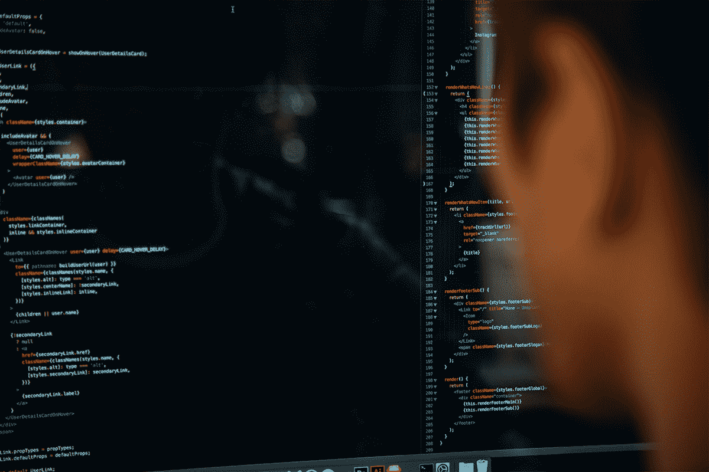

# 提高您的技术技能，这些顶级课程最高可享受 99%的优惠

> 原文：<https://www.xda-developers.com/improve-your-technical-skills-with-up-to-99-off-these-top-rated-courses/>

无论你是希望开始一份新的职业还是扩展你目前的职业，学习新的技能都是明智之举。现在，在 XDA 开发者仓库，有很多关于顶级培训的优惠活动。以下是一些亮点，建议零售价高达 99%的折扣。

## **微软 PowerShell 认证捆绑包**

****

如果你想自动化任何微软系统，你真的需要学习 PowerShell。这三个课程的集合通过 11 个小时的视频培训，教你如何从头开始编写脚本。你的导师是 Vijay Saini，他是一名 IT 专业人士，已经在 Udemy 上帮助了 55，000 多名学生。

花费 19 美元获得 [微软 PowerShell 认证套装](https://depot.xda-developers.com/sales/the-microsoft-powershell-certification-bundle?utm_source=xda-developers.com&utm_medium=referral&utm_campaign=the-microsoft-powershell-certification-bundle&utm_term=scsf-488849&utm_content=a0x1P000004exQDQAY&scsonar=1)(reg。600 美元)，节省了 96%。

## 【HTML、CSS & JavaScript 编码简介

需要从基本面入手？通过视频课程，这五个小时的课程帮助你掌握网络的基本语言。评级为 4.4 星，该培训还向您展示了如何从头开始构建自定义网站。

获得 [用 HTML 编码入门，CSS & JavaScript](https://depot.xda-developers.com/sales/introduction-to-coding-with-html-css-and-javascript?utm_source=xda-developers.com&utm_medium=referral&utm_campaign=introduction-to-coding-with-html-css-and-javascript&utm_term=scsf-488845&utm_content=a0x1P000004exQDQAY&scsonar=1) 售价 19.99 美元(reg。200 美元)，节省了 90%。

## **2021 年一体化道德黑客&渗透测试捆绑**

****

如果你想在利润丰厚的 [网络安全](https://www.xda-developers.com/become-a-comptia-certified-hacker-with-an-extra-20-off-these-e-learning-deals/) 领域工作，这个套装提供 46 小时的宝贵培训。九门包含的课程教你如何使用流行的测试工具和技术，以及恶意黑客使用的常见漏洞。以前的学生对这些课程的平均评分为 4.3 星。

花费 29.99 美元获得[2021 一体化道德黑客&渗透测试套装](https://depot.xda-developers.com/sales/the-2021-all-in-one-ethical-hacking-penetration-testing-bundle?utm_source=xda-developers.com&utm_medium=referral&utm_campaign=the-2021-all-in-one-ethical-hacking-penetration-testing-bundle&utm_term=scsf-485949&utm_content=a0x1P000004exQDQAY&scsonar=1)(reg。1800 美元)，节省了 98%。

## **按需付费:高级 Python 大师班&自动化培训包**

****

Python 是最好学的第一编程语言之一，全职开发人员每年可以赚超过 10 万美元。这个包帮助你掌握这门语言，有 14 门课程，从基础到高级项目。最精彩的部分？你想付多少就付多少。

为 [高级 Python 大师班&自动化培训捆绑](https://depot.xda-developers.com/sales/the-pwyw-advanced-python-masterclass-automation-certification-bundle?utm_source=xda-developers.com&utm_medium=referral&utm_campaign=the-pwyw-advanced-python-masterclass-automation-certification-bundle&utm_term=scsf-488844&utm_content=a0x1P000004exQDQAY&scsonar=1) (reg。$2,800).

## **终极甲骨文、SAP & Salesforce 培训预备包**

****

每个大公司都使用 CRM 软件进行营销和销售。这个包向你展示了如何控制三个流行的平台，六个完整长度的课程。培训涵盖 SQL 数据库、应用程序集成、节省时间的自动化和日常管理。

获得 [终极甲骨文，SAP & Salesforce 培训预备套装](https://depot.xda-developers.com/sales/the-ultimate-oracle-sap-salesforce-training-prep-bundle?utm_source=xda-developers.com&utm_medium=referral&utm_campaign=the-ultimate-oracle-sap-salesforce-training-prep-bundle&utm_term=scsf-488843&utm_content=a0x1P000004exQDQAY&scsonar=1) 售价 24.99 美元(reg。1200 美元)，节省了 97%。

## **用微软 Excel 2019 动手机器学习【电子书】**

****

从无人驾驶汽车到金融预测，机器学习现在处于科技的前沿。这本 254 页的电子书帮助你探索这个主题，同时获得有用的 Excel 技能。作者是 Julio Cesar Rodriguez Martino，专业的机器学习和 AI 工程师。

获得 [用微软 Excel 2019](https://depot.xda-developers.com/sales/hands-on-machine-learning-with-microsoft-excel-2019?utm_source=xda-developers.com&utm_medium=referral&utm_campaign=hands-on-machine-learning-with-microsoft-excel-2019&utm_term=scsf-488848&utm_content=a0x1P000004exQDQAY&scsonar=1) 【电子书】9.99 美元(reg。31 美元)，节省了 68%。

## **面向金融课程的 Python 实践**

****

谈到分析金融数据，Python 是最好的工具之一。在这五个小时的课程中，您将学习如何使用流行的 Python 库编写自己的模拟和预测。平均评分为 5 颗星，这是一个极好的学习资源。

花费 9.99 美元获得 [金融课程的 Python 实践](https://depot.xda-developers.com/sales/hands-on-python-for-finance?utm_source=xda-developers.com&utm_medium=referral&utm_campaign=hands-on-python-for-finance&utm_term=scsf-488847&utm_content=a0x1P000004exQDQAY&scsonar=1) (注册 124 美元)，节省了 92%。

## **完整的 2021 年微软、Windows、& Azure 捆绑**

该套装汇集了 17 门深度课程，提供微软系统的终极教育。通过简明的视频课程，您将了解如何在桌面设备、服务器和云中建立稳定、安全的环境。

获得 [完整版 2021 微软 Windows、& Azure 捆绑](https://depot.xda-developers.com/sales/the-complete-2021-microsoft-windows-azure-bundle?utm_source=xda-developers.com&utm_medium=referral&utm_campaign=the-complete-2021-microsoft-windows-azure-bundle&utm_term=scsf-488846&utm_content=a0x1P000004exQDQAY&scsonar=1) 售价 69.99 美元(reg。5015 美元)，节省了 98%。

*价格随时变化*