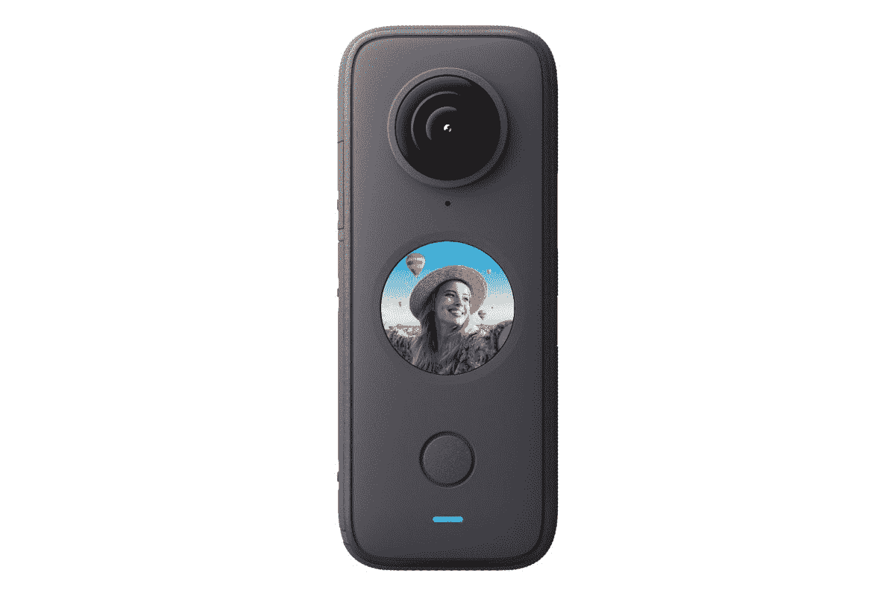

# 一个新的泄漏展示了 Insta360 的大触摸屏显示器的 X3 相机

> 原文：<https://www.xda-developers.com/insta360s-x3-leak/>

# 一个新的泄漏展示了 Insta360 的大触摸屏显示器的 X3 相机

一个新的泄露让我们很好地了解了 Insta360 在即将到来的活动中可能会宣布什么。Insta360 X3 将是其最新的 360°相机。

Insta360 计划在几天后发布一款新产品。虽然在其网站上没有太多的暗示，但一个新的泄漏显然泄露了公告的细节。如果泄露是准确的，Insta360 将宣布其一款名为 Insta360 X3 的 X2 360 相机的继任者。

据 *WinFuture，*即将推出的 Insta360 X3 将采用与其前代大致相同的设计，但设计看起来会更精简一些。一个明显的主要区别是其 2.29 英寸的大垂直屏幕。以前的型号选择了圆形显示屏，与新设备相比要小得多。尽管有了这个新的外观，很明显，新型号仍将拥有 5.7K 的最高记录分辨率。但是，当使用单个传感器拍摄时，可能会有所改善，从 1440p 到 4K 分辨率。

此外，该消息来源称，现在可以捕捉高达 72MP 的图像，并且可以以 8K 的分辨率拍摄时间流逝。至于其他功能，看起来 Insta360 X3 将提供与 GoPro 的马后炮类似的功能。该功能可持续录像，但仅在按下快门按钮时将视频捕捉到 SD 卡中。这让用户无论如何都不会错过任何一个瞬间。此外，由于 Wi-Fi 技术的进步，数据传输速度也将提高 50%。

 <picture></picture> 

Insta360 - ONE X2 360 Degree Digital Video Camera

##### Insta360 One RS 1 英寸 360 版

不幸的是，这次泄漏的大部分内容都在图像中，因为关于该设备的实际规格的细节很少。一旦细节被披露，看看它的最新相机如何与其产品线中的其他设备进行比较将会很有趣。谢天谢地，我们不用等太久，因为公告将于 9 月 8 日发布。虽然没有美国的定价，但泄露的消息称，欧洲市场的定价应该在€539.99 美元。

* * *

**来源** : [赢未来](https://winfuture.de/news,131682.html)

**经** : [濒临](https://www.theverge.com/2022/9/6/23338861/insta360-x3-360-degree-action-camera-release-price-specs-leak)